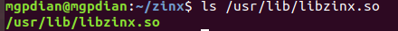

# zinx框架学习

我们不管框架的处理过程 只关心框架的功能 

但我们还是要学框架 

面向框架编程的方法？

+ 用框架：三步法：读文档 装环境 写用例
+ 写框架：罗马不是一日建成的，好的框架是不断重构得来的，没有人能够一次性创建出复用性特别高的框架。

## zinx框架功能:

zinx框架是一个处理多路IO的框架  在这个框架中提供了若干抽象类 分别在IO处理的多个阶段生效 , 开发者可以直接重写抽象类中的虚函数来满足自己开发需求过程中的处理功能

## zinx框架使用步骤

1 ZinxKernel::ZinxKernelInit() 初始化框架

2 写一个类继承AZinxHandler(带A表示带有虚函数), 重写虚函数, 在函数中对参数进行处理 （比如将参数内容打印到标准输出）

思路: 应该就是子类转父类 然后父类就可以看到子类的虚函数?

​		或者子类直接调用父类继承下来的函数?

3 写一个类继承Ichannel(带I表示为纯虚函数), 重写虚函数完成数据收发 重写GetInputNextStage函数 返回第二步创建类的对象

4 添加步骤3类创建的对象到框架中

5 运行框架

## zinx安装

https://github.com/marklion/zinx.git 中有比较详细的步骤

1 下载

git clone https://github.com/marklion/zinx.git

2 打开 运行makefile

​	`cd zinx`

​	`make`

3 安装

`sudo make install`

当访问这个路径成功时 就表明安装成功了

> ls /usr/lib/libzinx.so