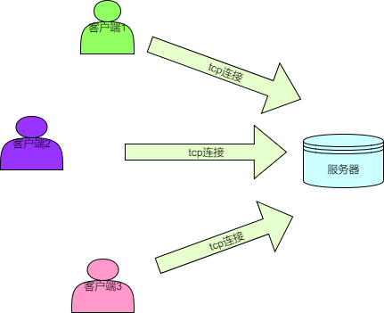

1.游戏需求分析

## 1.1特性列表

+ 新玩家登陆后可以看到其他玩家
+ 新玩家登陆后其他玩家可以看见他
+ 玩家移动时，别的玩家能够看到他移动
+ 玩家发送聊天信息时，其他玩家能看到

## 1.2 游戏架构分析

多个客户端通过tcp连接到服务器并将自身的动作和操作发送给服务器，服务器端收到客户端发来的动作后进行一定处理和计算在通过tcp发送给某些客户端。 

> 个人观点: 然而现在更主流的是udp  tcp由于自身的拥塞控制问题 导致网络连接通道传输速率不稳定

> 这是一个比较典型的cs架构 

## 1.3职责分解

### 客户端职责

（接受玩家输入，呈现游戏效果）

### 服务器职责

（接收客户端数据，发送数据给客户端）

- 新客户端连接后，向其发送ID和名称
- 新客户端连接后，向其发送**周围**玩家的位置
- 新客户端连接后，向**周围**玩家发送其位置
- 收到客户端的移动信息后，向**周围**玩家发送其新位置
- 收到客户端的移动信息后，向其发送**周围新**玩家位置
- 收到客户端的聊天信息后，向**所有**玩家发送聊天内容
- 客户端断开时，向**周围**玩家发送其断开的消息

## 1.4消息定义

每一条服务器和客户端之前的消息都应该满足以下格式

> |消息内容的长度（4个字节，低字节在前）|消息ID（4个字节，低字节在前）|消息内容|

详细定义如下

| 消息ID | 消息内容                                      | 发送方向 | 客户端处理               | 服务器处理                   |
| ------ | --------------------------------------------- | -------- | ------------------------ | ---------------------------- |
| 1      | 玩家ID和玩家姓名                              | S->C     | 记录自己ID和姓名         | 无                           |
| 2      | 聊天内容                                      | C->S     | 无                       | 广播给所有玩家               |
| 3      | 新位置                                        | C->S     | 无                       | 处理玩家位置更新后的信息同步 |
| 200    | 玩家ID，聊天内容/初始位置/动作（预留）/新位置 | S->C     | 根据子类型不通而不同     | 无                           |
| 201    | 玩家ID和玩家姓名                              | S->C     | 把该ID的玩家从画面中拿掉 | 无                           |
| 202    | 周围玩家们的位置                              | S->C     | 在画面中显示周围的玩家   | 无                           |

> 以上定义的消息以及其处理方式已经在客户端实现，本项目要实现的是**服务器端的相关处理**

**观点**

**服务器核心逻辑 : 接收数据 处理数据 发送数据**

