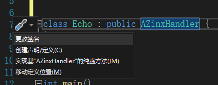
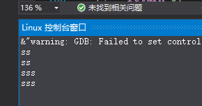

# zinx框架测试

## zinx框架功能:

zinx框架是一个处理多路IO的框架  在这个框架中提供了若干抽象类 分别在IO处理的多个阶段生效 , 开发者可以直接重写抽象类中的虚函数来满足自己开发需求过程中的处理功能


## zinx框架使用步骤

1 ZinxKernel::ZinxKernelInit() 初始化框架

2 写一个类继承AZinxHandler(带A表示带有虚函数), 重写虚函数, 在函数中对参数进行处理 （比如将参数内容打印到标准输出）

思路: 应该就是子类转父类 然后父类就可以看到子类的虚函数?

​		或者子类直接调用父类继承下来的函数?

3 写一个类继承Ichannel(带I表示为纯虚函数), 重写虚函数完成数据收发 重写GetInputNextStage函数 返回第二步创建类的对象

4 添加步骤3类创建的对象到框架中

5 运行框架


# zinx功能测试

## 1用例1-官方用例（标准输入回显标准输出）

#### 使用步骤 1

 **ZinxKernel::ZinxKernelInit() 初始化框架**

```c++
/*1 - 初始化框架*/
//初始化框架
ZinxKernel::ZinxKernelInit();
```

第一步 使用框架的ZinxKernel::ZinxKernelInit()来让框架进行初始化

与其对应的是 框架结束时的框架资源回收 写在末尾

```c++
//框架资源的回收 也就是结束框架
ZinxKernel::ZinKernelFnit();
```

####  使用步骤 2

**写一个类 用于数据的处理**

  **写一个类继承AZinxHandler(带A表示带有虚函数), 重写虚函数, 在函数中对参数进行处理**

#### 技巧: 快速重写继承的虚函数方法

点击父类 然后按ALT + Enter回车  会弹出提示  选择实现其纯虚函数方法



效果


下面是实现的细节  


下面的这个类的全貌

```c++
/*读标准输入 回响到标准输出*/
/*2-写功能处理类*/
//负责写操作的类
//这里通过继承AZinxHandler类 实现Echo的输出写功能 
class Echo : public AZinxHandler {
	// 通过 AZinxHandler 继承
	/*信息处理函数，开发者重写该函数实现信息的处理，
	当有需要一个环节继续处理时，应该创建新的信息对象（堆对象）并返回指针*/
	virtual IZinxMsg* InternelHandle(IZinxMsg& _oInput) override
	{
		/*回响到标准输出*/

		//GET_REF2DATA 作用 将_oInput 转换成 BytesMsg 的类型, 写进 input
		GET_REF2DATA(BytesMsg, input, _oInput);

		//std::cout << input.szData << std::endl;
		//创建一个输出通道类  来负责输出到标准输出

		ZinxKernel::Zinx_SendOut(input.szData, *poOut);

		return nullptr;
	}

	/*获取下一个处理环节函数，开发者重写该函数，
	可以指定当前处理环节结束后下一个环节是什么，
	通过参数信息对象，可以针对不同情况进行分别处理*/

	virtual AZinxHandler* GetNextHandler(IZinxMsg& _oNextMsg) override
	{
		return nullptr;
	}
}*poEcho = new Echo();
```


这里通过继承AZinxHandler类 实现Echo的输出写功能 

```c++
class Echo : public AZinxHandler{};
```

重写AZinxhandler的虚函数

1 InternelHandle 

```c++
/*信息处理函数，开发者重写该函数实现信息的处理，
	当有需要一个环节继续处理时，应该创建新的信息对象（堆对象）并返回指针*/
	virtual IZinxMsg* InternelHandle(IZinxMsg& _oInput) override
	{
		
	}
```

其中 该函数是信息处理函数,   接收消息 进行处理  可以返回这个处理后消息的指针  

用例中的处理方法为

```c++
/*回响到标准输出*/
{
		//GET_REF2DATA 作用 将_oInput 转换成 BytesMsg 的类型, 写进 input
		GET_REF2DATA(BytesMsg, input, _oInput);

		std::cout << input.szData << std::endl;
		//std::cout << input.szData << std::endl;
		//创建一个输出通道类  来负责输出到标准输出

		ZinxKernel::Zinx_SendOut(input.szData, *poOut);
		return nullptr;
 }
```

其中 GET_REF2DATA(BytesMsg, input, _oInput); 的效果是将 _oInput 转换成 BytesMsg 的类型, 写进 input

然后输出      

因为没有需要返回的处理消息后的指针 所以返回nullptr

2 GetNextHandler  用于指定下个处理函数 

```c++
/*获取下一个处理环节函数，开发者重写该函数，
	可以指定当前处理环节结束后下一个环节是什么，
	通过参数信息对象，可以针对不同情况进行分别处理*/

	virtual AZinxHandler* GetNextHandler(IZinxMsg& _oNextMsg) override
	{
		return nullptr;
	}
```

由于我们这次不需要 所以 就 不用写了 

最后是 函数生成

```c++
*poEcho = new Echo();
```

因为各种类都要获取接下来要执行的函数对象(比如上面的GetNextHandler)  他要你返回一个类对象  那我们就需要new一个, 这样每次调用都会new的话 最后会导致内存泄露  因为没有析构

所以我们在每个类后 都自己new一个类对象  这样其他类调用返回时可以直接指明这个对象 不用担心内存泄露  


#### 使用步骤3  

**写管道类 用于数据的获取和返回**

**写一个类继承Ichannel(带I表示为纯虚函数), 重写虚函数完成数据收发 重写GetInputNextStage函数 返回第二步创建类的对象**

```c++
//管道类
/*3-写通道类*/
//接收信息类?
//Ichannel 通道类，派生自基础处理者类，提供基于系统调用的数据收发功能
//一般地，用户应该根据处理的文件（信息源）不同而
//创建通道类的子类或选用合适的实用类（已经提供的通道类子类）来完成系统级文件IO
class TestStdin : public Ichannel
{
	// 通过 Ichannel 继承
	/*通道初始化函数，应该重写这个函数实现打开文件和一定的参数配置
	该函数会在通道对象添加到zinxkernel时被调用
	也就是 初始化  要将其改为true*/
	virtual bool Init() override
	{
		return true;
	}
	/*读取数据， 开发者应该根据目标文件不同，重写这个函数，以实现将fd中的数据读取到参数_string中
	该函数会在数据源所对应的文件有数据到达时被调用
	ReadFd  为 获取信息 也就是最初步的地点*/
	virtual bool ReadFd(std::string& _input) override
	{
		std::cin >> _input;
		return true;
	}
	/*写出数据， 开发者应该将数据写出的操作通过重写该函数实现
	该函数会在调用zinxkernel::sendout函数后被调用（通常不是直接调用而是通过多路复用的反压机制调用）*/
	virtual bool WriteFd(std::string& _output) override
	{
		return false;
	}
	/*通道去初始化，开发者应该在该函数回收相关资源
	该函数会在通道对象从zinxkernel中摘除时调用
	资源回收  */
	virtual void Fini() override
	{
	}
	/*获取文件描述符函数， 开发者应该在该函数返回当前关心的文件，
	一般地，开发者应该在派生类中定义属性用来记录数据来记录当前IO所用的文件，在此函数中只是返回该属性
	读取信息的位置 现在我们传入的信息地点是屏幕 所以文件描述符是0  也就是 STDIN_FILENO*/
	virtual int GetFd() override
	{
		//return 0; //这个也可以
		return STDIN_FILENO;
	}
	/*获取通道信息函数，开发者可以在该函数中返回跟通道相关的一些特征字符串，方便后续查找和过滤*/
	virtual std::string GetChannelInfo() override
	{
		return "stdin";
	}
	/*获取下一个处理环节，开发者应该重写该函数，指定下一个处理环节
	一般地，开发者应该在该函数返回一个协议对象，用来处理读取到的字节流
	这个函数  是决定 获取数据信息后  接下来要去那个处理函数  */
	virtual AZinxHandler* GetInputNextStage(BytesMsg& _oInput) override
	{
		return poEcho;
	}
};
```

#### 步骤4 

添加步骤3类创建的对象到框架中

```c++
/*4-将通道对象添加到框架*/
	//管道初始化
	TestStdin* poStdin = new TestStdin();
	//添加管道
	ZinxKernel::Zinx_Add_Channel(*poStdin);
```


#### 步骤5

运行框架

```c++
/*5-运行框架*/
	ZinxKernel::Zinx_Run();
```


### 开始运行

运行报错


### 链接问题


原因是没有在编译时添加库依赖项 类似-zinx?

解决方法

进行添加

点击 项目 的 属性 


进入属性页后  点击链接器的 输入


写入zinx


问题解决

项目可以正常运行


## 进一步

将处理功能类Echo的输出分离出来 

```c++
virtual IZinxMsg* InternelHandle(IZinxMsg& _oInput) override
	{
		/*回响到标准输出*/

		//GET_REF2DATA 作用 将_oInput 转换成 BytesMsg 的类型, 写进 input
		GET_REF2DATA(BytesMsg, input, _oInput);

		//std::cout << input.szData << std::endl;
		//创建一个输出通道类  来负责输出到标准输出
		ZinxKernel::Zinx_SendOut(input.szData, *poOut);
		return nullptr;
	}
```


输出功能交给 标准输出通道类  实现分离复用

```c++

/*创建标准输出通道类*/
class TestStdout : public Ichannel
{
	// 通过 Ichannel 继承
	virtual bool Init() override
	{
		return true;
	}
	virtual bool ReadFd(std::string& _input) override
	{
		return false;
	}
    //这里负责将接收的数据输出
	virtual bool WriteFd(std::string& _output) override
	{
		std::cout << _output << std::endl;
		return true;
	}
	virtual void Fini() override
	{
	}
	virtual int GetFd() override
	{
        //标准输出的文件描述符为1  STDOUT_FILENO
		return 1;
        //return STDOUT_FILENO;
	}
	virtual std::string GetChannelInfo() override
	{
		return "stdout";
	}
	virtual AZinxHandler* GetInputNextStage(BytesMsg& _oInput) override
	{
		return nullptr;
	}
} *poOut = new TestStdout();
```

只是点击运行会不能进行标准输出

因为你没有添加管道到ZinxKernel::Zinx_Add_Channel()中

```c++
/*4-将通道对象添加到框架*/
	//管道初始化
	TestStdin* poStdin = new TestStdin();
	//添加管道
	ZinxKernel::Zinx_Add_Channel(*poStdin);
	ZinxKernel::Zinx_Add_Channel(*poOut);
```

这样就能正常输出了



## 思路

- 创建标准输出类 继承Ichannel类  这个类负责将内容输出到啊标准输出 所以需要重写虚函数writeFd 在创建类的同时创建对象(new一个对象)
- 创建回响功能类 继承AZinxHandler类 这个类负责将传入内容进行处理后转发 (这里则是原封不动地通过标准输出类对象输出), 所以需要重写InternelHandler函数 记住 在创建类的同时创建对象(new一个对象)
- 创建标准输入类 继承Ichannel类 这个类负责将用户输入采集进来 交给回响功能类对象处理 , 所以需要重写ReadFd函数和GetawayInputNextStage函数(转发给处理功能类) 因为他不需要被转发 所以不用创建类的同时创建它这个对象, 等调用时在创建
- 按照顺序执行kernel的初始化，添加channel对象，运行等函数


## 标准输入回显标准输出的编写思路

1 创建三个类 : 标准输入类 回显类 标准输出类

2 重写标准输入类的读取函数 

3 重写回显类处理函数

4 重写标准输出类的写出函数

5 创建以上三个类的全局对象(堆对象), 添加通道对象到框架(kernel)

6 运行框架