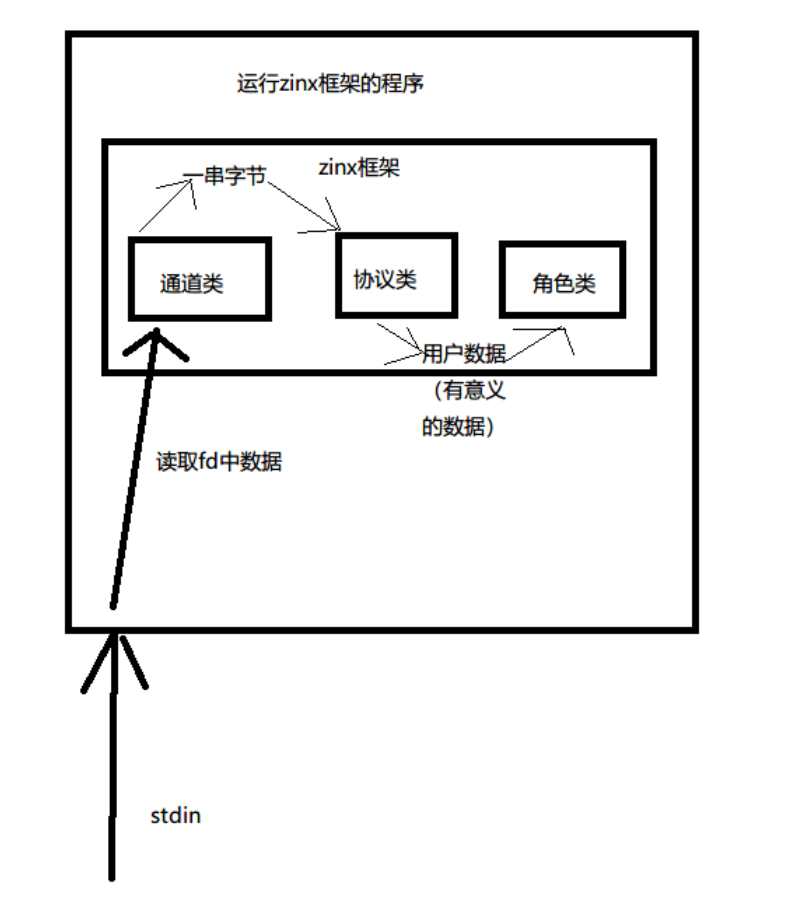
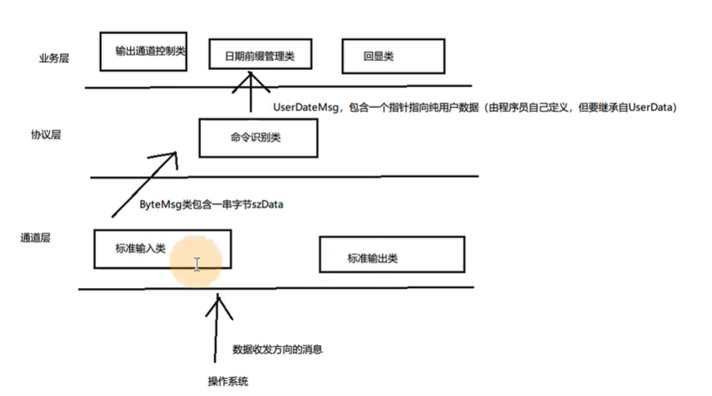

# zinx的业务逻辑

zinx的基础需要调用的框架静态函数

- 初始化 `ZinKernel::ZinxKernleInit()`和去初始化`ZinKernel::ZinkernelFini()` (就是结束框架)
- 通道添加和摘除 `ZinKernel::Zinx_Add_Channel()`和`ZinKernel::Zinx_Del_Channel()`
- 运行框架 `ZinKernel::Zin_Run()`
- 退出框架`ZinKernel::Zinx_Exit()`

### 多个AzinxHandler对象之间的信息传递

- 数据封装成IzinxMsg的类型  在多个AzinxHandler对象之间传递
- 使用时 需要将IZinxMsh类型引用动态转换成所需类型引用(通过GET_REF2DATE)

### Zinx框架处理数据的本质

- 将数据在多个AzinxHandler对象之间传递 挨个处理
- 传递的规则通过重写GetNextHandler

### Zinx推荐的高级用法

将业务逻辑分为三层

### 三层结构

channel 通道  protocol 协议  role 角色

channel  继承Ichannel 类  通道类负责数据的接收和发送 

protocol  继承Iprotocol类  协议类负责进行协议的解析或者封装 同时负责将解析好的数据 进行识别分发

role	继承role类 而role继承AzinxKernel类 	 角色类负责对数据进行处理

#### 三层结构重构原有功能

之前我们只有通道层和业务层(也就是角色类 但还是业务好听)

我们将其中的分发逻辑提取出来  作为协议层  用命令识别类来负责分发功能  

同时我们使用UserDateMsg , 它包含了一个指针指向纯用户数据 (由用户自己定义 但要继承UserDate)  使用这个来进行协议层和业务层的数据交流  因为可能数据要分开 发给不同的角色类  这时候 使用自定义类来将数据分开可能比较好

