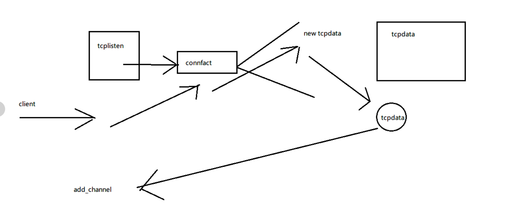
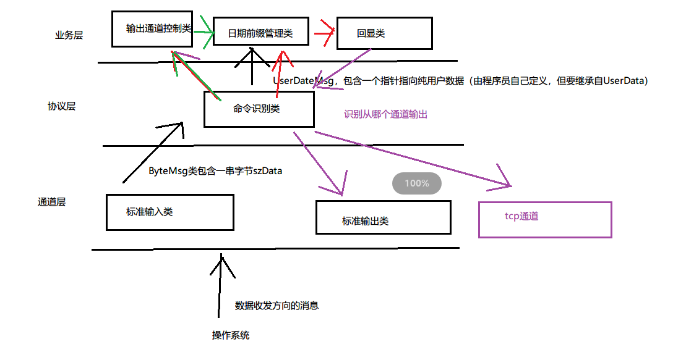

# TCP通道


zinx框架中 有三种和TCP有关的类

### 1 ZinxTcpData

这个类只有一个虚拟函数GetInputNextStage，它的含义与它的超类相同。您应该继承这个类并重写这个函数，以定义哪个处理程序应该处理接收到的字节流。

基于此类的对象维护自己的套接字。因此，应该在一个客户端连接之后构建对象。

这个只负责 数据发送   不负责套接字什么的

### 2 IZinxTcpConnFact

该类的名称是一个抽象类，用于构造ZinxTcpData对象。您只需要重写只有一个虚拟函数CreateTcpDataChannel来返回合适的ZinxTcpData对象。

只要使用这个 就可以生成ZinxTcpData

### 3 ZinxtcpListen

该类不是抽象类，您可以使用它直接构造对象。构造时，应指定TCP侦听端口号和IZinxTcpConnFact子类的一个对象。

负责监听套接字


实现流程图



zinxtcplisten 根据指定TCP侦听端口号和IZinxTcpConnFact子类的一个对象  当监听的端口有客户端client连接时 就创建new一个ZinxTcpConnFact子类   这个子类 会调用CreateTcpDataChannel 负责创建  一个Zinxtcpdata类 然后tcpdata作为channel来  转发到协议类


设计流程图



ZinxTcpData 和zinxtcplisten 本质还是channel  因为他们继承了Ichannel


### 添加TCP方式的数据通信 

1. 创建tcp数据通道类继承ZinxTcpData，重写GetInputNextStage 函
数，返回协议对象

2. 创建tcp连接工厂类继承IZinxTcpConnFact，重写
CreateTcpDataChannel ，构造步骤1的对象
3. 创建ZinxTCPListen类的对象，指定端口号和工厂对象（步骤2定义
的类的对象），添加到kernel中

### 步骤实现

1. 创建tcp数据通道类继承ZinxTcpData，重写GetInputNextStage 函数，返回协议对象  ZinxTcpData本质也是IChannel

```c++
/*tcp数据套接字通道类，继承通道类，该类也是一个抽象类，需要开发者继承该类，
重写GetInputNextStage函数以指定读取到的字节流的处理方式*/
class myTcpData : public ZinxTcpData
{
public:
    myTcpData(int _fd) : ZinxTcpData(_fd) {} //继承构造
    // 通过 ZinxTcpData 继承
    virtual AZinxHandler* GetInputNextStage(BytesMsg& _oInput) override;
};
```

```c++
AZinxHandler* myTcpData::GetInputNextStage(BytesMsg& _oInput)
{
    /*返回协议对象*/
    return CmdCheck::GetInstance(); //转到协议类
}
```


2. 创建tcp连接工厂类继承IZinxTcpConnFact，重写
   CreateTcpDataChannel ，构造步骤1的对象

```c++


/*产生tcp数据套接字通道类的抽象工厂类，
开发者需要重写CreateTcpDataChannel函数，来返回一个tcp通道对象
一般地，开发者应该同时创建一对tcp通道类和工厂类*/
//class IZinxTcpConnFact
class myFact : public IZinxTcpConnFact
{
    // 通过 IZinxTcpConnFact 继承
    virtual ZinxTcpData* CreateTcpDataChannel(int _fd) override;
};
```

```c++
ZinxTcpData* myFact::CreateTcpDataChannel(int _fd)
{
    return new myTcpData(_fd);
}
```


2. 创建ZinxTCPListen类的对象，指定端口号和工厂对象（步骤2定义的类的对象），添加到kernel中

不需要自己设置  直接写

```c++
ZinxKernel::Zinx_Add_Channel(*(new ZinxTCPListen(51111, new myFact())));
```

参数 一个是 监听的端口  一个收到连接后 要创建的IZinxTcpConnFact  然后 IZinxTcpConnFact 创建 ZinxTcpData


### 实现信息从那来回那去

协议类CmdCheck

```c++
class CmdCheck :
 public Iprotocol
{
     std::string szOutChannel;
 }
```

szOutChannel 用来记录 传入的通道类  在返回数据 根据他来返回

```c++

Irole* CmdCheck::GetMsgProcessor(UserDataMsg& _oUserDataMsg)
{

    szOutChannel = _oUserDataMsg.szInfo;
    if ("stdin" == szOutChannel)
    {
        szOutChannel = "stdout";
    }
}
```

记录 传入的通道类

```c++

Ichannel* CmdCheck::GetMsgSender(BytesMsg& _oBytes)
{
    //指定数据要通过的标准输出通道
    //可以通过字符串名称指定通道
    return ZinxKernel::Zinx_GetChannel_ByInfo(szOutChannel);
}
```


## 思考

- Ichannel对象读取到的数据给谁了？ 协议层
- 给该对象调用GetInputNextStage函数返回的对象  
- Iprotocol对象转换出的用户请求给谁了？
- 给该对象调用GetMsgProcessor函数返回的对象
