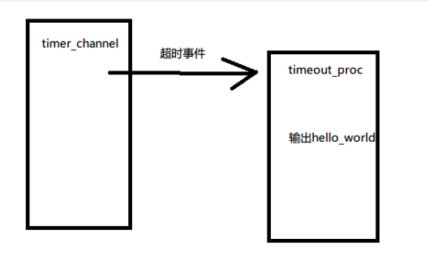

## 实现ZinxTimer定时器类

步骤1 创建一个ZinxTimer类继承Ichannel类 这个类通过timerFd来产生超时事件



定义一个定时器文件描述符 当超时时 ReadFd进行读取 将要进行的处理转发到GetInputNextStage函数 他转发到处理类那里


实现一个定时器类

```c++
class ZinxTimerChannel :
    public Ichannel
{
private:
    int m_Timerfd = -1;  //记录定时器的文件描述符  
};
```

```c++
#include "ZinxTimer.h"
#include <sys/timerfd.h>

//创建定时器文件描述符
bool ZinxTimerChannel::Init()
{

    bool bRet = false;
    //创建文件描述符
    int iFd = timerfd_create(CLOCK_MONOTONIC, 0);
    if (0 <= iFd)
    {
        //设置定时周期
        struct itimerspec period = {
            {3, 0}, {3, 0}
        };
        if (0 == timerfd_settime(iFd, 0, &period, NULL))
        {
            bRet = true;
            m_Timerfd = iFd;
        }
        
    }
    
    return bRet;
}

//读取超时次数
bool ZinxTimerChannel::ReadFd(std::string& _input)
{
    bool bRet = false;;
    char buff[8] = { 0 };

    if (sizeof(buff) == read(m_Timerfd, buff, sizeof(buff)))
    {
        bRet = true;
        _input.assign(buff, sizeof(buff));
    }
    return bRet;
}

bool ZinxTimerChannel::WriteFd(std::string& _output)
{
    return false;
}

//关闭文件描述符
void ZinxTimerChannel::Fini()
{
    close(m_Timerfd);
    m_Timerfd = -1;
}

//返回读取的定时器文件描述符
int ZinxTimerChannel::GetFd()
{
    return m_Timerfd;
}

std::string ZinxTimerChannel::GetChannelInfo()
{
    return "TimerFd";
}

class output_hello : public AZinxHandler {
    // 通过 AZinxHandler 继承
    virtual IZinxMsg* InternelHandle(IZinxMsg& _oInput) override
    {
        auto pchannel = ZinxKernel::Zinx_GetChannel_ByInfo("stdout");
        std::string output = "hello world";
        ZinxKernel::Zinx_SendOut(output, *pchannel);
        return nullptr;
    }
    virtual AZinxHandler* GetNextHandler(IZinxMsg& _oNextMsg) override
    {
        return nullptr;
    }
} *pout_hello = new output_hello();


//返回处理超时事件的对象
AZinxHandler* ZinxTimerChannel::GetInputNextStage(BytesMsg& _oInput)
{
    return pout_hello;
}

```


主函数需要加上

```c++
ZinxKernel::Zinx_Add_Channel(*(new ZinxTimerChannel()));//进入框架
```

