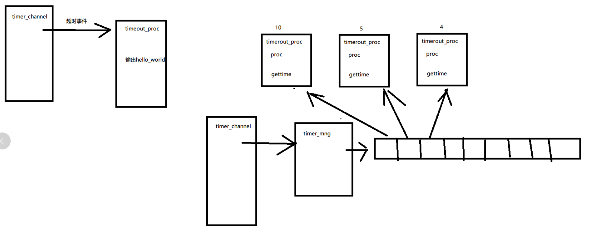

# 实现ZinxTimerDeliver定时器管理类

建一个ZinxTimerDeliver类继承AZinxHandler类 这个类用来管理每次超时事件的分发和超时时间管理

思路图



定时器类timer_channel发生超时事件后 转发给timer_mng

#### 定时器管理类timer_mng

- 处理超时事件：遍历所有定时任务，计数减一，若计数为0，则执行
- 该任务的超时处理函数
- 添加定时任务
- 删除定时任务
- 作为timer_channel的下一个环节

这是每个超时任务类

> Proc() 为处理超时事件
>
> GetTimeSec() 为 设置时间

```c++
//超时任务
class TimerOutProc {
public:
    virtual void Proc() = 0;
    virtual int GetTimeSec() = 0;
    //倒计时
    int iCount = -1;
};
```

实例的设置如下面

实例继承 TimerOutProc 来实现定时器

```c++

class timerhello : public TimerOutProc
{
	// 通过 TimerOutProc 继承
	virtual void Proc() override
	{
		auto pchannel = ZinxKernel::Zinx_GetChannel_ByInfo("stdout");
		std::string output = "hello world";
		ZinxKernel::Zinx_SendOut(output, *pchannel);
	}
	virtual int GetTimeSec() override
	{
		return 3;
	}
};


class timerbye : public TimerOutProc
{
	// 通过 TimerOutProc 继承
	virtual void Proc() override
	{
		auto pchannel = ZinxKernel::Zinx_GetChannel_ByInfo("stdout");
		std::string output = "bye";
		ZinxKernel::Zinx_SendOut(output, *pchannel);
	}
	virtual int GetTimeSec() override
	{
		return 5;
	}
};


```


### 定时器管理类 TimerOutMng 

继承 AZinxHandler 所以他是个业务类


```c++

class TimerOutMng : public AZinxHandler
{
private:
    std::list<TimerOutProc*> m_task_list; //定时器列表

    static TimerOutMng single; //单例
public:
    // 通过 AZinxHandler 继承
    //处理超时事件 遍历所有超时任务
    
    virtual IZinxMsg* InternelHandle(IZinxMsg& _oInput) override;
    virtual AZinxHandler* GetNextHandler(IZinxMsg& _oNextMsg) override;

    void AddTask(TimerOutProc* _ptask);
    void DelTask(TimerOutProc* _ptask);
	
    //返回单例
    static TimerOutMng& GetInstance()
    {
        return single;
    }
};
```

实现

```c++


//设置单例
TimerOutMng TimerOutMng::single;

//InternelHandle 遍历定时器列表 对每个任务计数减一 当为0时 调用任务的处理函数
IZinxMsg* TimerOutMng::InternelHandle(IZinxMsg& _oInput)
{
    //遍历任务列表 每个任务的计数减一
    for (auto task : m_task_list)
    {
        task->iCount--;
        //若计数为0 则调用处理函数
        if (task->iCount <= 0)
        {
            task->Proc();
            task->iCount = task -> GetTimeSec();
        }
    }
    return nullptr;
}

AZinxHandler* TimerOutMng::GetNextHandler(IZinxMsg& _oNextMsg)
{
    return nullptr;
}
//添加定时任务
void TimerOutMng::AddTask(TimerOutProc* _ptask)
{
    m_task_list.emplace_back(_ptask);
    _ptask->iCount = _ptask->GetTimeSec();
}
//删除定时任务
void TimerOutMng::DelTask(TimerOutProc* _ptask)
{
    m_task_list.remove(_ptask);
}

```


## 需要的额外设置

ZinxTimerChannel类 定时器

返回处理超时事件的对象 设置为定时器管理类的单例返回函数

```c++
//返回处理超时事件的对象
AZinxHandler* ZinxTimerChannel::GetInputNextStage(BytesMsg& _oInput)
{
    return &TimerOutMng::GetInstance();
}

```


主函数

将两个定时器加入定时器管理类的列表中

```c++
TimerOutMng::GetInstance().AddTask(new timerhello());
	TimerOutMng::GetInstance().AddTask(new timerbye());
```

