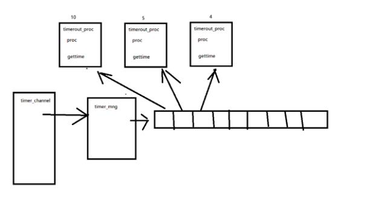
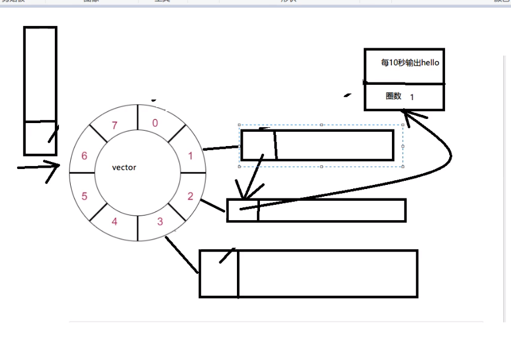

# 4 实现时间轮定时器

之前的定时器管理类timer_mng是通过列表遍历来是否对定时器的查询和访问  当定时器太多或者 定时太久 的情况出现  那就会导致 耗时太多的问题  



所以需要改进定时器



时间轮定时器 

## 思路

- 使用一个vector<list*>存储轮的齿轮
- 每个齿轮用list存储对应的定时任务
- 每个定时任务需要记录剩余的圈数 (即 定时/vector的长度 ) 对应的齿轮即 定时%vector的长度 的余
- 时间轮中要有一个刻度  如 每秒前进一步

### 时间轮设计

1 修改定时器类  将iCount 原本作为倒计时 修改为 所需的圈数

2 修改定时器管理类  之前 是使用 一个 双链表list来遍历管理定时器

现在使用  `std::vector<std::list<TimerOutProc* >>`来管理

```c++

class TimerOutMng : public AZinxHandler
{
private:
    //std::list<TimerOutProc*> m_task_list;
    std::vector<std::list<TimerOutProc* >> m_timer_wheel; //时间轮

    int cur_index = 0; //刻度 初始化的情况下 指针指向的位置(即 0点)
    static TimerOutMng single;

    TimerOutMng(); //初始化定时器链表
}
```

定时器管理类初始化 初始化时间轮的容器

```c++
TimerOutMng::TimerOutMng()
{
    //创建10个齿轮
    for (int i = 0; i < 10; i++)
    {
        std::list<TimerOutProc *> tmp;
        m_timer_wheel.emplace_back(tmp);
    }
}
```


### 时间轮添加任务

- 计算当前任务在哪个齿轮上
- 添加该任务到对应齿轮的list里
- 计算所需圈数记录到任务中

```c++

void TimerOutMng::AddTask(TimerOutProc* _ptask)
{
    //计算当前任务需要放到哪个齿轮上
    int index = (_ptask->GetTimeSec() + cur_index )% 10;
    //把任务存放到该齿轮上
    m_timer_wheel[index].emplace_back(_ptask);
    //计算所需圈数
    _ptask->iCount =  _ptask->GetTimeSec() / 10;

    /*m_task_list.emplace_back(_ptask);
    _ptask->iCount = _ptask->GetTimeSec();*/
}
```


### 时间轮删除任务

- 遍历所有齿轮
- 在每个齿轮中遍历所有节点
- 若找到则删除并返回

```c++
void TimerOutMng::DelTask(TimerOutProc* _ptask)
{
    // 遍历时间轮所有齿轮 删掉任务
    //m_task_list.remove(_ptask);
    for (auto chi : m_timer_wheel)
    {
        for (auto task : chi)
        {
            if (task == _ptask)
            {
                chi.remove(_ptask);
                break;
            }            
        }
    } 
}
```

list没有查找函数

vector也没有


### 实现时间轮调度处理

- 移动当前刻度
- 遍历当前齿轮中的任务列表
  - 若圈数为0 则执行处理函数 摘除本节点 重新添加
  - 否则 圈数减一

调度函数如下

```c++

IZinxMsg* TimerOutMng::InternelHandle(IZinxMsg& _oInput)
{
    //移动刻度 
    cur_index = (++cur_index) % WHELLSIZE;
    std::list<TimerOutProc*> m_cache;
    //遍历当前刻度的所有节点 有圈数的话 -1 或者执行处理函数
    //for (auto task : m_timer_wheel[cur_index])
    //不能使用for(auto) 因为 当超时后 需要将定时器删除然后再添加下一个位置
    // 这样会导致迭代器生效  需要记录list原本的长度来遍历 防止迭代器失效
    for (auto itr = m_timer_wheel[cur_index].begin(); itr != m_timer_wheel[cur_index].end();)
    {
        if ((*itr)->iCount <= 0)
        {
            //这样直接运行定时器的处理函数 存在安全隐患
            //(*itr)->Proc() : TimerOutMng::GetInstance().DelTask(this); 删除他自己
            //这样做会导致 接下来的迭代器全部失效 直接报错
            //解决方法 根据缓存的思路   可以将超时的定时器 放入一个容器中 等到遍历完成一次 后再执行
            //(*itr)->Proc();
            m_cache.emplace_back(*itr);
            auto ptmp = *itr;
            itr = m_timer_wheel[cur_index].erase(itr);
            //删除迭代器后 会出现迭代器失效 因为他不知道下一个是那里
            //而erase 会返回下一个有效迭代器的值
            //所以我们不用操作  将返回值给itr即可

            AddTask(ptmp);
        }
        else {
            (*itr)->iCount--;
            ++itr;
        }
    }

    //统一处理本次超时任务
    for (auto &task : m_cache)
    {
        task->Proc();
    }
    return nullptr;
}
```


过程中出现的问题

如果使用下面的处理 会导致崩溃

```c++
for (auto itr = m_timer_wheel[cur_index].begin(); itr != m_timer_wheel[cur_index].end();)
    {
        if ((*itr)->iCount <= 0)
        {
           
            (*itr)->Proc();
            //(*itr)->Proc() : TimerOutMng::GetInstance().DelTask(this); 删除他自己
            auto ptmp = *itr;
            itr = m_timer_wheel[cur_index].erase(itr);
            AddTask(ptmp);
        }
        else {
            (*itr)->iCount--;
            ++itr;
        }
    }
```

因为定时器 执行(*itr)->Proc() : TimerOutMng::GetInstance().DelTask(this); 删除他自己 后 迭代器失效 后面的添加什么都到会导致报错 

处理方法:  使用一个容器存放超时定时器  在循环结束后 再去执行每个超时定时器的方法 

```c++
std::list<TimerOutProc*> m_cache;
```

```c++
 m_cache.emplace_back(*itr); //放入超时定时器
```

```c++
//统一处理本次超时任务
    for (auto &task : m_cache)
    {
        task->Proc();
    }
```


时间轮优化

防止由于处理过多定时器 导致没有接收到 定时信号  而没有处理下一个刻度的事情

```c++

IZinxMsg* TimerOutMng::InternelHandle(IZinxMsg& _oInput)
{
    //因为定时器会返回 距离上次接收 超时多少次 
    //所以我们将超时次数记录下来 防止因为处理多个定时器导致 
    //没有接收到定时器超时信号
    uint64_t iTimeOutCout = 0;
    GET_REF2DATA(BytesMsg, oBytes, _oInput);
    oBytes.szData.copy((char*)&iTimeOutCout, sizeof(iTimeOutCout), 0);

    while (iTimeOutCout-- > 0)
    {
        //移动刻度 
        cur_index = (++cur_index) % WHELLSIZE;
        std::list<TimerOutProc*> m_cache;
        //遍历当前刻度的所有节点 有圈数的话 -1 或者执行处理函数
        //for (auto task : m_timer_wheel[cur_index])
        //不能使用for(auto) 因为 当超时后 需要将定时器删除然后再添加下一个位置
        // 这样会导致迭代器生效  需要记录list原本的长度来遍历 防止迭代器失效
        for (auto itr = m_timer_wheel[cur_index].begin(); itr != m_timer_wheel[cur_index].end();)
        {
            if ((*itr)->iCount <= 0)
            {
                //这样直接运行定时器的处理函数 存在安全隐患
                //(*itr)->Proc() : TimerOutMng::GetInstance().DelTask(this); 删除他自己
                //这样做会导致 接下来的迭代器全部失效 直接报错
                //解决方法 根据缓存的思路   可以将超时的定时器 放入一个容器中 等到遍历完成一次 后再执行
                //(*itr)->Proc();
                m_cache.emplace_back(*itr);
                auto ptmp = *itr;
                itr = m_timer_wheel[cur_index].erase(itr);
                //删除迭代器后 会出现迭代器失效 因为他不知道下一个是那里
                //而erase 会返回下一个有效迭代器的值
                //所以我们不用操作  将返回值给itr即可

                AddTask(ptmp);
            }
            else {
                (*itr)->iCount--;
                ++itr;
            }
        }

        //统一处理本次超时任务
        for (auto& task : m_cache)
        {
            task->Proc();
        }
    }
    
    return nullptr;
}

```

核心

```c++
//因为定时器会返回 距离上次接收 超时多少次 
    //所以我们将超时次数记录下来 防止因为处理多个定时器导致 
    //没有接收到定时器超时信号
    uint64_t iTimeOutCout = 0;
    GET_REF2DATA(BytesMsg, oBytes, _oInput);
    oBytes.szData.copy((char*)&iTimeOutCout, sizeof(iTimeOutCout), 0);

    while (iTimeOutCout-- > 0)
    {
    }
```

读取定时器类ZinxTimerChannel::ReadFd  使用read(m_Timerfd, buff, sizeof(buff))读取超时次数  返回的 数据

使用oBytes.szData.copy((char*)&iTimeOutCout, sizeof(iTimeOutCout), 0); 来接受这个次数 来进行次数循环


