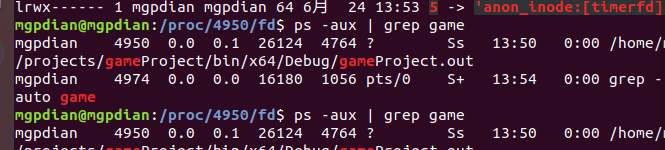
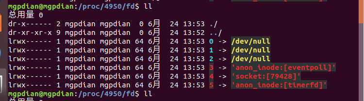

# 14 守护进程

**设计：**

- 判断启动参数，若为daemon则按照守护进程启动
- 启动守护进程时，创建子进程用于游戏业务；父进程用于接收子进程退出状态并重启子进程。

复习下守护进程的流程

1. 先`fork()`一个子进程 然后让父进程退出
2. 调用`setsid()`创建一个会话组 让子进程成为新的会话组长和进程组长
3. 禁止进程重新打开控制终端。经过以上步骤，进程已经成为一个无终端的会话组长，但是它可以重新申请打开一个终端。为了避免这种情况发生，可以通过使进程不再是会话组长来实现。再一次通过fork（）创建新的子进程，使调用fork的进程退出。
4. 重定向3个文件描述符 
5. 修改当前工作目录
6. 使用`umask(0)`清空从父进程继承的屏蔽字
7. 屏蔽`SIGCHLD`信号 

> ​	signal(SIGCHLD,  SIG_IGN);

6 7 可能不需要

```c++
//守护进程
void daemon_init()
{
	/*
	1、fork
	2、父进程退出
	3、子进程设置回话 ID
	4、子进程设置指向路径
	5、子进程重定向三个文件描述符
	*/
	//1 fork
	int m_ipid = fork();
	if (0 > m_ipid)
	{
		//异常退出
		exit(-1);
	}
	if (0 < m_ipid)
	{
		//2 父进程退出
		exit(0);
	}
	
	//3 子进程 设置会话ID
	setsid();
	//4 子进程 设置工作路径
	chdir("/home/mgpdian/projects/gameProject/bin/x64/Debug");
	//5 子进程 重定向3个文件描述符 /dev/null
	//如果是web 则可以关闭所有从父进程继承的不再需要的文件描述符 
	//但是这里我们要看 所以需要重定向
	//for (int i = 0; i < NOFILE; close(i++));
	int nullfd = open("/dev/null", O_RDWR);
	if (nullfd >= 0)
	{
		dup2(nullfd, 0);
		dup2(nullfd, 1);
		dup2(nullfd, 2);
		close(nullfd);
	}
	
	//这两个可能不需要
	//6 清空屏蔽字 umask(0)
	//umask(0);
	//7 屏蔽SIGCHLD信号
	//signal(SIGCHLD, SIG_IGN);
}

```

###  守护进程fork关掉父进程

- 设置回话ID
- 重定向0 1 2 
- 在 /proc/XXXX(pid)/fd/ 目录中可以查到当前进程打开的文件描述符

使用`ps -aux | grep game` 找到进程ID 4950




使用`cd /proc/4950` 加入进程文件夹

使用`ll` 可以看到文件描述符的情况了



