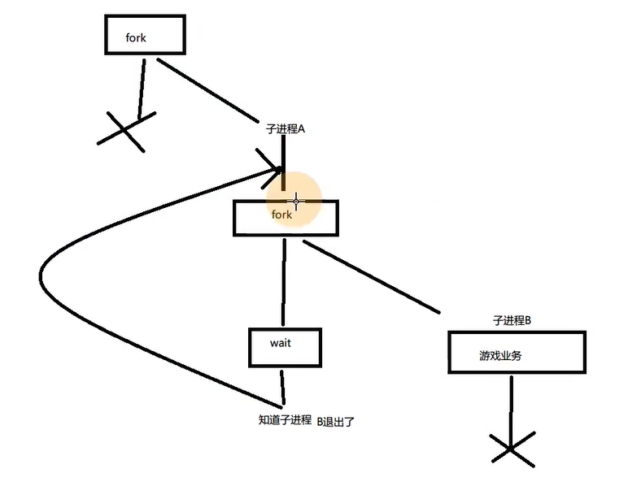

# 15 进程监控

bug一直存在  但我们可能一直找不到 等到实际使用的时候才会突然出现  导致程序崩溃

bug我们无法找到 但程序可以重启

思路:  首先是守护进程  的流程

然后 子进程再fork一次  一个主进程(就是第一个子进程) 启动wait 阻塞监听 新子进程 的状态 如果他异常退出  那就wait到 然后重新创建一个子进程 重新运行服务器



进程监控流程

- 加入循环 然后fork
- 父进程 wait
- 子进程 break

```c++

	while (1)
	{
		int pid = fork();
		if (0 > pid)
		{
			//异常退出
			exit(-1);
		}

		//父进程等待子进程退出
		if (0 < pid)
		{
			int iStatus = 0;
			wait(&iStatus);
			//判断是否是异常退出  

			//如果是正常退出  则正常退出
			if (0 == iStatus)
			{
				exit(0);
			}
		}
		//子进程跳出循环执行游戏业务
		else {
			break;
		}
	}
```

