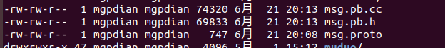
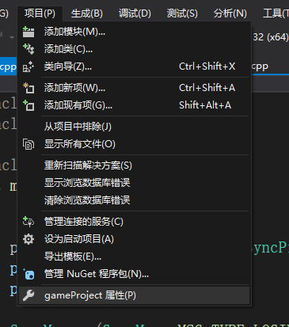
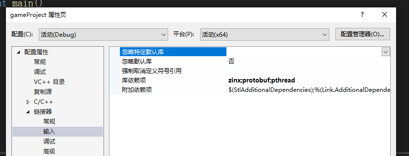
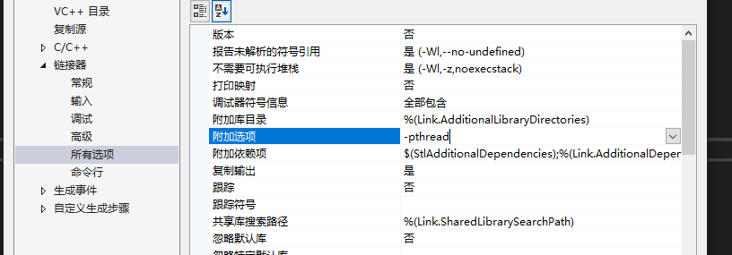

# 消息类实现

首先安装protobuf

然后是通过设置好的消息格式 提交给protobuf 让他生成相关的

.cc和.h文件

c++的调用为: --cpp_out=OUT_DIR

将msg.proto文件放入得

> protoc --cpp_out=. msg.proto

得到 mgs.pb.cc 和 mgs.pb.h  将他们移动项目文件夹中



## 消息类的实现

接下来是消息类的实现

```c++

class GameMsg :
    public UserData
{

public:
    enum MSG_TYPE {
        MSG_TYPE_LOGIN_ID_NAME = 1,
        MSG_TYPE_CHAT_CONTENT = 2,
        MSG_TYPE_NEW_POSITION = 3,
        MSG_TYPE_BROADCAST = 200,
        MSG_TYPE_LOGOFF_ID_NAME = 201,
        MSG_TYPE_SRD_POSITION = 202
    };
private:
    enum MSG_TYPE m_enMsgType;
    //客户端的请求的消息
    google::protobuf::Message * m_pMsg = nullptr;
public:
    GameMsg();
    virtual ~GameMsg();

    //已知消息内容创建消息对象
    GameMsg(MSG_TYPE _type, google::protobuf::Message* _pMsg);

    //将字节流内容转换成消息结构
    GameMsg(MSG_TYPE _type, std::string _stream);

    //获取google::protobuf::Message
    google::protobuf::Message* getMsg();

    //序列化本消息
    std::string serialize();


    //获取信号ID
    int getMsgType();

};

```

### 其中的类型分析

```c++
enum MSG_TYPE {
        MSG_TYPE_LOGIN_ID_NAME = 1,
        MSG_TYPE_CHAT_CONTENT = 2,
        MSG_TYPE_NEW_POSITION = 3,
        MSG_TYPE_BROADCAST = 200,
        MSG_TYPE_LOGOFF_ID_NAME = 201,
        MSG_TYPE_SRD_POSITION = 202
    };
enum MSG_TYPE m_enMsgType;
```

这个为传入的消息结构 也就是消息ID


下面这个为 请求信息 对象

```c++
//客户端的请求的消息
google::protobuf::Message * m_pMsg = nullptr;
```


### 函数的具体实现

构造和析构

```c++
GameMsg::GameMsg()
{
}

GameMsg::~GameMsg()
{
	if (nullptr != m_pMsg)
	{
		delete m_pMsg;
	}
}
```


```c++
//已知消息内容创建消息对象
GameMsg::GameMsg(MSG_TYPE _type, google::protobuf::Message* _pMsg) : m_enMsgType(_type), m_pMsg(_pMsg)
{
}
```

这个为直接将 已知的 类型和消息对象 赋值给消息类的 m_enMsgType 和 m_pMsg


下面的则将 字节流消息 根据需要的类型 转换成 对应的消息对象内容

原理是继承和多态

```c++
//将字节流内容转换成消息结构

GameMsg::GameMsg(MSG_TYPE _type, std::string _stream):m_enMsgType(_type)
{
	//通过简单工厂构造具体消息对象
	switch (_type)
	{
	case GameMsg::MSG_TYPE_LOGIN_ID_NAME: 
		m_pMsg = new pb::SyncPid();//玩家ID和玩家姓名
		break;
	case GameMsg::MSG_TYPE_CHAT_CONTENT: 
		m_pMsg = new pb::Talk();//聊天内容
		break;
	case GameMsg::MSG_TYPE_NEW_POSITION:
		m_pMsg = new pb::Position();//新位置
		break;
	case GameMsg::MSG_TYPE_BROADCAST:
		m_pMsg = new pb::BroadCast();//玩家ID，聊天内容/初始位置/动作（预留）/新位置
		break;
	case GameMsg::MSG_TYPE_LOGOFF_ID_NAME:
		m_pMsg = new pb::SyncPid();//玩家ID和玩家姓名
		break;
	case GameMsg::MSG_TYPE_SRD_POSITION:
		m_pMsg = new pb::SyncPlayers();//周围玩家们的位置
		break;
	default:
		break;
	}

	//将参数解析成消息对象内容
	m_pMsg->ParseFromString(_stream);
	
}

```

这个是将消息对象 序列号为字符串

```c++
//序列化本消息
std::string GameMsg::serialize()
{
	std::string ret;
	m_pMsg->SerializeToString(&ret);
	return ret;
}

```

总结

GameMsg类型的函数 重要负责反序列化

serialize负责序列化


### 测试

下面是测试用例s

```c++
//测试序列化
pb::SyncPid* pmsg = new pb::SyncPid();
	pmsg->set_pid(1);
	pmsg->set_username("test");

	GameMsg gm(GameMsg::MSG_TYPE_LOGIN_ID_NAME, pmsg);
	auto output = gm.serialize();

	for (auto byte : output)
	{
		printf("%02X", byte);
	}
	puts("");
//测试反序列化
	char buff[] = { 0x08, 0x01, 0x12, 0x04, 0x74, 0x65, 0x73, 0x74 };
	std::string input(buff, sizeof(buff));

	auto ingm = GameMsg(GameMsg::MSG_TYPE_LOGIN_ID_NAME, input);
	std::cout << dynamic_cast<pb::SyncPid*>(ingm.getMsg())->pid() << std::endl;
	std::cout << dynamic_cast<pb::SyncPid*>(ingm.getMsg())->username() << std::endl;
```

输出为

```c++
0801120474657374
1
test
```


### 编译问题


和zinx一样 需要添加连接





在连接器输入  的库依赖项 添加 protobuf 和 pthread (他解析时一个会启用一个线程来分析)  这是链接参数

同时 还需要添加 选项

在链接器的所有选项中的附加选项 添加-pthread   这是编译参数




# 新增

MultiMsg 类 来保存 GameMsg类的list 

让协议类可以一次读取多个GameMSg

```c++
class MultiMsg : public UserData
{
public:

    std::list<GameMsg*> m_Msgs;

    MultiMsg();
    virtual ~MultiMsg();
};
```

记得析构

```c++
MultiMsg::MultiMsg()
{
}

MultiMsg::~MultiMsg()
{
	for (auto& m_Msg : m_Msgs)
	{
		delete m_Msg;
	}
}

```

