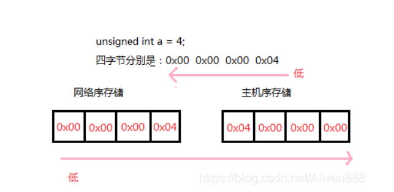

# 5 协议层实现

首先问题 TCP沾包

由于TCP是流数据  可能会沾在一起 也可能会分成几段发送 所以读取很重要

在这个问题的解决方式时 规定报文消息格式

|消息内容的长度（4个字节，低字节在前）|消息ID（4个字节，低字节在前）|消息内容

我们通过 消息内容长度 来决定每次读取的长度  不多读 也不少读


注意 消息内容长度 不包括消息ID的4字节长度

我们将接收的TCP流放入缓存中  每次读取消息内容的长度 消息ID 和消息内容的和的长度    

然后通过滑动窗口 来设置下次读取的位置


字节序转换

|消息内容的长度（4个字节，低字节在前）|消息ID（4个字节，低字节在前）|消息内容

为什么他们低字节要在前



因为他们传入时是网络字节序  低字节在前 

而我们是主机字节序  需要将网络字节序转换为主机字节序 

所以需要字节序转换

```c++

//在前四个字节中读取消息内容长度
//将网络字节序转换为主机字节序
    int iLength = 0;
    iLength |= m_dataCache[0] << 0;
    iLength |= m_dataCache[1] << 8;
    iLength |= m_dataCache[2] << 16;
    iLength |= m_dataCache[3] << 24;
```


一个字节有八位 所以要位移八位


# TCP粘包处理

- 数据要有边界
- 缓存 将未处理报文缓存 将新报文续到报文尾部
- 按照报文要求 一边处理一边滑动窗口


声明

```c++
#pragma once
#include <zinx.h>


//这里不要加头文件 会发生循环引用问题
class GameChannel;
class GameRole;

class GameProtocol :
    public Iprotocol
{
private:
    std::string m_dataCache;
    GameChannel* m_channel = nullptr;
    GameRole* m_role = nullptr;
public:
    GameProtocol();
    virtual ~GameProtocol();
    // 通过 Iprotocol 继承
    virtual UserData* raw2request(std::string _szInput) override;
    virtual std::string* response2raw(UserData& _oUserData) override;
    virtual Irole* GetMsgProcessor(UserDataMsg& _oUserDataMsg) override;
    virtual Ichannel* GetMsgSender(BytesMsg& _oBytes) override;

    void setGameChannel(GameChannel* _pChannel);
    void setGameRole(GameRole* _pRole);
    Irole* getGameRole();
    Ichannel* getGameChannel();
};


```

实现

构造和析构

```c++

GameProtocol::GameProtocol()
{
}

GameProtocol::~GameProtocol()
{//待补充
    if (nullptr != m_role)
    {
        ZinxKernel::Zinx_Del_Role(*m_role);
        delete m_role;
    }
    //由协议类 析构 专门处理他的业务类
    
}
```

读取原始版文  转换为消息对象 raw2request

并将这个对象通过GetMsgProcessor 转发给 因为业务层

```c++

//输入参数是通道传来的原始报文
//返回值是转换后的消息对象MultiMsg
//转换方式 TCP沾包处理
//|消息内容的长度（4个字节，低字节在前）|消息ID（4个字节，低字节在前）|消息内容|
UserData* GameProtocol::raw2request(std::string _szInput)
{
    MultiMsg* pRet = new MultiMsg();
    //拼接到之前的报文中
    m_dataCache.append(_szInput);


    while (true)
    {
        if (m_dataCache.size() < 8)
        {
            break;
        }
        //将网络字节序转换为主机字节序

        //在前四个字节中读取消息内容长度
        int iLength = 0;
        iLength |= m_dataCache[0] << 0;
        iLength |= m_dataCache[1] << 8;
        iLength |= m_dataCache[2] << 16;
        iLength |= m_dataCache[3] << 24;

        //中四个字节读类型id
        int id = 0;
        id |= m_dataCache[4] << 0;
        id |= m_dataCache[5] << 8;
        id |= m_dataCache[6] << 16;
        id |= m_dataCache[7] << 24;

        //通过读到的长度判断后序报文是否合法
        if (m_dataCache.size() - 8 < iLength)
        {
            //本条报文长度不够 直接返回 等待下一条报文  
            break;
        }

        //构造一条用户请求
        GameMsg* pMsg = new GameMsg((GameMsg::MSG_TYPE)id, m_dataCache.substr(8, iLength));

        pRet->m_Msgs.emplace_back(pMsg);
        //得到读取后剩下的报文
        //m_dataCache = m_dataCache.substr(8 + iLength, m_dataCache.size() - 8 - iLength);
        //比较效率的写法
        m_dataCache.erase(0, 8 + iLength);

    }
    
    return pRet;
}

```

这个是测试用例

```c++
 //测试
    /*<----------------------------------------->
        recv from 5:09 00 00 00 01 00 00 00 08 01 12 05 6C 6C 6C 6C 6B
        < ----------------------------------------->
        Pid: 1
        Username : "llllk"*/
  /*  for (auto& single : pRet->m_Msgs)
    {
        std::cout << single->getMsg()->Utf8DebugString() << std::endl;
    }*/
```


将收到 消息对象转换为 序列化字符串 response2raw

并将这个字符串通过 GetMsgSender 转发给 通道类

```c++

//参数来自业务层 待发送的消息
//返回值为转换后的字节流
std::string* GameProtocol::response2raw(UserData& _oUserData)
{
    int iLength = 0;
    int id = 0;
    std::string MsgContent;

    GET_REF2DATA(GameMsg, oOutput, _oUserData);
    id = oOutput.getMsgType();
    MsgContent = oOutput.serialize(); //使用序列化返回字符串
    iLength = MsgContent.size();


    auto pret = new std::string();
    //要将长度和id 转换成网络字节序
    //要和之前的倒过来
   
    pret->push_back((iLength >> 0) & 0xff);//只要后8位 所以要与0xff
    pret->push_back((iLength >> 8) & 0xff);
    pret->push_back((iLength >> 16) & 0xff);
    pret->push_back((iLength >> 24) & 0xff);


    pret->push_back((id >> 0) & 0xff); // 只要后8位 所以要与0xff
    pret->push_back((id >> 8) & 0xff);
    pret->push_back((id >> 16) & 0xff);
    pret->push_back((id >> 24) & 0xff);


    pret->append(MsgContent); 
   
    return pret;
}

```

测试

```c++
 pb::Talk* pmsg = new pb::Talk();
    pmsg->set_content("hello");
    GameMsg* pGameMsg = new GameMsg(GameMsg::MSG_TYPE_CHAT_CONTENT, pmsg);
    ZinxKernel::Zinx_SendOut(*(pGameMsg), *this);
    //返回的数据 也就是 长度 id  hello
    //0:04 : 18 收到数据：{ 07 00 00 00 02 00 00 00 0A 05 68 65 6C 6C 6F }

```


转发至业务类 GetMsgProcessor

```c++
Irole* GameProtocol::GetMsgProcessor(UserDataMsg& _oUserDataMsg)
{
    return m_role;
}
```


转发至通道类GetMsgSender

```c++
//返回数据发送的通道
Ichannel* GameProtocol::GetMsgSender(BytesMsg& _oBytes)
{
    return m_channel;
}
```

其他函数 设置 通道类和业务类

```c++

void GameProtocol::setGameChannel(GameChannel* _pChannel)
{
    this->m_channel = _pChannel;
}

void GameProtocol::setGameRole(GameRole* _pRole)
{
    this->m_role = _pRole;
}

Irole* GameProtocol::getGameRole()
{
    return this->m_role;
}

Ichannel* GameProtocol::getGameChannel()
{
    return this->m_channel;
}

```

