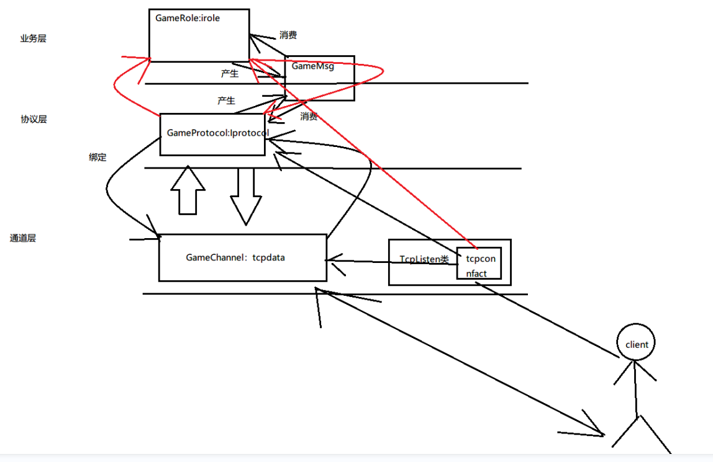
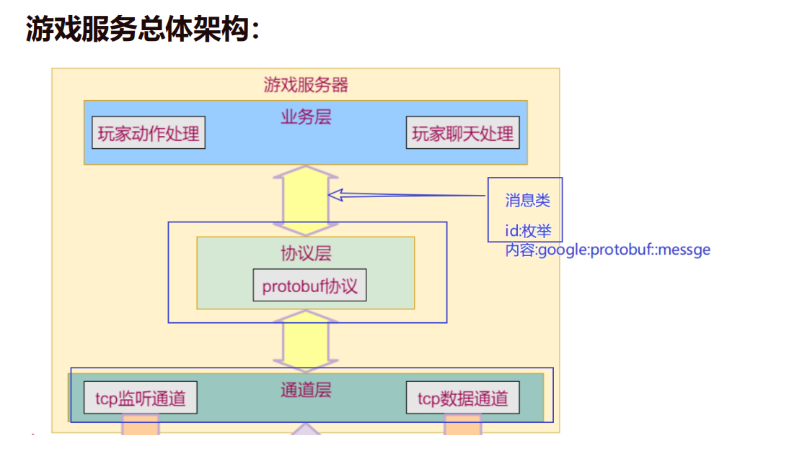

# 6 游戏架构流程整理

流程实现解析

一个客户端连接到来,  TCPListen类 监听端口 检测到有连接到来 生成一个工厂类  工厂类生成一个 Tcpdata类 的子类  即GameChannel,  来作为负责该连接的专属通道层类 , 同理 生成一个 Iprotocol类的子类GameProtocol来负责协议层  , 再生成一个Irole的子类 GameRole来负责 业务层 , 

同时 他们在生成的同时  GameChannel 和 GameProtocol 相互绑定

GameProtocol 和 GameRole 相互绑定,  解析时 由GameProtocol  析构 GameRole  再由GameChannel 析构GameProtocol  

其中  GameChannel 作为连接的 输出和 输入 通道

GameProtocol  处理 接收到的数据 将他们转换为协议的内容 或者 将协议的内容 转换为 序列化字符串  再将他们 转发给对应的业务层 或者 通道层 

GameProtocol  转发到业务层 是通过 生成一个 MultiMsg 类 他拥有一个 list  来接收多个 GameMsg   由业务层接收  

同理 业务层 生成数据后 也会产生一个 MultiMsg  由协议层接收

