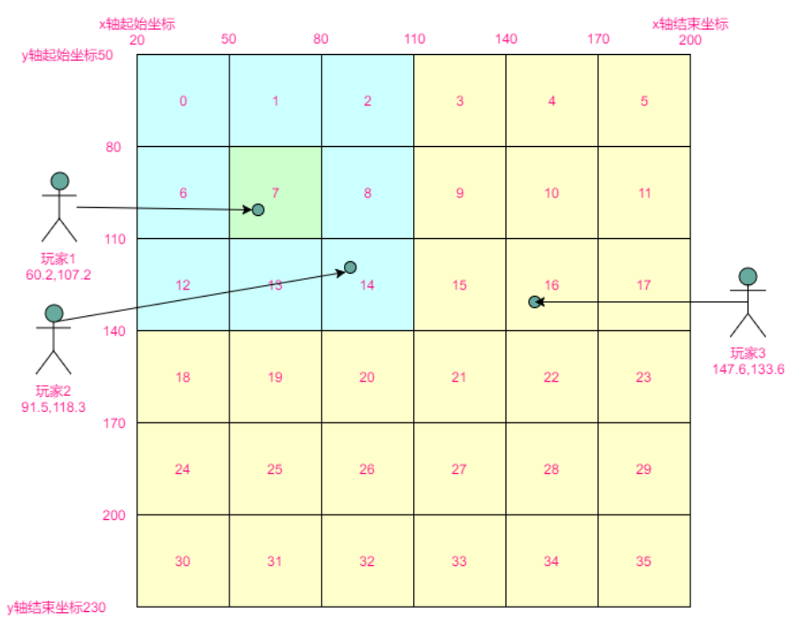

# 7 业务类实现- AOI算法

游戏相关的核心消息处理逻辑都是要在该类中实现的。

**需求回首：**

- 新客户端连接后，向其发送ID和名称
- 新客户端连接后，向其发送**周围**玩家的位置
- 新客户端连接后，向**周围**玩家发送其位置
- 收到客户端的移动信息后，向**周围**玩家发送其新位置
- 收到客户端的移动信息后，向其发送**周围新**玩家位置
- 收到客户端的聊天信息后，向**所有**玩家发送聊天内容
- 客户端断开时，向**周围**玩家发送其断开的消息

关键字：周围。

以上所列出的需求，基本都是这样的套路：在XXX的时候，发送XXX给XXX。

- 发送时机
- 消息内容
- **发送对象：怎样表示周围玩家？**

## AOI设计与实现

###  AOI算法简介

**定义：** 获取感兴趣的区域（Area Of Interest）的算法。

**解决的问题：** 形成周围的概念。在多人游戏中，各个游戏客户端之间需要通过服务器向彼此更新自身状态。但对于当玩家来说，我们不需要获取“太远”的玩家的信息，所以，在服务器端，我们通过AOI算法可以获取到某个客户端“周围”的玩家，进而只在该小范围内同步信息。

**网格法AOI**：

- 参考游戏世界的坐标，创建一个边界相同的矩形。
- 选取适当的颗粒度，将矩形分割成几×几的网格。
- 每个客户端都要按照实际坐标添加到某个格子里。
- 客户端所在格子的周围八个格子内的玩家就是周围玩家。

**举例：** 世界坐标是X[20,200]，Y[50,230]，划分成6×6的网格为：



- 已知玩家坐标（x，y），该玩家在几号网格？

> 网格编号=(x-x轴起始坐标)/x轴网格宽度 + (y-y轴起始坐标)/y轴宽度*x轴网格数量 x轴网格宽度=(x轴结束坐标-x轴起始坐标)/x轴网格数量；y轴的计算方式相同

- 已知玩家在n号网格，周围的格子(包括自己)有哪些？


#### 总结:

- 目的: 获取周围玩家
- 模型: 将游戏世界的坐标分割成网格 玩家属于某个网格
- 周围: 玩家所属网格周围8个相邻网格内的玩家
- 游戏世界矩形(地图): 包含 固定数量网格对象的容器
- 网格对象 包含若干玩家的容器
- 玩家 拥有横纵坐标的对象


## AOI算法实现

- 面向接口编程: 定义AOI_Player类 来 表示网格内玩家, 提供纯虚函数来获取玩家坐标
- 网格类用于存放网格内的玩家 封装一个list用来添加和删除玩家
- 世界地图类用于构造和表示所有网格
  - 属性：x和y轴的起始结束坐标，x和y轴的网格数
  - 网格表示：封装一个vector存放所有的网格对象，网格序号按照vector存储序号表示
  - 主要函数：根据坐标获取网格，根据网格号获取周围网格


### 世界地图类实现

- 构造函数 : 边界相关属性的赋值 创建网格
- 添加玩家的函数: 计算玩家所属网格 添加他
- 删除玩家函数 计算玩家所属网格 移除他

```c++

#pragma once
#include <list>
#include <vector>
//玩家类
//拥有横纵坐标的对象
class Player {
public:
	virtual int GetX() = 0;
	virtual int GetY() = 0;
};

//网格类 (这个块有多少玩家)
class Grid {
public:
	std::list<Player*> m_players; //因为玩家可能会频繁移动
};


//游戏世界矩形 (地图)
class AOIWorld
{
private:
	//地图大小
	int x_begin = 0;
	int x_end = 0;
	int y_begin = 0;
	int y_end = 0;
	// 横纵轴都要分成几份
	//网格大小
	int x_count = 0;
	int y_count = 0;
	int x_width = 0;
	int y_width = 0;
public:
	std::vector<Grid> m_grids; 

	//通过构造函数指定矩形的大小和分割颗粒
	AOIWorld(int _x_begin, int _x_end, int _y_begin, int _y_end,
		int _x_count, int _y_count);
	virtual ~AOIWorld();

	//获取周围玩家
	std::list<Player*> GetSrdPlayers(Player* _player);

	//添加玩家到AOI网格
	bool AddPlayer(Player* _player);

	//摘除玩家 (玩家不一定要被删除 可能只是移动到下一个网格中
	void DelPlayer(Player* _player);
	
};


```


### AOIWorld 具体实现

构造函数

计算公式: x轴网格宽度=(x轴结束坐标-x轴起始坐标)/x轴网格数量；y轴的计算方式相同

来计算出需要的网格的大小 并且创建网格类

```c++
//通过构造函数指定矩形的大小和分割颗粒
AOIWorld::AOIWorld(int _x_begin, int _x_end, int _y_begin, int _y_end, int _x_count, int _y_count)
	: x_begin(_x_begin),x_end(_x_end),y_begin(_y_begin),y_end(_y_end),x_count(_x_count),y_count(_y_count)
{
	//x轴网格宽度=(x轴结束坐标-x轴起始坐标)/x轴网格数量；y轴的计算方式相同
	x_width = (x_end - x_begin) / x_count;
	y_width = (y_end - y_begin) / y_count;

	//创建网格类
	for (int i = 0; i < x_count * y_count; i++)
	{
		Grid tmp;
		m_grids.emplace_back(tmp);
	}
}
```

核心获取周围的玩家

计算方法


```c++
//获取周围玩家
std::list<Player*> AOIWorld::GetSrdPlayers(Player* _player)
{
	std::list<Player *> ret;
	
	//计算所属编号
	int grid_id = (_player->GetX() - x_begin) / x_width + (_player->GetY() - y_begin) / y_width * x_count;
	//访问周围的网格

	//计算读取网格的横纵网格数目位置
	int x_index = grid_id % x_count;
	int y_index = grid_id / x_count;

	//左上 grid_id - 1 - x_count
	if (x_index > 0 && y_index > 0)
	{
		std::list<Player*>& cur_list = m_grids[grid_id - 1 - x_count].m_players;
		ret.insert(ret.begin(), cur_list.begin(), cur_list.end());
	}
	
	//正上方 grid_id  - x_count
	if (y_index > 0)
	{
		std::list<Player*>& cur_list = m_grids[grid_id  - x_count].m_players;
		ret.insert(ret.begin(), cur_list.begin(), cur_list.end());
	}

	//右上 grid_id - x_count + 1
	if (x_index < x_count - 1 && y_index > 0)
	{
		std::list<Player*>& cur_list = m_grids[grid_id - x_count + 1].m_players;
		ret.insert(ret.begin(), cur_list.begin(), cur_list.end());
	}

	//正左 grid_id - 1
	if (x_index > 0)
	{
		std::list<Player*>& cur_list = m_grids[grid_id - 1].m_players;
		ret.insert(ret.begin(), cur_list.begin(), cur_list.end());
	}
	{
	
	}
	//自己 正中 grid_id
	std::list<Player*>& cur_list = m_grids[grid_id].m_players;
	ret.insert(ret.begin(), cur_list.begin(), cur_list.end());

	//正右 grid_id + 1
	if (x_index < x_count - 1)
	{
		std::list<Player*>& cur_list = m_grids[grid_id + 1].m_players;
		ret.insert(ret.begin(), cur_list.begin(), cur_list.end());
	}

	//左下 grid_id - 1 + x_count
	if (x_index > 0 && y_index < y_count - 1)
	{
		std::list<Player*>& cur_list = m_grids[grid_id - 1 + x_count].m_players;
		ret.insert(ret.begin(), cur_list.begin(), cur_list.end());
	}

	//正下 grid_id + x_count
	if (y_index < y_count - 1)
	{
		std::list<Player*>& cur_list = m_grids[grid_id + x_count].m_players;
		ret.insert(ret.begin(), cur_list.begin(), cur_list.end());
	}

	//右下 grid_id + 1 + x_count
	if (x_index < x_count - 1  && y_index < y_count - 1)
	{
		std::list<Player*>& cur_list = m_grids[grid_id + 1 + x_count].m_players;
		ret.insert(ret.begin(), cur_list.begin(), cur_list.end());
	}


	return ret;
}

```


添加和移除

```c++

//添加玩家到AOI网格
bool AOIWorld::AddPlayer(Player* _player)
{
	//计算所属网格号
	//添加到该网格中
	// //x轴网格宽度=(x轴结束坐标-x轴起始坐标)/x轴网格数量；y轴的计算方式相同
	
	//网格编号 = (x-x轴起始坐标)/x轴网格宽度 + (y-y轴起始坐标)/y轴宽度 * x轴网格数量 
	int grid_id = (_player->GetX() - x_begin) / x_width + (_player->GetY() - y_begin) / y_width * x_count;

	//添加到该网格中
	m_grids[grid_id].m_players.emplace_back(_player);

	
	return false;
}

//摘除玩家 (玩家不一定要被删除 可能只是移动到下一个网格中
void AOIWorld::DelPlayer(Player* _player)
{
	int grid_id = (_player->GetX() - x_begin) / x_width + (_player->GetY() - y_begin) / y_width * x_count;
	
	m_grids[grid_id].m_players.remove(_player);
}

```


### 测试

```c++
//测试地图类
class myPlayer : public Player
{
public:
	myPlayer(int _x, int _y, std::string _name) : x(_x), y(_y) , name(_name){}
	int x;
	int y;
	std::string name;
	// 通过 Player 继承
	virtual int GetX() override
	{
		return x;
	}
	virtual int GetY() override
	{
		return y;
	}
};
```

```c++
//测试 地图类
	AOIWorld w(20, 200, 50, 230, 6, 6);

	myPlayer p1(60, 107, "1");
	myPlayer p2(91, 118, "2");
	myPlayer p3(147, 133, "3");

	w.AddPlayer(&p1);
	w.AddPlayer(&p2);
	w.AddPlayer(&p3);

	auto srd_list = w.GetSrdPlayers(&p1);
	for (auto& single : srd_list)
	{
		//dynamic_cast<myPlayer*> (single);
		std::cout << dynamic_cast<myPlayer*> (single) -> name << std::endl;
	}
```

结果  3不在周围

```c++
2
1
```

