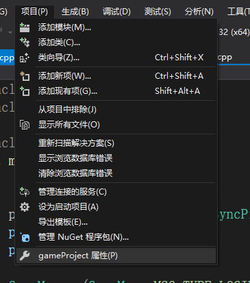
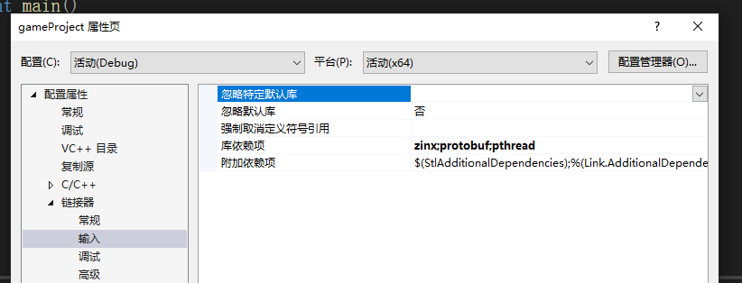
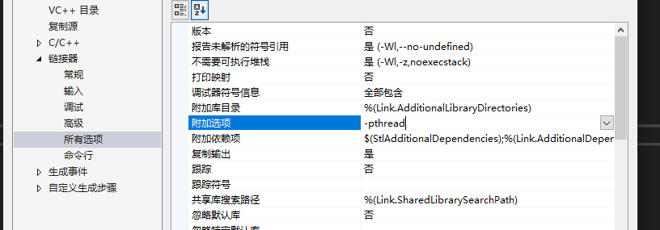

protobuf使用

使用

> #include <google/protobuf/message.h>

> google::protobuf::Message * m_pMsg = nullptr;

和zinx一样 需要添加连接

在连接器输入  的库依赖项 添加 protobuf 和 pthread (他解析时一个会启用一个线程来分析)  这是链接参数

同时 还需要添加 选项

在链接器的所有选项中的附加选项 添加-pthread   这是编译参数

