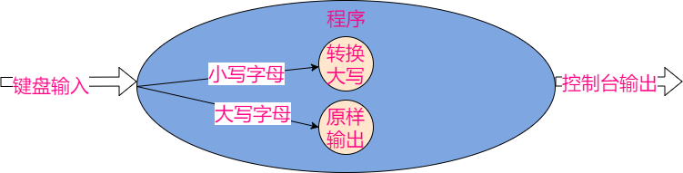
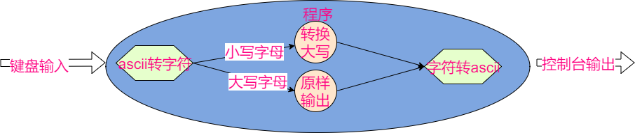
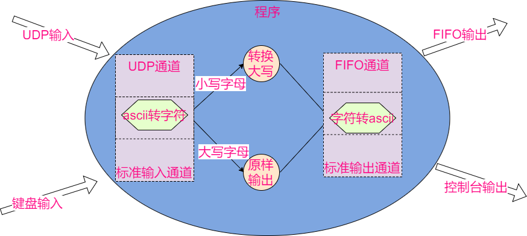
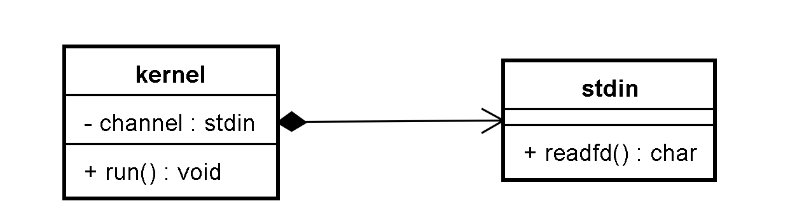
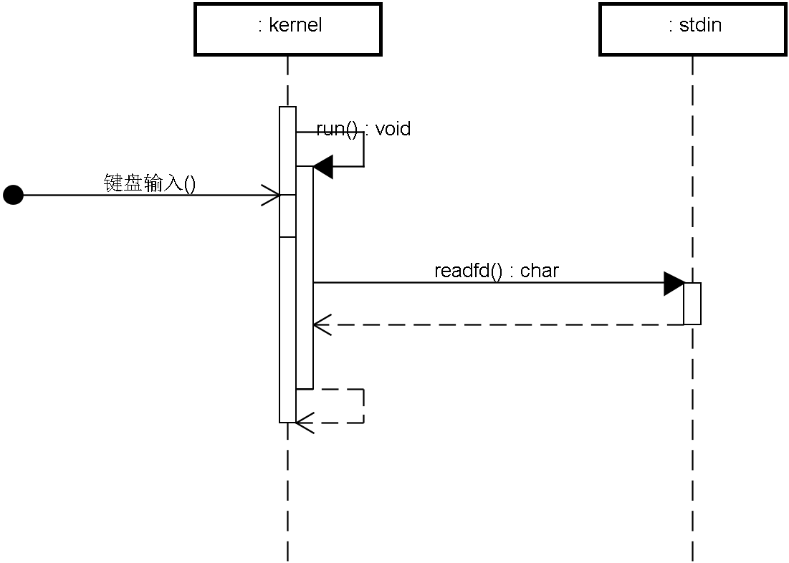

# 1 Zinx实现- 简单场景


# 框架设计

设计zinx框架用于处理IO并发。

从简单场景入手，考虑易变化的部分。

## 1.1. 简单场景

键盘输入字符，控制台直接输出该字符


## 1.2. 功能多样化

若输入小写字母，则输出大写字母，若输入大写字母则原样输出



## 1.3. 数据多样化

输入和输出均要字母的ascii码



## 1.4. 通道多样化

UDP输入数据，输出到FIFO文件



# 2实现---》重构---》实现

- 面向对象的设计方法：将用例图中的每个实体转换成类
- 为每个类设计成员（方法为主）
- 先设计实体类，再逐步抽象抽象类

## 2.1单一业务编写

键盘输入字符，控制台直接输出该字符


**需求：**读取标准输入，回显到标准输出

**类设计：**标准输入通道类，框架核心类



**功能流程：**

- kernel类提供run函数用于在接收到键盘输入后调用stdin的读取函数，然后输出内容（epoll）
- stdin类只负责提供读取标准输入的函数



**对象构造时机：**

- 核心类：程序运行前创建，全局单例
- 标准输入类：进入IO循环前创建，添加到kernel对象


我们先通过实现1.1简单的场景 来实现最简单的核心类和 通道类

通道类负责输入 而核心类则负责接受通道类的数据 进行处理


## 简单通道类实现 

负责读取 屏幕的输入

### 数据结构

```c++
class StdInChannel
{
public:
	StdInChannel();
	virtual ~StdInChannel();

	std::string ReadFd();
};
```

### 实现

```c++
std::string StdInChannel::ReadFd()
{
	std::string ret;
	std::cin >> ret;

	return ret;
}
```


## 核心类实现

核心类 负责 IO多路复用的epoll控制 

### 数据结构

```c++

class ZinxKernel
{
private:
	StdInChannel* m_channel = nullptr;
	int m_epollfd = -1;
public:
	ZinxKernel();
	virtual ~ZinxKernel();

	void run();

	void AddChannel(StdInChannel* _pChannel);
	
	void DelChannel(StdInChannel* _pChannel);
	StdInChannel* GetChannel()
	{
		return this->m_channel;
	}
};
```

使用AddChannel 和 DelChannel 来实现 对通道类的上树和下树

现在先将通道类的文件描述符设置为0  这意味着 当屏幕输入时 会触发epoll树  触发后 会调用通道类的ReadFd() 函数 这时候函数会去读取屏幕的数据 然后返回给核心类  这时候核心类对其进行输出

### 实现

#### 初始化 

创建epoll树 (后面应该会将其改到Init和Fint)

```c++
ZinxKernel::ZinxKernel()
{
	int fd = epoll_create(1);
	if (fd >= 0)
	{
		m_epollfd = fd;
	}
}

ZinxKernel::~ZinxKernel()
{
	if (-1 != m_epollfd)
	{
		close(m_epollfd);
	}
	
}
```

#### 运行函数Run()

开始运行  epoll_wait

当有屏幕输入事件发生时 触发epoll树 将这个epoll_event 放入链表中, 然后在遍历链表时 调用`event.data.ptr`指针的`Readfd()` 来获得屏幕输入的数据 然后打印出来

```c++

void ZinxKernel::run()
{

	while (true)
	{
		//1 等传入 (epoll) 
		struct epoll_event astEvents[200];
		int ready_count = epoll_wait(m_epollfd, astEvents, 200, -1);
		if (0 == ready_count)
		{
			if (EINTR == errno)
			{
				// 被信号打断 则继续循环
				continue;
			}
		}
		//2 调用输入通道的读取函数
		for (int i = 0; i < ready_count; ++i)
		{
			//将void* 强转成 StdInChannel*
			StdInChannel* pchannel = static_cast<StdInChannel*>(astEvents[i].data.ptr);

			std::string content = pchannel->ReadFd();

			//3 回显到标志输出
			std::cout << content << std::endl;
		}
	}
	
	
}

```

#### 通道类的加入和删除

通道类作为指针传入 

使用一个`epoll_event` 的data.ptr 将该指针记录

data.fd 设置为文件描述符0 即 屏幕输入

事件设置为EPOLLIN 输入事件

将这个`epoll_event` 添加到epoll树中

```c++
void ZinxKernel::AddChannel(StdInChannel* _pChannel)
{
	//将参数和文件描述符0 关联起来 (epoll_ctl)

	struct epoll_event stEvent;
	stEvent.events = EPOLLIN;
	stEvent.data.ptr = _pChannel; 
	stEvent.data.fd = 0;
	epoll_ctl(m_epollfd, EPOLL_CTL_ADD, 0, &stEvent);

}

void ZinxKernel::DelChannel(StdInChannel* _pChannel)
{
	epoll_ctl(m_epollfd, EPOLL_CTL_DEL, 0, nullptr);
}
```

