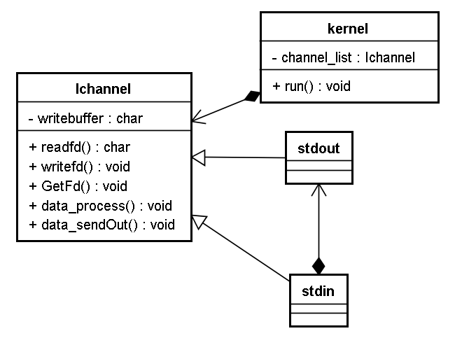
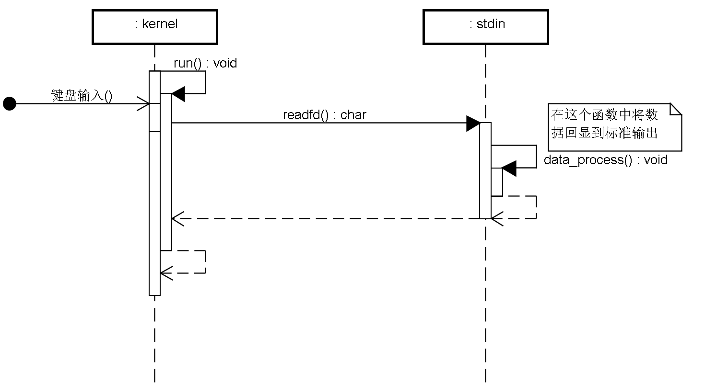
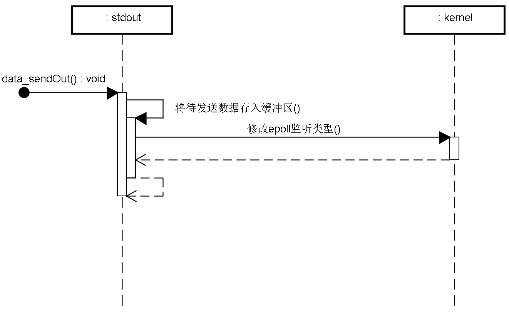
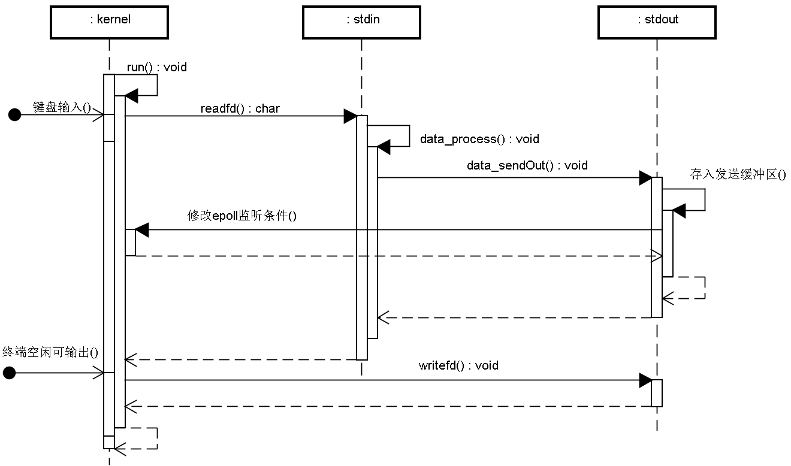

# 2  输出扩展---》抽象


键盘输入字符，控制台直接输出该字符


我们需要通过一个类在封装输出功能

定义标准输出类stdout，添加到epoll中，在EPOLLOUT时执行write

**遇到的问题：**输入通道类stdin和输出通道类stdout与很多相同点，无需写重复代码

**抽象：**定义通道抽象类，把输入和输出的不同通过虚函数扩展

**通道抽象类设计**：

- 提供虚函数用于泛化读写
- 提供虚函数用于返回对应的文件描述符
- epoll处理输出，所以需要输出缓冲区
- 对外：提供输出数据调用（将数据放到输出缓冲区，等待epoll调用）
- 对外：提供泛化扩展，用于处理输入的数据

**kernel类适配修改**：

- 用抽象类指针list存储当前需要侦听的channel
- 根据需求动态地调整epoll事件的监听种类

**stdin类重构，stdout类创建**:

- 继承抽象通道类，实现纯虚函数



数据输入处理：



输出数据处理



总流程：



我们抽象出一个通道类IChannel 让stdin和stdout来继承  这样可以减少重复代码

### 头文件 

IChannel

```c++
class IChannel
{
private:
	std::string m_buffer;
public:
	IChannel();
	virtual ~IChannel();

	virtual std::string ReadFd() = 0;
	//不直接调用Writefd 只是存到缓存 m_buffer 并修改 epoll, 等到 epoll 返回再发, 通用函数
	virtual void WriteFd(std::string _output) = 0;

	virtual int GetFd() = 0;

	virtual void data_process(std::string _input) = 0;

	//不直接调用Writefd 只是存到缓存 m_buffer 并修改 epoll, 等到 epoll 返回再发, 通用函数
	virtual void data_sendout(std::string _output);


	// 向外刷出缓存数据 内部调用 WriteFd 这个才是真正的输出函数
	//由这个来调用writefd
	void FlushOut();
};


```

ZinxKernel

```c++
//单例 让其他类可以对epoll进行修改 (指读写切换)
class ZinxKernel
{
private:
	StdInChannel* m_channel = nullptr;
	std::list<IChannel*> m_channel_list; //代表所有通道
	int m_epollfd = -1;
	ZinxKernel();
	virtual ~ZinxKernel();
	static ZinxKernel g_kernel;
public:
	static ZinxKernel& GetInstance()
	{
		return g_kernel;
	}

	void run();

	//添加通道顺便将通道 fd 和 epoll 关联起来
	void AddChannel(IChannel* _pChannel);
	//删除通道顺便将通道 fd 移除 epoll
	void DelChannel(IChannel* _pChannel);
	// 修改 epoll 的监听类型
	// 添加输出的监听方向
	void ModChannel_AddOut(IChannel* _pChannel);
	// 删除输出的监听方向
	void ModChannel_DelOut(IChannel* _pChannel);

	StdInChannel* GetChannel()
	{
		return this->m_channel;
	}


};

class StdInChannel:public IChannel
{
private:
	
public:
	StdInChannel();
	virtual ~StdInChannel();

	StdOutChannel* m_out = nullptr;
	

	// 通过 IChannel 继承
	virtual std::string ReadFd() override;
	virtual void WriteFd(std::string _output) override;
	virtual int GetFd() override;
	virtual void data_process(std::string _input) override;

	
	
};

class StdOutChannel:public IChannel
{
public:
	StdOutChannel();
	virtual ~StdOutChannel();


	// 通过 IChannel 继承
	virtual std::string ReadFd() override;

	virtual void WriteFd(std::string _output) override;

	virtual int GetFd() override;

	virtual void data_process(std::string _input) override;

};

```


### 实现

IChannel

```c++

//输出数据 将参数记录到缓存中
void IChannel::data_sendout(std::string _output)
{
	m_buffer.append(_output.begin(), _output.end());

	//修改epoll监听类型 添加out方向的监听
	ZinxKernel::GetInstance().ModChannel_AddOut(this);

}

void IChannel::FlushOut()
{
	WriteFd(m_buffer);
}

```

ZinxKernel

```c++
#include "ZinxKernel.h"
#include <sys/epoll.h>
#include <unistd.h>
#include <iostream>

//创建单例实例
ZinxKernel ZinxKernel::g_kernel;


ZinxKernel::ZinxKernel()
{
	int fd = epoll_create(1);
	if (fd >= 0)
	{
		m_epollfd = fd;
	}
}

ZinxKernel::~ZinxKernel()
{
	if (-1 != m_epollfd)
	{
		close(m_epollfd);
	}
	
}

void ZinxKernel::run()
{

	while (true)
	{
		//1 等传入 (epoll) 
		struct epoll_event astEvents[200];
		int ready_count = epoll_wait(m_epollfd, astEvents, 200, -1);
		if (0 == ready_count)
		{
			if (EINTR == errno)
			{
				// 被信号打断 则继续循环
				continue;
			}
		}
		//2 调用通道的读取函数或者写出函数
		for (int i = 0; i < ready_count; ++i)
		{
			if (0 != (astEvents[i].events & EPOLLIN))
			{
				//需要处理外部输入的数据
				//1 读取数据
				//将void* 强转成 IChannel*
				IChannel* pchannel = static_cast<IChannel*>(astEvents[i].data.ptr);
				std::string content = pchannel->ReadFd();
				
				//2 处理数据
				pchannel->data_process(content);
			}
			if (0 != (astEvents[i].events & EPOLLOUT))
			{
				//需要向外输出的数据
				IChannel* pchannel = static_cast<IChannel*>(astEvents[i].data.ptr);
				pchannel->FlushOut();
				//删除输出方向的epoll监听 修改为只有输入的监听
				ModChannel_DelOut(pchannel);
			}
			

			//3 回显到标志输出
			//std::cout << content << std::endl;
		}
	}
	
	
}


void ZinxKernel::AddChannel(IChannel* _pChannel)
{
	//将参数和文件描述符0 关联起来 (epoll_ctl)

	struct epoll_event stEvent;
	stEvent.events = EPOLLIN;
	stEvent.data.ptr = _pChannel; 
	
	
	epoll_ctl(m_epollfd, EPOLL_CTL_ADD, _pChannel->GetFd(), &stEvent);

}

void ZinxKernel::DelChannel(IChannel* _pChannel)
{
	epoll_ctl(m_epollfd, EPOLL_CTL_DEL, _pChannel->GetFd(), nullptr);
}


//当输入的通道得到数据后 会把数据传给输出通道的缓冲区 同时 把epoll添加输出信号
void ZinxKernel::ModChannel_AddOut(IChannel* _pChannel)
{
	struct epoll_event stEvent;
	stEvent.events = EPOLLIN | EPOLLOUT;
	stEvent.data.ptr = _pChannel;
	
	epoll_ctl(m_epollfd, EPOLL_CTL_MOD, _pChannel->GetFd(), &stEvent);
}

//得到输出信号后 输出数据后 修改为输入信号
void ZinxKernel::ModChannel_DelOut(IChannel* _pChannel)
{
	struct epoll_event stEvent;
	stEvent.events = EPOLLIN;
	stEvent.data.ptr = _pChannel;
	
	//stEvent.data.fd = _pChannel->GetFd();
	epoll_ctl(m_epollfd, EPOLL_CTL_MOD, _pChannel->GetFd(), &stEvent);
}
```

抽象类实现

StdInChannel

```c++

std::string StdInChannel::ReadFd()
{
	std::string ret;
	std::cin >> ret;

	return ret;
}

void StdInChannel::WriteFd(std::string _output)
{
}

int StdInChannel::GetFd()
{
	return 0;
}

void StdInChannel::data_process(std::string _input)
{
	//将数据回显到标准输出 
	//调用标准输出通道对象的sendout函数
	m_out->data_sendout(_input);

}

```

StdOutChannel

```c++

std::string StdOutChannel::ReadFd()
{
    return std::string();
}

void StdOutChannel::WriteFd(std::string _output)
{
    std::cout << _output << std::endl;
}

int StdOutChannel::GetFd()
{
    return 1;
}

void StdOutChannel::data_process(std::string _input)
{
}
```


mian

```c++
#include <iostream>

#include "ZinxKernel.h"
#include "StdInChannel.h"
int main()
{
	StdInChannel in_channel;
	StdOutChannel out_channel;
	in_channel.m_out = &out_channel;

	ZinxKernel &kernel = ZinxKernel::GetInstance();
	kernel.AddChannel(&in_channel);
	kernel.AddChannel(&out_channel);
	kernel.run();

	return 0;
}
```

### 遇到问题

套接字添加和修改

```c++
struct epoll_event stEvent;
	stEvent.events = EPOLLIN;
	stEvent.data.ptr = _pChannel; 
	
	
	epoll_ctl(m_epollfd, EPOLL_CTL_ADD, _pChannel->GetFd(), &stEvent);
```

如果添加 `stEvent.data.fd = _pChannel->GetFd();`会无法读取

原因应该是 添加后 表示你要从fd文件套接字的缓冲区读取数据  但你没读 导致报错


# 回显功能的实现方式 

- kernel类：基于epoll调度所有通道
- 通道抽象类：
  - 写出缓冲区函数
  - 将数据追加到缓冲区的函数, 并将输出通道的fd添加out
  - 虚函数：读，写，获取fd，数据处理
- 标准输入通道子类
  - 重写读和处理的函数
  - 处理数据的函数：将数据交给输出通道
- 标准输出通道子类
  - 重写写数据的函数
- kernel和通道类的调用
  - 创建通道对象（成员赋值）
  - 添加通道到kernel 
  - run