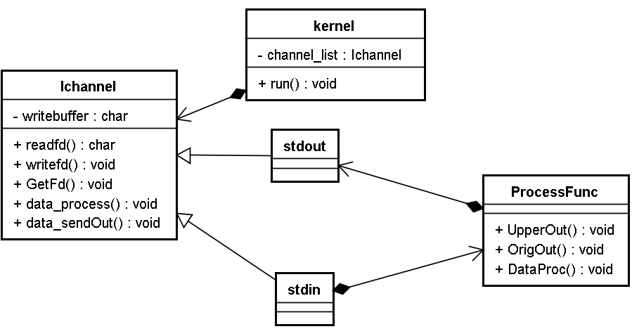
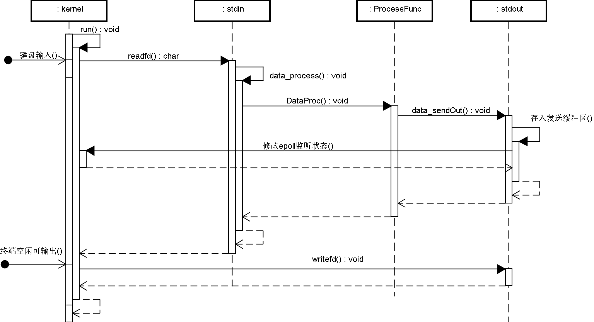

# 4 功能多样化

**需求**：若输入的是大写字母则原样输出，若不是则转大写输出

**类设计**：创建功能处理类，用于判断输入的字符是大写还是小写。无论输入是什么，都将其交给该类处理（依赖倒置）



**功能流程：**

- stdin通道类中包含一个功能处理类对象
- 功能处理类中包含一个stdout类对象
- 数据被读取到stdin通道，stdin通道将其交给功能处理类对象，该对象判断数据特点后转大写或直接交个stdout类对象进行输出



# 添加转大写功能

- 写新类（数据处理类）封装转换大写字母的功能
- 拆掉标准输入通道和标准输出通道的包含关系，在标准输入通道中包含数据处理类的对象
- 数据处理类中包含输出通道对象

### 逻辑实现流程

写一个数据处理类 来实现大小写功能

该类有一个指针指向 输出通道对象

而输入通道对象 也有一个指针指向这个数据处理类

当数据到来时 输入通道对象会根据这个指针将数据发送给该类  然后该类处理后 转发给输出通道类

### 具体实现

数据处理类 ProcessFunc

```c++
class ProcessFunc
{
public:

	IChannel* m_out = nullptr;
	ProcessFunc();
	virtual ~ProcessFunc();

	void DataProcess(std::string _input);
	void UpperOut(std::string _input);
	void OrigOut(std::string _input);
};

void ProcessFunc::DataProcess(std::string _input)
{
	//参数中第一个小写字母 转大写输出
	if (_input[0] <= 'z' && _input[0] >= 'a')
	{
		UpperOut(_input);
	}
	else
	{
		//否则原样输出
		OrigOut(_input);
	}
}

void ProcessFunc::UpperOut(std::string _input)
{
	std::transform(_input.begin(), _input.end(), _input.begin(), ::toupper);
	m_out->data_sendout(_input);
}

void ProcessFunc::OrigOut(std::string _input)
{
	m_out->data_sendout(_input);
}

```

不管有没有进行了加工  都会 对输出通道类的data_sendout发送数据


### 输入通道类

StdInChannel 

添加指向数据处理类的指针

```c++
class StdInChannel:public IChannel
{
    ProcessFunc* m_proc = nullptr;
};
```

不再将数据交给输出通道 而是交给了数据处理类

```c++
void StdInChannel::data_process(std::string _input)
{
	//将数据回显到标准输出 
	//调用标准输出通道对象的sendout函数
	//m_out->data_sendout(_input);

	//将数据交给process_func类处理
	m_proc->DataProcess(_input);
}
```


### 主函数修改

```c++
int main()
{
	StdInChannel in_channel;
	StdOutChannel out_channel;
	ProcessFunc pf;


	pf.m_out = &out_channel;
	in_channel.m_proc = &pf;
    
    ZinxKernel &kernel = ZinxKernel::GetInstance();
	kernel.AddChannel(&in_channel);
	kernel.AddChannel(&out_channel);
    
    kernel.run();
}
```

