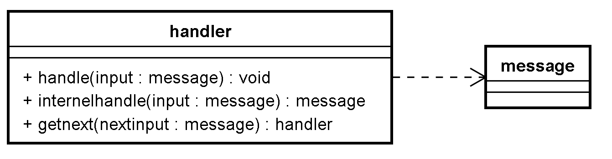

# 5 责任链

## 数据转移与数据处理抽象

**当前的现状**：数据从键盘输入到屏幕输出，经历了好几个对象的链式处理。

**合理的推测**：随着功能的扩展和复杂化，不同的情况需要更多的处理方式

**抽象：** 创建抽象类用来按照某种规律依次处理和传递数据（责任链模式）


> 通道类和功能处理类的对象都是整个流程中的环节，将这些环节连起来则形成责任链

**处理者类设计：**

- 提供handle函数作为链式处理的入口
- handle内部执行当前环节的处理，并执行下一阶段的处理函数，直到没有下一环节
- 提供internalhandle纯虚函数用来执行本环节处理
- 提供getnext纯虚函数用来获取下一环节

**消息类设计：**

- 只提供虚析构函数，用户可自行扩展




# 理解分析责任链

因为面向对象的能力无法满足我们的需求  即 无法按需 更新下一个处理者(即 有时候我想让1号帮我处理 有时候我又想让2号帮我)

这时候就引入了责任链

责任链hanler(处理者)

他主要包括了三个函数


> handle 负责 调用执行当前环节的处理  并执行下一阶段的处理函数，直到没有下一环节
>
> 简而言之: 就是把要处理的数据传给 internelhandle  得到他处理后的数据   然后 把数据传给 getnext设置的下一个处理类
>
> internelhandle   负责 数据的处理
>
> getnext 设置下一个处理类  或者为空 表示结束了

## 责任链的实现

**责任链模式**

- 处理者类和消息类

- 处理者类需要子类重写内部处理函数和获取下一个处理者的函数

- 处理者类的外部处理函数：当前环节处理---》获取下一个环节---》下一个环节处理

注意在责任链模式中 消息可以创建后 在同一个函数中析构  但是责任链类可以一直存着  因为他们要一直工作


抽象类 责任链 和消息类

```c++
class ZinxMessage{
public:
	ZinxMessage() {}
	virtual ~ZinxMessage() {}
};
class AZinxHandler
{
public:
	AZinxHandler();
	virtual ~AZinxHandler();
	
	//负责 调用执行当前环节的处理 
	//并执行下一阶段的处理函数，直到没有下一环节
	void handle(ZinxMessage* _inputMsg);
	
	// 负责 数据的处理 由继承的子类去具体实现
	virtual ZinxMessage* internel_handle(ZinxMessage* _inputMsg) = 0;

	//_next_input 是 internel_handle的返回值
	virtual AZinxHandler* GetNext(ZinxMessage* _next_input) = 0;
};
```

抽象类中只实现了handle 因为不需要子类重写

```c++
void AZinxHandler::handle(ZinxMessage* _inputMsg)
{
	//1 当前环节处理
	ZinxMessage*  pNextMsg = internel_handle(_inputMsg);

	if (nullptr != pNextMsg) //最后一个环节不产生输出
	{
		//2 获取下一个环节 根据数据不同 来获得不同的下一个环节的处理对象
		AZinxHandler* pNextHandler = GetNext(pNextMsg);
		if (nullptr != pNextHandler)
		{
			//3 下一个环节处理
			pNextHandler->handle(pNextMsg);
		}
		delete pNextMsg;
	}

	
}
```


### 测试用例

1 继承消息类 写出一个子类 传递数据

2 处理类继承父类  internel_handle 来处理数据 

GetNext 可以根据数据的不同 传递给不同的下一个处理类  

当返回为空时 表示不需要再处理了  结束责任链

```c++

class testMsg : public ZinxMessage
{
public:
	std::string data;
};


class output_next_letter :public AZinxHandler
{
	// 通过 AZinxHandler 继承
	virtual ZinxMessage* internel_handle(ZinxMessage* _inputMsg) override
	{
		testMsg* pmsg = dynamic_cast<testMsg*>(_inputMsg);
		printf("%c\n", pmsg->data[0] + 1);
		return nullptr;
	}

	virtual AZinxHandler* GetNext(ZinxMessage* _next_input) override
	{
		return nullptr;
	}

}step3;

class output_ascii :public AZinxHandler
{
	// 通过 AZinxHandler 继承
	virtual ZinxMessage* internel_handle(ZinxMessage* _inputMsg) override
	{
		testMsg* pmsg = dynamic_cast<testMsg*>(_inputMsg);
		printf("%d\n", pmsg->data[0]);

		//原样交给下一个环节 
		//那为什么要new一个呢 因为后面在同一个函数中会对他进行析构
		//如果不new 的话 那上一个和这一个消息都是同一个 重复析构会导致崩溃
		testMsg* pret = new testMsg();
		pret->data = pmsg->data;

		return pret;
	}

	virtual AZinxHandler* GetNext(ZinxMessage* _next_input) override
	{
		return &step3;
	}

}step2;


class trancUpper : public AZinxHandler
{
	// 通过 AZinxHandler 继承

	virtual ZinxMessage* internel_handle(ZinxMessage* _inputMsg) override
	{
		testMsg* pmsg = dynamic_cast<testMsg*>(_inputMsg);
		std::string output("a");
		std::transform(pmsg->data.begin(), pmsg->data.end(), output.begin(), ::toupper);
		
		std::cout << output << std::endl;
		
		//new 新的消息对象返回
		testMsg* pret = new testMsg();
		pret->data = output;

		return pret;
	}

	virtual AZinxHandler* GetNext(ZinxMessage* _next_input) override
	{
		
		return &step2;
	}
	
}step1;


```

```c++

void test_chain()
{
	std::string tmp;
	std::cin >> tmp;

	testMsg init_msg;
	init_msg.data = tmp;
	step1.handle(&init_msg);
}

```

