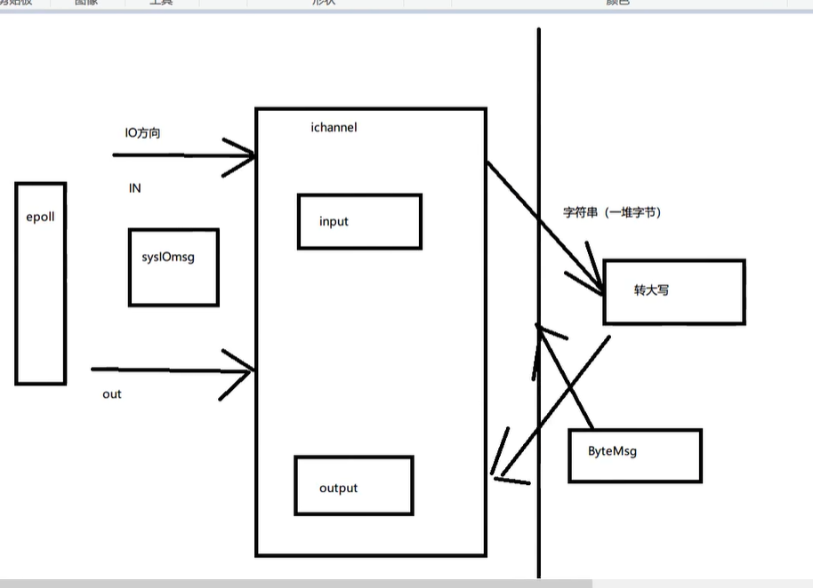
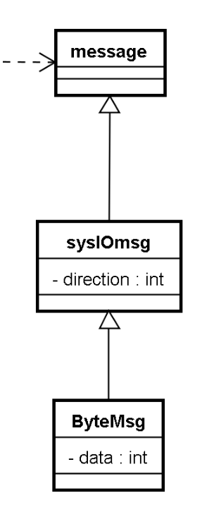

# 6 通道层重构和消息设计 一

第一级



input和output都是通道类 而他们实际上接收的数据都是epoll发送的IO数据 

我们可以把IO数据封装成一个消息类`sysIOmsg` 用这个消息类来负责`epoll`和'IChannel'之间的通信

同理 使用ByteMsg来负责 IChannel和 数据处理类的通信


现在 重构通道类 IChannel

我们现在认为 IChannel 也属于责任链中的一环

```c++
class IChannel : public AZinxHandler
{
// 通过 AZinxHandler 继承
	virtual ZinxMessage* internel_handle(ZinxMessage* _inputMsg) override;
	virtual AZinxHandler* GetNext(ZinxMessage* _next_input) override;
};
```


之前我们想继承消息类 来实现 一个封装IO消息的`sysIOmsg`  和一个数据消息类ByteMsg

但如果把俩者分开的话  你就不知道 这个数据消息类 是要输入还是要输出 

所以 我们为了方便 将ByteMSg 继承 sysIOMSg



```c++
class sysIODicMsg : public ZinxMessage
{
public:
	enum IO_DIC {
		IO_IN, IO_OU
	}m_DIC;

	sysIODicMsg(IO_DIC _dic) :m_DIC(_dic) {}
};


//为了让数据保持之前的状态，即包含上一阶段的 IO 方向消息，避免额外的赋值操作，我们继承 SysIODirMsg 类
class ByteMsg : public sysIODicMsg
{
public:
	std::string content;
	ByteMsg(std::string _content, sysIODicMsg &_iodic) :content(_content), sysIODicMsg(_iodic.m_DIC) {}
};

```

