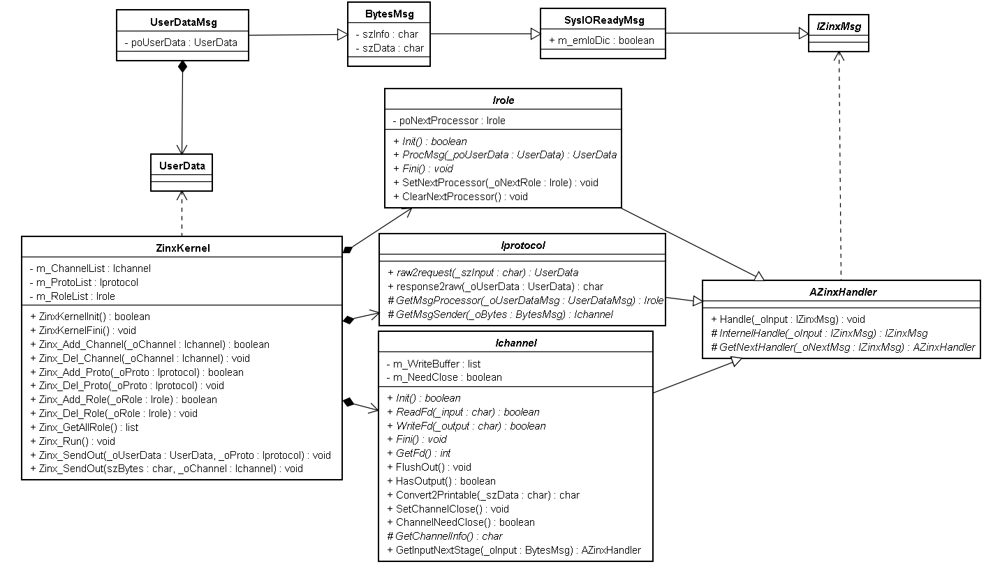

# 8 框架代码分析

# 范式统一和细节完善

一般的IO处理过程可以高度抽象为3个部分或层次，数据收发，协议转换，业务处理。所以基于现有责任链模式的处理机制，可以提供三个抽象类，通道，协议，角色类用于组合起来处理IO业务

- 通道类继承handler

  - internalhandle函数进行数据读取并存储到ByteMsg消息或将ByteMsg消息存入发送缓冲区等待发送
  - 提供SetChannelClose函数用于告诉kernel该通道需要关闭
  - 提供readfd纯虚函数和writefd纯虚函数用于泛化不同文件类型的读写
  - 提供init纯虚函数和fini纯虚函数用于泛化不同文件的初始化和去初始化操作
  - 提供GetInputNextStage纯虚函数用于泛化不同输入数据的不同处理方式

- 协议类继承handler

  - internalhandle函数进行ByteMsg数据和用户数据之间的相互转换
  - 提供raw2request和response2raw纯虚函数用于泛化不同协议对字节流和用户数据之间的不同处理方式
  - 提供GetMsgProcessor纯虚函数用于泛化不同协议数据分发的方式
  - 提供GetMsgSender纯虚函数用于泛化不同协议对数据发送通道的选择

- 角色类继承handler

  - internalhandle函数处理各种用户数据
  - 提供ProcMsg纯虚函数用于泛化不同业务的不同处理方式
  - 提供init和fini函数用于泛化不同业务处理实体的初始化和去初始化过程
  - 提供调用SetNextProcessor和ClearNextProcessor函数可以动态地指定下一个责任链节点

- kernel类

  - 提供run函数监听所有通道，是框架循环主体
  - 提供三层对象（通道，协议，角色）的资源管理（add，del），记录对象指针但不负责对象内存（在且只在框架退出时强制释放所有记录在kernel的对象）
  - 提供Zinx_SendOut函数的两个重载版本用于向外发送数据

  