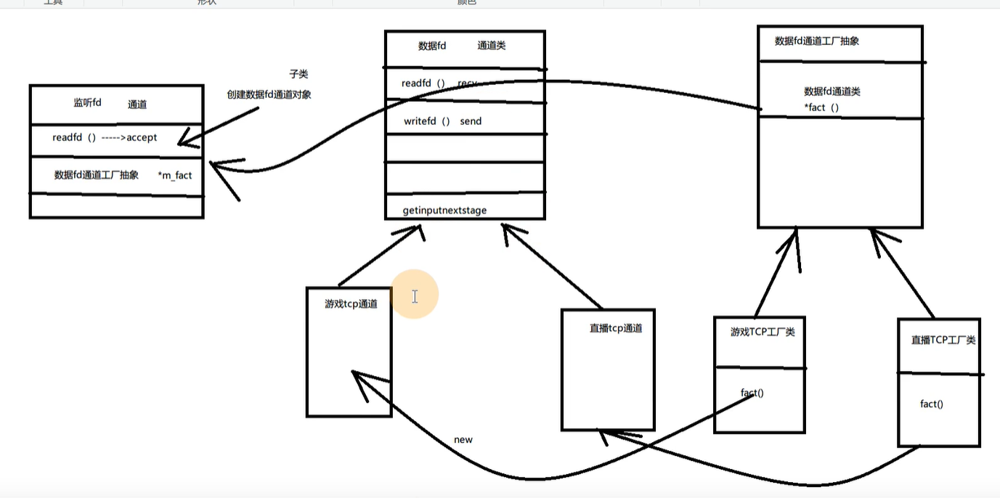

# 9 工厂类 设计TCP通道类

首先认识工厂类

我们想基于通道类 写出不同作用的tcp通道  但如果直接继承 如果扩展起来 那就会很麻烦 因为tcp类的大部分功能差不多  而且通道无法识别 到后面新增的类 因为不认识

所以我们再使用一个通道工厂抽象类 将重复的函数写出来  然后在写具体的tcp工厂类继承这个工厂类  这样的话 就能减少很多重复代码

同时 这样抽象类 传递的是 *m_fact 指针 不用被识别