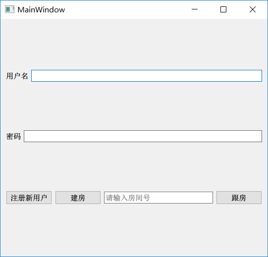
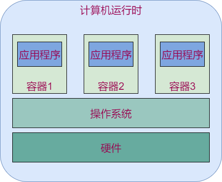

# 1 部署方案分析

# 1.需求分析

靠谱的商用项目不是只有一个可执行程序就够了的。好的商用项目应该遵守的原则：

- 客户端（方便使用）：启动器，安装包等
- 服务器（方便部署和扩展）：依赖库，启动脚本等

**需求原型：**

- 用户注册，登陆
- 建房
- 跟房

- 登陆服务器：管理当前的游戏服务器
- 登陆客户端：提供登陆注册和建房跟房界面（简单的qt编程）
- 游戏服务器：内容不用动，但要部署多份。

## 1.1方案1（多主机或虚拟机）

- 登陆服务器

  - 记录当前启动游戏服务器的服务器IP或主机名
  - 向登陆客户端返回IP或主机名
  - 管理这些主机的状态（启动，停止。，更新）

- 登陆客户端：通过房号查找游戏服务所在的计算机IP

- 游戏服务器：每个主机或虚拟机启动一个。

  **优点：** 游戏服务器部署简单，测试简单，跟单个服务器的操作完全相同。

**缺点：** 登陆服务器的业务复杂，不好维护游戏服务器所在的诸多主机。

## 1.2方案2（多进程）

- 登陆服务器
  - 记录当前启动的游戏服务器的端口号
  - 向登陆客户端返回端口号
  - 管理启动的游戏服务器进程
- 登陆客户端：向登陆服务器获取游戏服务器端口号
- 游戏服务器：
  - 支持端口可配
  - 增加多份除进程之外的资源（数据库，日志文件等）
  - 保护对公共资源的访问

**优点：** 登陆服务器实现简单，只需要要简单的进程管理即可

**缺点：** 游戏服务器的职责变的复杂（增加信号量集等进程间通信），而且不好管理（相同的文件或数据库存在多份）

## 1.3方案3（容器化）

- 登陆服务器
  - 记录当前启动的游戏服务器的端口号
  - 向登陆客户端返回端口号
  - 管理启动的游戏服务器所在容器
- 登陆客户端：向登陆服务器获取游戏服务器端口号
- 游戏服务器：每个容器启动一个游戏服务，启动多个容器映射不同端口

**特点：** 无需修改游戏服务器软件，登陆服务器通过管理容器实现管理游戏服务器。

## 1.4结论

使用容器化的效果最佳

容器: 一种虚拟化技术 这种技术将操作系统内核虚拟化, 可以允许用户空间软件实例被分割成几个独立的单元 在内核中运行 而不是只有一个单一实例运行

解释: 在操作系统和应用程序之间添加一层: 容器层, 容器层对于操作系统来说, 就是一个应用程序.  容器层对于应用程序来说 好像一个操作系统

就是本来 多个应用程序  对于 操作系统 等于多进程

而添加容器后  就是 对于操作系统 有多个容器  而每个容器中有多个应用程序 ?

-  一个主机可以有多个相似或相同的容器
- 应用程序不知道自己运行在容器中。
- docker是当前最主流的容器工具

## 1.5计划

1. 将游戏服务器放到docker容器中运行
2. 登陆服务器管理多个容器并提供创建容器和查询容器的功能
3. 登陆客户端发送用户命密码请求和房间创建或跟随请求，根据用户选择，启动游戏连接对应游戏服务器

## 容器技术

- 容器是操作系统和应用程序之间的一个虚拟层
- 应用程序可以在容器中运行（跟在操作系统中运行相同）。容器以应用程序的形式运行在操作系统中

