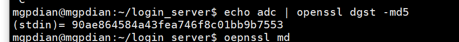
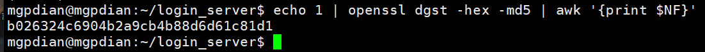
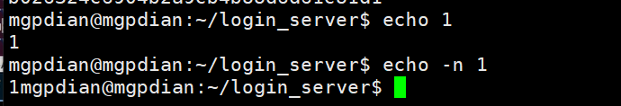
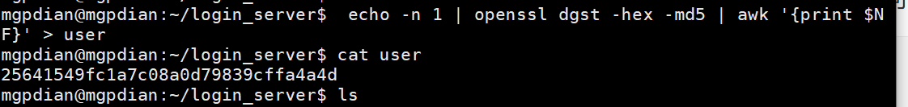
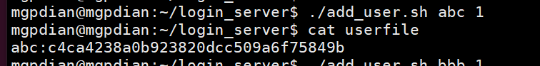

# 15 实现注册静态页面


为项目专门创建一个文件夹来存放数据

修改`/etc/nginx/nginx.conf` 的设置

```c++
server{
                root /home/mgpdian/login_server;
                listen 81;
                location /{
                        index  register.html;
  
                }
                location /fast/{
                        include /etc/nginx/fastcgi_params;
                        fastcgi_pass 127.0.0.1:55555;
                }
        }

```


```c++
<!DOCTYPE html>
<html lang="zh-CN">
    <head>
        <meta charset="utf-8">
        <title>注册界面</title>
    </head>
    <body>
        <form action="reg/" method="post" accept-charset="UTF-8" enctype="text/plane">
         <input name="username" type="text" placeholder="用户名">
         <input name="password" type="password" placeholder="密码">
         <input type="submit" id="submit" value="提交">
    </body>
```


# 摘要值计算脚本

我们一直使用的是明文加密 这是不好的

现在我们选取在前端进行哈希加密后 将密文传给后端 保存

linux上有加密的工具

```c++
echo abc | openssl dgst -md5
```



我们会发现前面要一段 我们不需要的

可以使用 

```c++
echo 1 | openssl dgst -hex -md5 | awk '{print $NF}'
```

来去掉他




要注意的是 echo 1 他返回的是 1 加上 一个回车

我们密码编写时 不要加上回车 要加上 -n




现在开始编写脚本

思路

我们先将加密后的密码 放入一个文件中  然后通过cat可以输出他的值

```bash
$ echo -n 1 | openssl dgst -hex -md5 | awk '{print $NF}' > user

$cat user
```




在这基础上 将他们写入一个shell脚本 add_user.sh

```shell
#!/bin/bash
  
USERNAME=$1
PASSWORD=$2

PASSWORD=`echo -n $PASSWORD | openssl dgst -md5 -hex | awk '{print $NF}'`

echo "${USERNAME}:${PASSWORD}" >> userfile
                  
```


给他赋予权限

```c++
chmod 755 add_user.sh
```

运行

