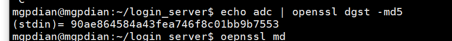
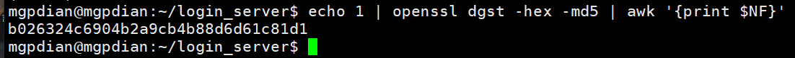
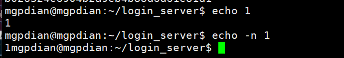
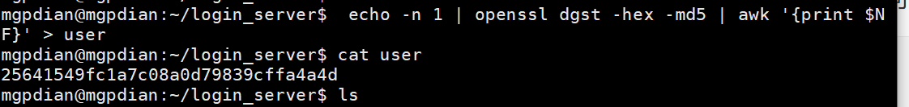
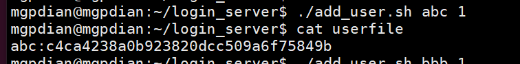

# 16 摘要计算脚本

我们一直使用的是明文加密 这是不好的

现在我们选取在前端进行哈希加密后 将密文传给后端 保存

linux上有加密的工具

```c++
echo abc | openssl dgst -md5
```



我们会发现前面要一段 我们不需要的

可以使用 

```c++
echo 1 | openssl dgst -hex -md5 | awk '{print $NF}'
```

来去掉他




要注意的是 echo 1 他返回的是 1 加上 一个回车

我们密码编写时 不要加上回车 要加上 -n




现在开始编写脚本

思路

我们先将加密后的密码 放入一个文件中  然后通过cat可以输出他的值

```bash
$ echo -n 1 | openssl dgst -hex -md5 | awk '{print $NF}' > user

$cat user
```




在这基础上 将他们写入一个shell脚本 add_user.sh

```shell
#!/bin/bash
  
USERNAME=$1
PASSWORD=$2

PASSWORD=`echo -n $PASSWORD | openssl dgst -md5 -hex | awk '{print $NF}'`

echo "${USERNAME}:${PASSWORD}" >> userfile
                  
```


给他赋予权限

```c++
chmod 755 add_user.sh
```

运行

