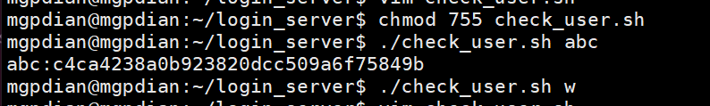
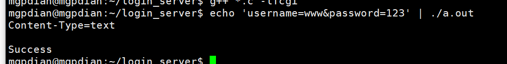
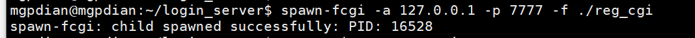
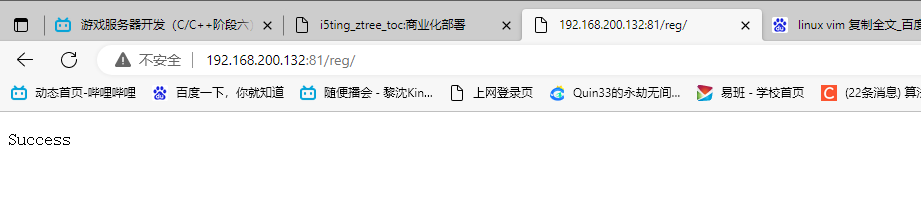

# 17 注册页面和处理框架搭建

vim 分屏操作: vsplit xxx


头文件  user_opt.h

Adduser为 添加用户 

CheckUser 为确定用户名是否已经存在

```c++
#include <stdio.h>
void AddUser(const char *_name, const  char *_password);
bool CheckUser(const char *_name, const char *_password_dgst);
```

user_opt.c

```c++
#include <stdio.h>
#include <unistd.h>
#include <stdlib.h>
#include <sys/types.h>
#include <sys/wait.h>
void AddUser(const char *_name, const char *_password){
    char buff[1024] = {0};
    
    sprintf(buff, "./add_user.sh %s %s", _name, _password);
	system(buff); //脚本
}
bool CheckUser(const char *_name, const char *_password_dgst)
{
    	bool bRet = false;
    
    	if(NULL == _password_dgst)
        {
            //父进程 观察子进程是否运行成功
            if(fork() > 0)
            {

                int iStatus = 0;
                wait(&iStatus);
                if(0 == iStatus)
                {
                        bRet = true;
                }
            }
            else{
                //子进程
                execlp("./check_user.sh", "./check_user.sh", _name, NULL);
                //第一个参数"./check_user.sh" 类似于this
            }
        }
        return bRet;

}
    
```


编写查询脚本 check_user.sh

```shell
#!/bin/bash
  
cat userfile | grep -w $1

但我们不需要他输出出来 只想知道这个脚本是否运行成功

使用到了 重定向
  
cat userfile | grep -w $1 2>&1 > /dev/null

#赋予权限
chmod 755 check_user.sh

```



但我们不需要他输出出来 只想知道这个脚本是否运行成功

使用到了 重定向

```shell
#!/bin/bash
  
cat userfile | grep -w $1 2>&1 > /dev/null
```


主函数 reg_cgi.c

fread 可以读取链接里的请求数据

```c++
#include <string>
#include <stdlib.h>
#include "user_opt.h"
#include <fcgi_stdio.h>


int main()
{
        while(FCGI_Accept() >= 0)
        {
                char buff[1024] = {0};
                fread(buff, 1, sizeof(buff), stdin);
                std::string orig_string(buff);
                
                int and_pos = orig_string.find("&");
                
                std::string username = orig_string.substr(9, and_pos - 9);
                std::string password = orig_string.substr(and_pos + 10, orig_string.size() - and_pos - 10);

                printf("Content-Type=text\r\n\r\n");
                if(true == CheckUser(username.c_str(), NULL))
                {
					//user exist
                        printf("User Exist\r\n");
                }
                else{
                        AddUser(username.c_str(), password.c_str());
                        //register success
                        printf("Success\r\n");
                }

        }

}
```


运行




将其设置成 FCGI程序

```c++
spawn-fcgi -a 127.0.0.1 -p 7777 -f ./reg_cgi
```




修改nginx设置

修改`/etc/nginx/nginx.conf`

```c++
sudo vim /etc/nginx/nginx.conf
```


```c++
server{
                root /home/mgpdian/login_server;
                listen 81;
                location /{
                        index  register.html;

                }
                location /reg/{
                        include /etc/nginx/fastcgi_params;
                        fastcgi_pass 127.0.0.1:7777;
                }
        }

```

```c++
sudo nginx -s reload
```

运行




# 


### 用户注册页面和处理

- 页面：点击提交后会向服务器发一个POST请求（身体是一串 用户

  名&密码 字符串）

- reg_cgi程序，读取用户名和密码（fread 字符串处理）---》调用检查用户和添加用户的函数

- reg_cgi程序，输出成功或失败的网页提示

- 添加用户函数：system调用添加用户脚本（不关心返回值时）

- 查询用户是否存在函数：fork+exec形式调用脚本（关心脚本执行是否成功）

- 在qt界面的注册按钮槽函数中调用QDesktopServices::openUrl，传入注册页url---->启动浏览器