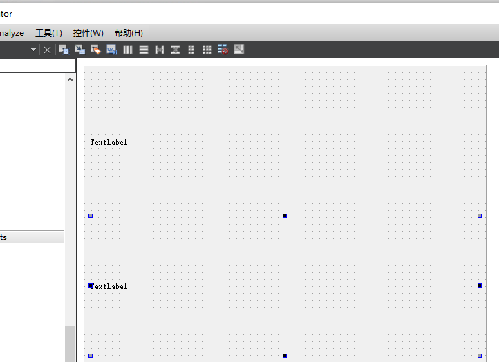

# 19 QT: 登录页面


# 控件拖动设置


修改布局


网格需要里面有内容才能修改布局

添加内容后 

到右边的对象 MainWindow  右键他

选择最下面的布局


最后选择 栅格布局 (因为截图会导致选项退出 没法截图)

效果


然后把红框删除 这样他就会默认栅格布局了

比如




具体控件拖动如下:


设置控件名称

用户名 为 username

密码为 password


对密码输入控件 设置显示加密密码


按钮设置

注册按钮 名为 register_2

建房按钮 名为 createroom


效果


#### 登陆窗口搭建

密码输入栏---》echoMode ： password


# 内联函数设置

设置点击事件

鼠标选中建房  然后右键


选择转到糟

选择clicked() 点击事件


### 问题

数据传输问题

为什么 使用协议 来分析和组成数据

> 因为 这样解析比较方便

为什么 不用protobuf 而使用Json

> 因为 Json 传递的是字符串 而protobuf 是转换成二进制后的数据 

> 所以Json调试比较方便明了  
>
> 之前说明了登录客户端不需要太考虑效率 所以我们选择Json来方便调试

## QT的Json数据解析

QT自己带有Json库

`QJsonDocument`, `QJsonArray`和 `QJsonObject`这三个类在解析Json数据时比较常用

**使用步骤**：

1. 使用QJsonDocument创建整体的Json数据对象
2. 调用QJsonDocument的array函数可以返回QJsonArray的对象
3. 遍历QJsonArray对象可以取出QJsonObject对象
4. 操作符[]可以访问指定的key所对应的值

头文件

```c++
#include <QJsonDocument> //Json数据对象
#include <QJsonArray>	//Json数组
#include <QJsonObject> //Json对象
```

简单json实现 (不要炒 因为功能不完整)

```c++
   //取出用户名密码
    QString username = ui ->username->text();
    QString password = ui ->password->text();
    //拼登录请求(Json格式)
    //构建一个json对象 填入用户名和密码
    QJsonObject json;
    json["username"] = username;
    json["password"] = password;
    //将json对象放到doc中
    QJsonDocument json_doc(json);
    qDebug() << json_doc.toJson();

```


但是如果 这样传输的话 在网络通信会非常不安全 所以 我们需要先将密码加密后再传输

### Json总结

- 创建json对象QJsonObject  通过[]设定username和password的值是输入框的内容
- 基于json对象创建QJsonDocument对象 toJson获取json格式的登录请求

# QT的数字签名

### 生成数字签名

`QCryptographicHash`类用来将原始时间生成数字签名。

**使用步骤**：

1. 构造某个算法的签名生成器
2. 添加原始数据到生成器中
3. 调用生成函数得到数字签名

```c++
#include <QCryptographicHash> //加密
```

加密实现 (不完整)

```c++
    //构造某个算法的签名生成器
    QCryptographicHash md5_hash(QCryptographicHash::Md5);

    //添加原始数据到生成器中
    md5_hash.addData(password.toUtf8());
    //调用生成函数得到数字签名
    QString md5_password(md5_hash.result());  
```


我们发现加密后的 都是 \x的转义字符 并不符合我们的需求 需要修改

修改方法 在 `md5_hash.result()`后面再加`.toHex()`

完整版

```c++
	...
    //构造某个算法的签名生成器
    QCryptographicHash md5_hash(QCryptographicHash::Md5);

    //添加原始数据到生成器中
    md5_hash.addData(password.toUtf8());
    //调用生成函数得到数字签名
    QString md5_password(md5_hash.result().toHex());

    ...
    json["password"] = md5_password;
	...
```


### 数字签名总结

- 密码要生成签名值后再拼接请求发送

- > QCryptographicHash类 
  >
  > 1 创建生成类
  >
  > QCryptographicHash md5_hash(QCryptographicHash::Md5);
  >
  > 2 addData 添加原始数据
  >
  > 3 result().toHex() 获取签名并转换成16进制的可显示数据


接下来是处理网络数据发送的需求

# QT的http网络访问

`QNetworkAccessManager`,`QNetworkRequest`和`QNetworkReply`这三个类是Qt在网络访问比较常用的类。

`QNetworkAccessManager` 负责解析http协议

`QNetworkRequest` 接受http数据

`QNetworkReply` 发送http数据

**使用步骤：**

1. 创建QNetworkAccessManager对象
2. 创建QNetworkRequest对象，并用setXXX的方法，设置http的请求头或请求数据
3. 调用QNetworkAccessManager对象的post或get方法，将请求发出去。函数返回一个QNetworkReply对象。
4. 将第3步的QNetworkReply对象的finish信号绑定到一个槽函数。
5. 在槽函数中通过QNetworkReply的readAll函数可以读取到服务器的响应数据

头文件

```c++
#include <QtNetwork/QNetworkAccessManager>
#include <QtNetwork/QNetworkRequest>
#include <QtNetwork/QNetworkReply>
```


因为http不仅有发 还有收 如果在点击事件时再创建 那就有点浪费了  因为他后面还会回复你的请求 

所以我们将头文件放到主窗口


并在主窗口的 MainWindow中 添加QNetworkAccessManger 类对象 方便之后的使用

```c++
QNetworkAccessManager m_access_mng;
```


完成发送http功能

```c++
 //发给登录服务器(发http -> qt网络访问库)
    //QNetworkRequest req(QUrl("http://192.168.200.132/login/"));
    QNetworkRequest req(QUrl("http://10.3.113.175:7777/login/"));
    req.setHeader(QNetworkRequest::ContentLengthHeader, output.size());
    req.setHeader(QNetworkRequest::ContentTypeHeader, "application/json");

    m_access_mng.post(req, output.toUtf8());
    //异步处理服务器的回复(connect 服务器回复和回复的处理函数)
```

编译报错


原因是 没用在launcher.pro这个项目配置文件中 添加依赖项


解决方法:

右键目标类  点击上下文相关帮助


会在右边弹出一个 框  找到qmake这一行


在pro这个项目的配置文件中添加 qmake这一行的依赖项


再次运行


成功运行并接收到数据

# qt发送http请求


- 在launcher.pro这个项目配置文件中 添加依赖项

> 

- 先创建QNetworkAccessManager对象

> #include <QtNetwork/QNetworkAccessManager>
> #include <QtNetwork/QNetworkRequest>
> #include <QtNetwork/QNetworkReply>
>
> 将三个头文件也放到主窗口
>
> 
>
> 主窗口的 MainWindow中 添加QNetworkAccessManger 类对象 方便之后的使用
>
> ```c++
> QNetworkAccessManager m_access_mng;
> ```
>
> 

- 创建QNetworkRequest对象（指定url），setHeader设置必要的请求头
- 调用QNetworkAccessManager对象的post函数发送请求（req和请求的身体部分）

```c++
//取出用户名密码
    QString username = ui ->username->text();
    QString password = ui ->password->text();

    //构造某个算法的签名生成器
    QCryptographicHash md5_hash(QCryptographicHash::Md5);

    //添加原始数据到生成器中
    md5_hash.addData(password.toUtf8());
    //调用生成函数得到数字签名
    QString md5_password(md5_hash.result().toHex());

    //拼登录请求(Json格式)
    //构建一个json对象 填入用户名和密码的加密值
    QJsonObject json;
    json["username"] = username;
    json["password"] = md5_password;

    //将json对象放到doc中
    QJsonDocument json_doc(json);

    QString output = json_doc.toJson();
//////////////////////////////////////////////////////////////////////////////////////////////////////////
//发给登录服务器(发http -> qt网络访问库)
    //QNetworkRequest req(QUrl("http://192.168.200.132/login/"));
    QNetworkRequest req(QUrl("http://10.3.113.175:7777/login/"));
    req.setHeader(QNetworkRequest::ContentLengthHeader, output.size());
    req.setHeader(QNetworkRequest::ContentTypeHeader, "application/json");

    m_access_mng.post(req, output.toUtf8());
```

