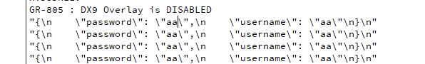

# 20 QT的Json数据解析问题

数据传输问题

为什么 使用协议 来分析和组成数据

> 因为 这样解析比较方便

为什么 不用protobuf 而使用Json

> 因为 Json 传递的是字符串 而protobuf 是转换成二进制后的数据 

> 所以Json调试比较方便明了  
>
> 之前说明了登录客户端不需要太考虑效率 所以我们选择Json来方便调试

## QT的Json数据解析

QT自己带有Json库

`QJsonDocument`, `QJsonArray`和 `QJsonObject`这三个类在解析Json数据时比较常用

**使用步骤**：

1. 使用QJsonDocument创建整体的Json数据对象
2. 调用QJsonDocument的array函数可以返回QJsonArray的对象
3. 遍历QJsonArray对象可以取出QJsonObject对象
4. 操作符[]可以访问指定的key所对应的值

头文件

```c++
#include <QJsonDocument> //Json数据对象
#include <QJsonArray>	//Json数组
#include <QJsonObject> //Json对象
```

简单json实现 (不要炒 因为功能不完整)

```c++
   //取出用户名密码
    QString username = ui ->username->text();
    QString password = ui ->password->text();
    //拼登录请求(Json格式)
    //构建一个json对象 填入用户名和密码
    QJsonObject json;
    json["username"] = username;
    json["password"] = password;
    //将json对象放到doc中
    QJsonDocument json_doc(json);
    qDebug() << json_doc.toJson();

```



但是如果 这样传输的话 在网络通信会非常不安全 所以 我们需要先将密码加密后再传输

### Json总结

- 创建json对象QJsonObject  通过[]设定username和password的值是输入框的内容
- 基于json对象创建QJsonDocument对象 toJson获取json格式的登录请求