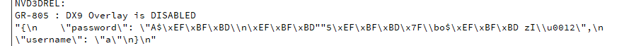

# 21 QT的数字签名

### 生成数字签名

`QCryptographicHash`类用来将原始时间生成数字签名。

**使用步骤**：

1. 构造某个算法的签名生成器
2. 添加原始数据到生成器中
3. 调用生成函数得到数字签名

```c++
#include <QCryptographicHash> //加密
```

加密实现 (不完整)

```c++
    //构造某个算法的签名生成器
    QCryptographicHash md5_hash(QCryptographicHash::Md5);

    //添加原始数据到生成器中
    md5_hash.addData(password.toUtf8());
    //调用生成函数得到数字签名
    QString md5_password(md5_hash.result());  
```



我们发现加密后的 都是 \x的转义字符 并不符合我们的需求 需要修改

修改方法 在 `md5_hash.result()`后面再加`.toHex()`

完整版

```c++
	...
    //构造某个算法的签名生成器
    QCryptographicHash md5_hash(QCryptographicHash::Md5);

    //添加原始数据到生成器中
    md5_hash.addData(password.toUtf8());
    //调用生成函数得到数字签名
    QString md5_password(md5_hash.result().toHex());

    ...
    json["password"] = md5_password;
	...
```


### 数字签名总结

- 密码要生成签名值后再拼接请求发送

- > QCryptographicHash类 
  >
  > 1 创建生成类
  >
  > QCryptographicHash md5_hash(QCryptographicHash::Md5);
  >
  > 2 addData 添加原始数据
  >
  > 3 result().toHex() 获取签名并转换成16进制的可显示数据

