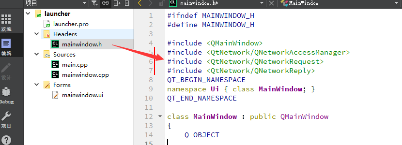
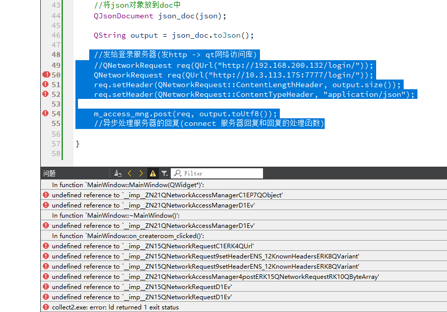
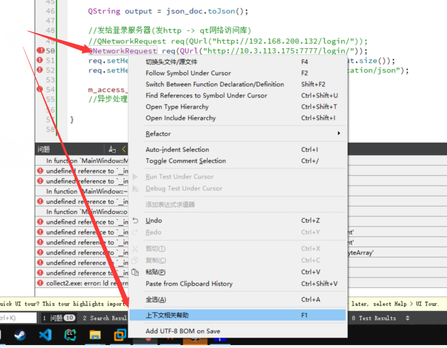
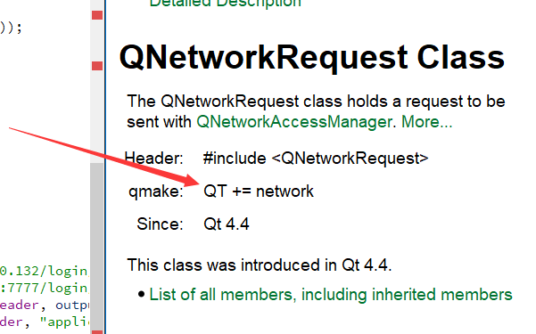
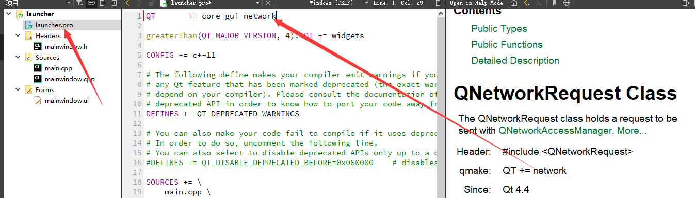
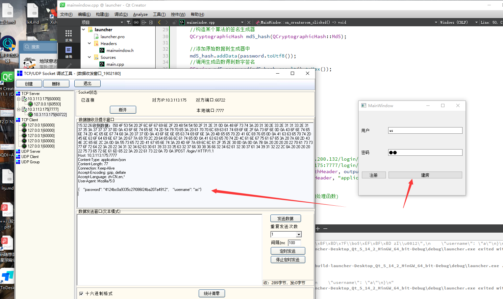

# 22 QT的http网络访问

接下来是处理网络数据发送的需求

# QT的http网络访问

`QNetworkAccessManager`,`QNetworkRequest`和`QNetworkReply`这三个类是Qt在网络访问比较常用的类。

`QNetworkAccessManager` 负责解析http协议

`QNetworkRequest` 接受http数据

`QNetworkReply` 发送http数据

**使用步骤：**

1. 创建QNetworkAccessManager对象
2. 创建QNetworkRequest对象，并用setXXX的方法，设置http的请求头或请求数据
3. 调用QNetworkAccessManager对象的post或get方法，将请求发出去。函数返回一个QNetworkReply对象。
4. 将第3步的QNetworkReply对象的finish信号绑定到一个槽函数。
5. 在槽函数中通过QNetworkReply的readAll函数可以读取到服务器的响应数据

头文件

```c++
#include <QtNetwork/QNetworkAccessManager>
#include <QtNetwork/QNetworkRequest>
#include <QtNetwork/QNetworkReply>
```


因为http不仅有发 还有收 如果在点击事件时再创建 那就有点浪费了  因为他后面还会回复你的请求 

所以我们将头文件放到主窗口



并在主窗口的 MainWindow中 添加QNetworkAccessManger 类对象 方便之后的使用

```c++
QNetworkAccessManager m_access_mng;
```


完成发送http功能

```c++
 //发给登录服务器(发http -> qt网络访问库)
    //QNetworkRequest req(QUrl("http://192.168.200.132/login/"));
    QNetworkRequest req(QUrl("http://10.3.113.175:7777/login/"));
    req.setHeader(QNetworkRequest::ContentLengthHeader, output.size());
    req.setHeader(QNetworkRequest::ContentTypeHeader, "application/json");

    m_access_mng.post(req, output.toUtf8());
    //异步处理服务器的回复(connect 服务器回复和回复的处理函数)
```

### 编译报错



原因是 没用在launcher.pro这个项目配置文件中 添加依赖项


### 解决方法:

右键目标类  点击上下文相关帮助



会在右边弹出一个 框  找到qmake这一行



在pro这个项目的配置文件中添加 qmake这一行的依赖项



再次运行



成功运行并接收到数据

# qt发送http请求


- 在launcher.pro这个项目配置文件中 添加依赖项

> 

- 先创建QNetworkAccessManager对象

> #include <QtNetwork/QNetworkAccessManager>
> #include <QtNetwork/QNetworkRequest>
> #include <QtNetwork/QNetworkReply>
>
> 将三个头文件也放到主窗口
>
> 
>
> 主窗口的 MainWindow中 添加QNetworkAccessManger 类对象 方便之后的使用
>
> ```c++
> QNetworkAccessManager m_access_mng;
> ```
>
> 

- 创建QNetworkRequest对象（指定url），setHeader设置必要的请求头
- 调用QNetworkAccessManager对象的post函数发送请求（req和请求的身体部分）

```c++
//取出用户名密码
    QString username = ui ->username->text();
    QString password = ui ->password->text();

    //构造某个算法的签名生成器
    QCryptographicHash md5_hash(QCryptographicHash::Md5);

    //添加原始数据到生成器中
    md5_hash.addData(password.toUtf8());
    //调用生成函数得到数字签名
    QString md5_password(md5_hash.result().toHex());

    //拼登录请求(Json格式)
    //构建一个json对象 填入用户名和密码的加密值
    QJsonObject json;
    json["username"] = username;
    json["password"] = md5_password;

    //将json对象放到doc中
    QJsonDocument json_doc(json);

    QString output = json_doc.toJson();
//////////////////////////////////////////////////////////////////////////////////////////////////////////
//发给登录服务器(发http -> qt网络访问库)
    //QNetworkRequest req(QUrl("http://192.168.200.132/login/"));
    QNetworkRequest req(QUrl("http://10.3.113.175:7777/login/"));
    req.setHeader(QNetworkRequest::ContentLengthHeader, output.size());
    req.setHeader(QNetworkRequest::ContentTypeHeader, "application/json");

    m_access_mng.post(req, output.toUtf8());
```

