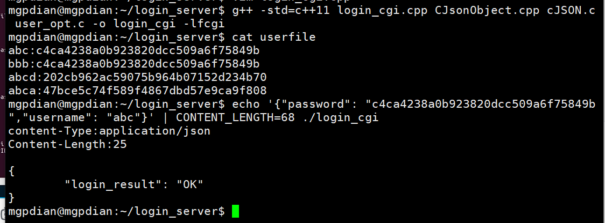

# 23 服务器处理登录器请求

#### 修改Nginx配置

添加一个 location

进入nginx.conf

```c++
sudo vim /etc/nginx/nginx.conf
```

修改

```c++
location /login/{
                        include /etc/nginx/fastcgi_params;
                        fastcgi_pass 127.0.0.1:8888;
                }
```

重启

```c++
sudo nginx -s reload
```


## 脚本修改

### 修改判断脚本 `check_user.sh`

让脚本具有判断 用户密码是否正确的能力

```c++
#!/bin/bash
  

if [ "$2" == "" ]
then
        cat userfile | grep -w $1 2>&1 > /dev/null
else    
        cat userfile | grep -w "$1:$2" 2>&1 > /dev/null
fi      
```

这里学一下重定向

> /dev/null 是一个特殊的文件，写入到它的内容都会被丢弃；如果尝试从该文件读取内容，那么什么也读不到。但是 /dev/null 文件非常有用，将命令的输出重定向到它，会起到"禁止输出"的效果。
>
> 如果希望屏蔽 stdout (1代表stdout)和 stderr(2代表stderr)，可以这样写：
>
> 2>&1 将1和2合并
>
> command > /dev/null
>
> 表示重定向到 丢弃文件
>
> 综合就是 将标准输出和标准错误重定向到丢弃文件中 让他们不要输出 
>
> ```
> $ command > /dev/null 2>&1
> ```
>
> > **注意：**0 是标准输入（STDIN），1 是标准输出（STDOUT），2 是标准错误输出（STDERR）。
> >
> > 这里的 **2** 和 **>** 之间不可以有空格，**2>** 是一体的时候才表示错误输出。


注意: 0 表示成功 1表示失败


> vim小技巧 
>
> 4yy p 是复制4行  p表示粘贴
>
> gg=G 为全局格式化

### 修改`user_opt.c`

```c++
#include <stdio.h>
#include <unistd.h>
#include <stdlib.h>
#include <sys/types.h>
#include <sys/wait.h>
void AddUser(const char *_name, const char *_password){
    char buff[1024] = {0};
    
    sprintf(buff, "./add_user.sh %s %s", _name, _password);
	system(buff); //脚本
}
bool CheckUser(const char *_name, const char *_password_dgst)
{
    	bool bRet = false;
    
    	//if(NULL == _password_dgst)
        //{
            //父进程 观察子进程是否运行成功
            if(fork() > 0)
            {

                int iStatus = 0;
                wait(&iStatus);
                if(0 == iStatus)
                {
                        bRet = true;
                }
            }
            else{
                //子进程
                execlp("./check_user.sh", "./check_user.sh", _name, _password_dgst, NULL);
                //第一个参数"./check_user.sh" 类似于this
            }
        //}
        return bRet;

}
     
```

修改内容 他将_password_dgst 是否为空的判断删除了  相应的 子进程的execlp脚本调用 添加了 _password_dgst  

这样就交给check_user.sh 来判断 _password_dgst 是否为空 来采取相应的方法


### 创建登录函数 `login_cgi.cpp`

```c++

#include <string>
#include <FCGI_stdio.h>

int main()
{
    while(FCGI_Accept() >= 0)
    {
        std::string username;
        std::string password;
        
        if(true == CheckUser(username.c_str(), password.c_str()))
        {
            //reply ok to client
        }
        else{
            //replay failed to client
        }
    }
}
```


### 为项目添加Json库

[库在这里](G:\笔记\游戏服务器\第6阶段-游戏服务器开发\游戏服务器项目\项目资料\4-环境\2-依赖库)

把里面的CJsonObject-1.0.zip 移动到 login_server中 进行解压

解压


将里面的文件全部拷贝到login_server 然后 删除俩个CJsonObject包

```c++
cp * -a ../
```

-a表示保存原来文件具有的权限


删除


### 添加登录判断类 `login_cgi.cpp`

了解下JSON用法

```c++
int json_len = atoi( getenv("CONTENT_LENGTH")); //读取http传输的环境变量
//http传输过来的数据是字符串 所以要使用atoi去转换成int

char *buff = (char*) calloc(1UL, json_len);//1UL 设置全0

fread(buff, 1, json_len, stdin); //读取传输过来的请求数据


std::string json_string(buff);
CJsonObject json(json_string);
//将char 转换为字符串  然后将字符放入json 让json去解析他

json.Get("username", username);
json.Get("password", password);
//Get可以从json中通过键来获取值


CJsonObject reply;
reply.Add("login_result", "OK"); //将键值对放入json中

std::string reply_string = reply.ToFormattedString();
//将json转换为字符串
```


```c++
#include <stdlib.h>
#include <string>
#include "user_opt.h"
#include "CJsonObject.hpp"
#include <fcgi_stdio.h>

int main()
{
    while(FCGI_Accept() >= 0)
    {
        std::string username;
        std::string password;
       
	int json_len = atoi( getenv("CONTENT_LENGTH")); //读取http传输的环境变量
	
	char *buff = (char*) calloc(1UL, json_len);//1UL 设置全0
	
	fread(buff, 1, json_len, stdin);
	
	std::string json_string(buff);
	neb::CJsonObject json(json_string);

	json.Get("username", username);
	json.Get("password", password);

	
	printf("content-Type:application/json\r\n");
	
	neb::CJsonObject reply;
        if(true == CheckUser(username.c_str(), password.c_str()))
        {
            //reply ok to client
	    reply.Add("login_result", "OK");
       	}
        else{
            //replay failed to client
	    reply.Add("login_result", "Failed");
       	}
	std::string reply_string = reply.ToFormattedString();
	printf("Content-Length:%d\r\n\r\n", reply_string.size());

	printf("%s\r\n", reply_string.c_str());

	free(buff);
    }
}

```

测试




### 设置为spawn-fcgi  

```c++
spawn-fcgi -a 127.0.0.1 -p 8888 -f ./login_cgi
```


### 总结

### 服务器处理登陆请求

- 取数据：先取长度（CONTENT_LENGTH）,CJSON库解析数据并创建json对象，调用get函数取用户名和密码
- 处理数据：调用CheckUser函数验证用户名和密码
- 回复登陆结果：创建json对象，设置login_result键的值（OK或 Failed），填Content-Length属性（json字符串的长度），printf整 个json字符串（ToFormatString）；