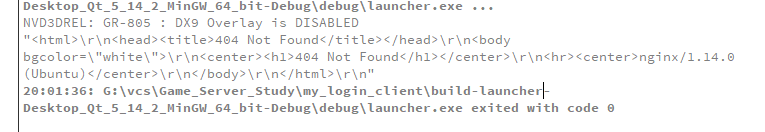

# 24 客户端处理回复数据

### http网络访问

`QNetworkAccessManager`,`QNetworkRequest`和`QNetworkReply`这三个类是Qt在网络访问比较常用的类。

**使用步骤：**

1. 创建QNetworkAccessManager对象
2. 创建QNetworkRequest对象，并用setXXX的方法，设置http的请求头或请求数据
3. 调用QNetworkAccessManager对象的post或get方法，将请求发出去。函数返回一个QNetworkReply对象。
4. 将第3步的QNetworkReply对象的finish信号绑定到一个槽函数。
5. 在槽函数中通过QNetworkReply的readAll函数可以读取到服务器的响应数据

因为QNetworkAccessManager发送请求后 会返回一个QNetworkReply对象  为了方便调用  我们在主函数那里先放入这个对象 方便调用

 ```c++
 QNetworkReply *m_reply = NULL;
 ```


设置他

```c++
 m_reply = m_access_mng.post(req, output.toUtf8());
```


### 绑定

QNetworkReply对象的finish信号绑定到一个槽函数

使用一个函数来完成这个操作

```
    QNetworkReply *m_reply = NULL;
```


在void MainWindow::on_createroom_clicked() 函数那里添加 关联器

```c++
m_reply = m_access_mng.post(req, output.toUtf8());
    //异步处理服务器的回复(connect 服务器回复和回复的处理函数)
    connect(m_reply, SIGNAL(finished()), this, SLOT(proc_login_reply()));

```

新增 void MainWindow::proc_login_reply()

```c++
void MainWindow::proc_login_reply()
{
    qDebug() << m_reply -> readAll();

}
```


问题 

测试出现 404回应



原因: 收到nginx设置 80端口后 会和nginx虚拟机产生冲突

关闭虚拟机 把虚拟机的设置删除

```c++
##
        # Virtual Host Configs
        ##


        server{
                root /home/mgpdian/login_server;
                listen 80;
                location /{
                        index  register.html;

                }
                location /reg/{
                        include /etc/nginx/fastcgi_params;
                        fastcgi_pass 127.0.0.1:7777;
                }
                location /login/{
                        include /etc/nginx/fastcgi_params;
                        fastcgi_pass 127.0.0.1:8888;
                }
        }
```

测试


完善登录窗口效果

成功 输出命令行

失败 弹出窗口

```c++
void MainWindow::proc_login_reply()
{


    //判断登录结果
    QJsonDocument json_doc = QJsonDocument::fromJson(m_reply -> readAll());

    QJsonObject json = json_doc.object();

    if("OK" == json["login_result"].toString())
    {
        qDebug() << "login_result";
    }
    else{
        QMessageBox::information(this, "登录失败", "用户名或者密码错误");
    }
}
```


## 接收服务器回复的http

- 在主窗口类中定义属性QNetworkReply，用来存某次请求的回复对象

- 接收完post或get函数的返回值后，connect到某个回复处理函数

  (finished）

- 回复处理函数中，若失败则弹出提示窗口