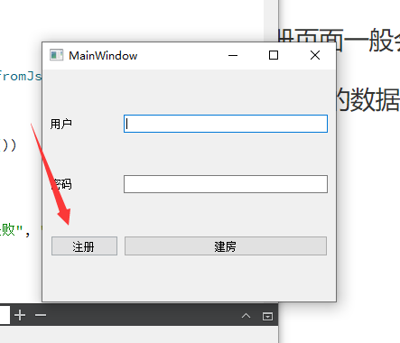
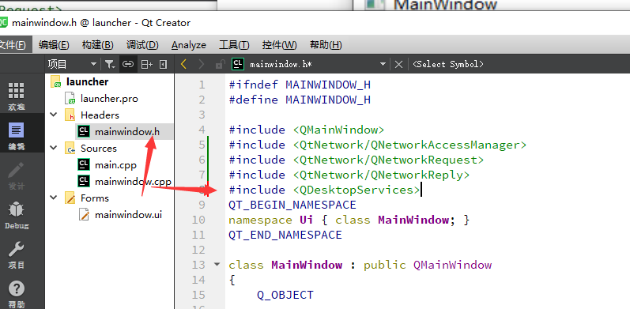
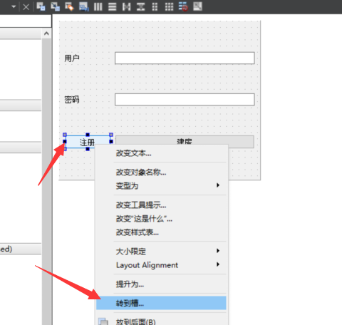
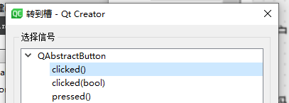
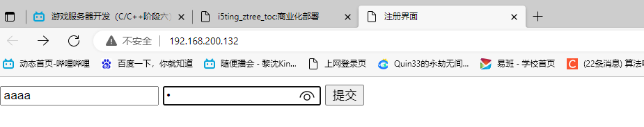
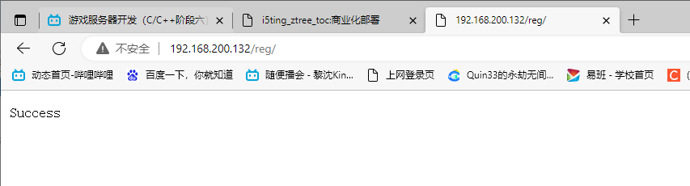
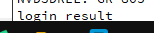

# 25 注册页面弹出

因为注册页面一般会选择 在网页上处理 这样能减少性能的消耗

同时 网页上的数据(比如广告)更新比较方便 

那



点击注册 时 如何判断我们要弹出哪个浏览器呢

QT有一个库 可以来自动调用默认浏览器

```c++
#include <QDesktopServices>
```




为注册按钮添加点击函数






添加点击事件函数

跳转到默认浏览器 并访问 设置的url

```
void MainWindow::on_register_2_clicked()
{
    //启动浏览器 并访问注册界面
    QDesktopServices::openUrl(QUrl("http://192.168.200.132"));
}
```

注册








总结

**用户注册页面和处理**

- 页面：点击提交后会向服务器发一个POST请求（身体是一串 用户名&密码 字符串）

- reg_cgi程序，读取用户名和密码（fread 字符串处理）---》调用检查用户和添加用户的函数

- reg_cgi程序，输出成功或失败的网页提示

- 添加用户函数：system调用添加用户脚本（不关心返回值时）

- 查询用户是否存在函数：fork+exec形式调用脚本（关心脚本执行是否成功）

- 在qt界面的注册按钮槽函数中调用QDesktopServices::openUrl，传入注册页url---->启动浏览