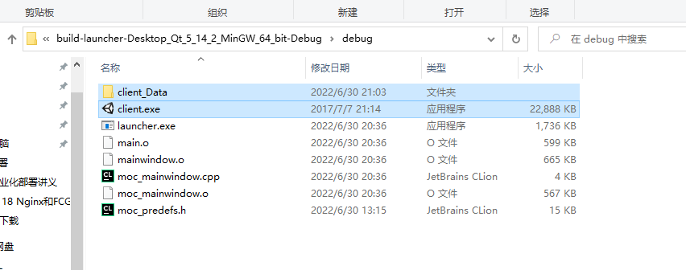
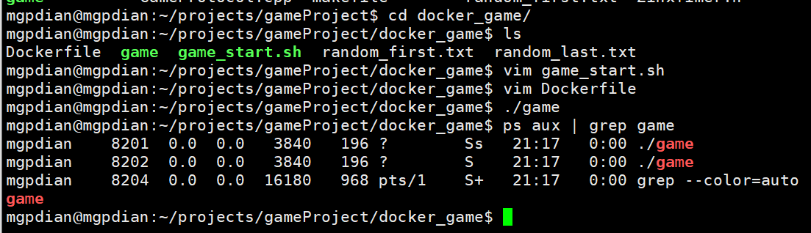
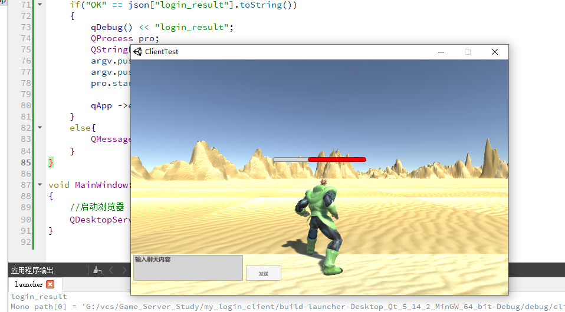

# 26 登录后启动游戏程序

QT还是有库! 

头文件

```c++
#include <QProcess>
```

选择

```c++
QProcess pro;
pro.startDetached(); //类似detach 子进程分离
```

再将游戏启动器里的 这两个文件 复制到 QT的debug文件中



这样qt就能直接找到要运行的对象了


登录成功后 选择

```c++
if("OK" == json["login_result"].toString())
    {
        qDebug() << "login_result";
        QProcess pro;
        QStringList argv;
        argv.push_back("192.168.200.132");
        argv.push_back("51111");
        pro.startDetached("client.exe", argv, "."); //第三个参数 是访问路径 无所谓 因为不会去访问
    
    	qApp -> exit();  //登录成功后 退出登录器
    }
```


```c++
qApp -> exit();  //登录成功后 退出登录器
```

去启动游戏进程



启动游戏登录器

测试成功




**启动游戏进程**

- 调用qproccess的startdetached（）

- 游戏客户端和qt程序放到同级目录