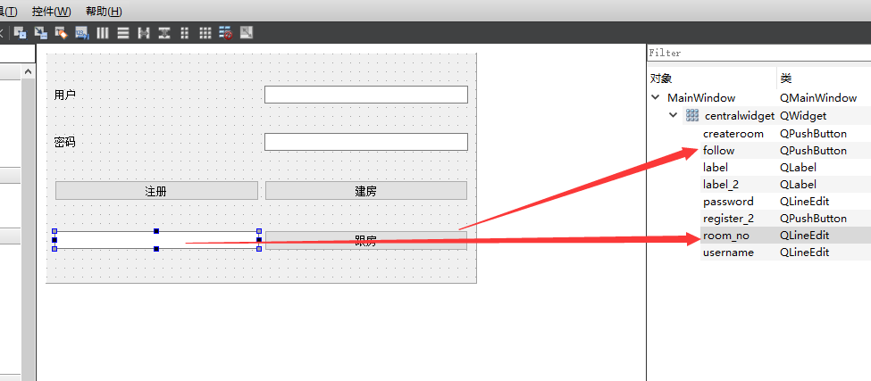

# 27 客户端创建房间

主函数添加这些函数

```c++
private:
    Ui::MainWindow *ui;
    QNetworkAccessManager m_access_mng;
    QNetworkReply *m_reply = NULL;
    enum login_opt{
        create_room, follow_room, change_password
    } m_cur_opt;
private:
    void Req_login();
    void Req_login(QString _opt);
    //void Req_login(QString _opt, QString _room_no);
```

m_cur_opt 来表示当前的状态

Req_login 没啥用了

Req_login(QString _opt) 通过点击不同的按钮 来传入不同的状态 进行http传输


将本来属于on_createroom_clicked的功能赋予给Req_login  但没啥用

#### Req_login  

```c++

void MainWindow::Req_login()
{
    //取出用户名密码
    QString username = ui ->username->text();
    QString password = ui ->password->text();

    //构造某个算法的签名生成器
    QCryptographicHash md5_hash(QCryptographicHash::Md5);

    //添加原始数据到生成器中
    md5_hash.addData(password.toUtf8());
    //调用生成函数得到数字签名
    QString md5_password(md5_hash.result().toHex());

    //拼登录请求(Json格式)
    //构建一个json对象 填入用户名和密码的加密值
    QJsonObject json;
    json["username"] = username;
    json["password"] = md5_password;

    //将json对象放到doc中
    QJsonDocument json_doc(json);

    QString output = json_doc.toJson();

    //发给登录服务器(发http -> qt网络访问库)
    QNetworkRequest req(QUrl("http://192.168.200.132/login/"));
    //QNetworkRequest req(QUrl("http://10.3.113.175:7777/login/"));
    req.setHeader(QNetworkRequest::ContentLengthHeader, output.size());
    req.setHeader(QNetworkRequest::ContentTypeHeader, "application/json");

    m_reply = m_access_mng.post(req, output.toUtf8());
    //异步处理服务器的回复(connect 服务器回复和回复的处理函数)
    connect(m_reply, SIGNAL(finished()), this, SLOT(proc_login_reply()));
}

```

#### Req_login(QString _opt)

比Req_login() 多了

```c++
// 将参数填入 opt 键
    json["opt"] = _opt;
```

```c++

void MainWindow::Req_login(QString _opt)
{
    //取出用户名密码
    QString username = ui ->username->text();
    QString password = ui ->password->text();

    //构造某个算法的签名生成器
    QCryptographicHash md5_hash(QCryptographicHash::Md5);

    //添加原始数据到生成器中
    md5_hash.addData(password.toUtf8());
    //调用生成函数得到数字签名
    QString md5_password(md5_hash.result().toHex());

    //拼登录请求(Json格式)
    //构建一个json对象 填入用户名和密码的加密值
    QJsonObject json;
    json["username"] = username;
    json["password"] = md5_password;

    // 将参数填入 opt 键
    json["opt"] = _opt;
    //将json对象放到doc中
    QJsonDocument json_doc(json);

    QString output = json_doc.toJson();

    //发给登录服务器(发http -> qt网络访问库)
    QNetworkRequest req(QUrl("http://192.168.200.132/login/"));
    //QNetworkRequest req(QUrl("http://10.3.113.175:7777/login/"));
    req.setHeader(QNetworkRequest::ContentLengthHeader, output.size());
    req.setHeader(QNetworkRequest::ContentTypeHeader, "application/json");

    m_reply = m_access_mng.post(req, output.toUtf8());
    //异步处理服务器的回复(connect 服务器回复和回复的处理函数)
    connect(m_reply, SIGNAL(finished()), this, SLOT(proc_login_reply()));
}


```

#### proc_login_reply()

通过当前记录的m_cur_opt状态 来 判断登录后接收到的结果

```c++
if(create_room == m_cur_opt)
{}...
```


```c++

void MainWindow::proc_login_reply()
{


    //判断登录结果
    QJsonDocument json_doc = QJsonDocument::fromJson(m_reply -> readAll());

    QJsonObject json = json_doc.object();

    if("OK" == json["login_result"].toString())
    {
        if(create_room == m_cur_opt)
        {
            qDebug() << "login_result";
            QProcess pro;
            QStringList argv;
            QString room_no = json["room_no"].toString();

            QMessageBox::information(this, "房间号", "房间号" + room_no);
            argv.push_back("192.168.200.132");
            argv.push_back(room_no);
            pro.startDetached("client.exe", argv, ".");

            qApp ->exit();
        }
        else if(follow_room == m_cur_opt)
        {

        }
    }
    else{
        QMessageBox::information(this, "登录失败", "用户名或者密码错误");
    }
}
```


**客户端创建房间**

- 在原登陆请求中增加一个key代表当前操作（create_room）
- 服务器在原回复的基础上，增加一个key代表房间信息（新建的容器的端口号）
- 先弹出提示框（显示房间号），然后启动游戏


留给跟房功能



