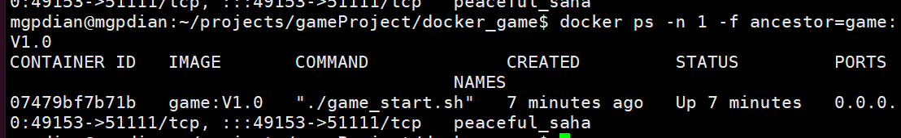

# 28 创建容器脚本

回顾docker

```docker
docker ps -a  //查看容器
docker images //查看镜像
docker run -d -P game:V1.0 //-d守护进程运行game容器 -P使用随机端口关联容器中提供的端口

//随机端口可以 使用ps -a查看
docker ps -a
```


docker新使用

-f 表示过滤 

-f ancestor=xxx  表示只显示xxx

```c++
docker ps -f ancestor=game:V1.0
```

-n 表示 显示最近几条

```c++
docker ps -n 1 -f ancestor=game:V1.0
```




接下来 去掉上面的属性行

```c++
docker ps -n 1 -f ancestor=game:V1.0 | grep game_start
```


通过awk -F 过滤掉输出的一部分

awk -F "->" '{print $1}'

表示 以-> 为分割  

{print $1} 为 输出前一部分

{print $2} 为 输出后一部分

```c++
docker ps -n 1 -f ancestor=game:V1.0 | grep game_start | awk -F "->" '{print $1}'
```


过滤只剩下端口

NF表示 输出最后的那一部分

```c++
docker ps -n 1 -f ancestor=game:V1.0 | grep game_start | awk -F "->" '{print $1}' | awk -F : '{print $NF}'
```


这样我们就得到了需要的端口


# 创建脚本

在login_server 目录下 创建脚本

```c++
vim create_room.sh
```


create_room.sh

```shell
#!/bin/bash

docker run -d -P game:V1.0 2>&1 >/dev/null

docker ps -n 1 -f ancestor=game:V1.0 | grep game_start | awk -F "->" '{print $1}' | awk -F : '{print $NF}'
```

设置脚本权限

```c++
chmod 755 create_room.sh
```


这样我们就获得了 服务器端创建的房间号