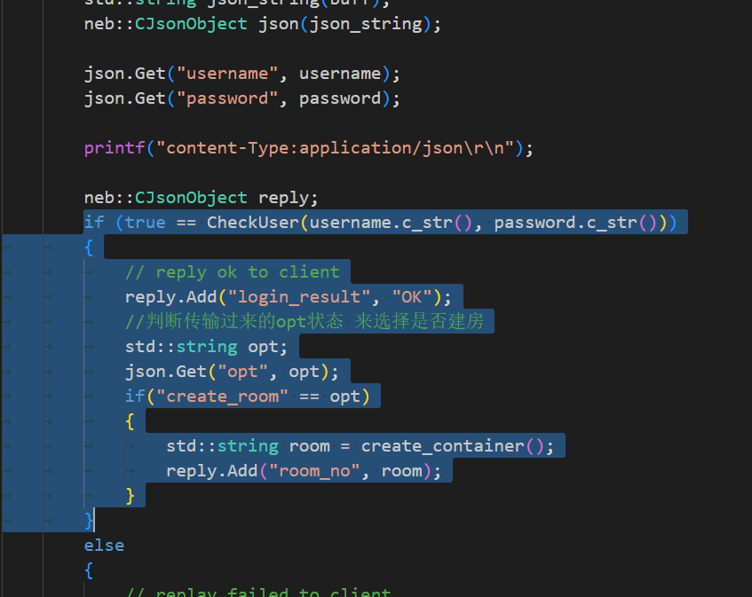
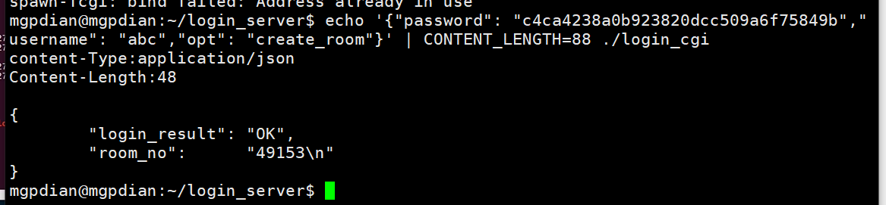
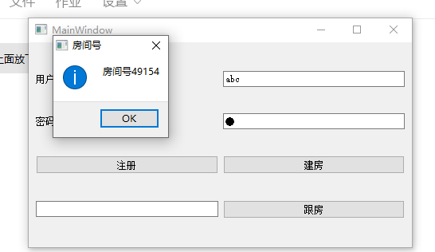
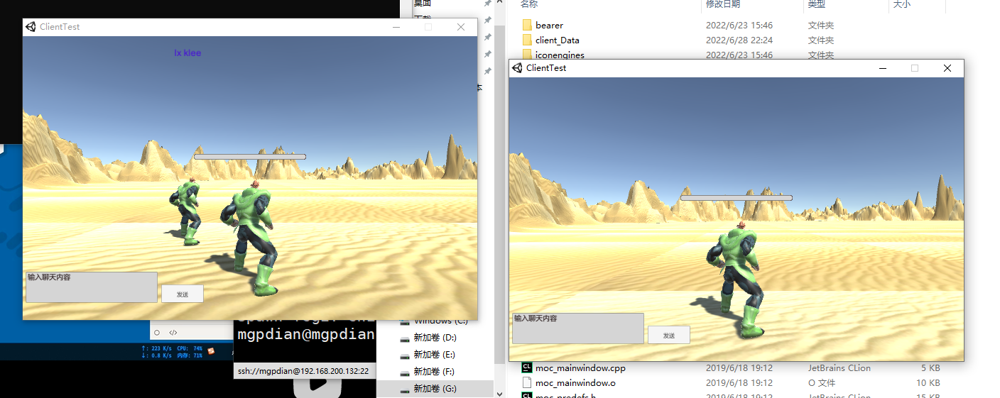

# 29 服务器创建房间实现

从28 我们可以通过 脚本创建一个容器里面有一个服务器房间

接下来 让login_cgi程序 在登录的情况下 调用该脚本 生成房间


### 首先要获取用户的状态

在login_opt.cpp 添加

```c++
if (true == CheckUser(username.c_str(), password.c_str()))
		{
			// reply ok to client
			reply.Add("login_result", "OK");
			//判断传输过来的opt状态 来选择是否建房
			std::string opt;
			json.Get("opt", opt);
			if("create_room" == opt)
			{
				std::string room = create_container();
				reply.Add("room_no", room);
			}
		}
```




### 如果获取到为建房状态 则创建房间 运行脚本

因为我们需要脚本的输出(返回的随机端口)作为房间号

popen正好能满足这个需求

在user_opt.cpp那里创建

```c++
std::string create_container()
{
	std::string ret;
	//popen 可以运行脚本 并且获取他的输出
	FILE* fd = popen("./create_room.sh", "r");
	if(nullptr != fd)
	{
		char buff[1024];
		fread(buff, 1, sizeof(buff), fd);
		ret.append(buff);
		//退出最后一个字符 --\n
		ret.pop_back();
		pclose(fd);
	}
	return ret;
}
```


编译后 

### 测试

```c++
echo '{"password": "c4ca4238a0b923820dcc509a6f75849b","username": "abc","opt": "create_room"}' | CONTENT_LENGTH=88 ./login_cgi

```




测试成功后

## 设置spawn-fcgi

将之前设置的spawn-fcgi 重新覆盖

```c++
spawn-fcgi -a 127.0.0.1 -p 8888 -f ./login_cgi
```

如果端口被占用 就去进程那里查看 关闭使用端口的程序


成功获得

### qt建房测试

> qt的 建房
>
> ```c++
> void MainWindow::proc_login_reply()
> {
> 
> 
>     //判断登录结果
>     QJsonDocument json_doc = QJsonDocument::fromJson(m_reply -> readAll());
> 
>     QJsonObject json = json_doc.object();
> 
>     if("OK" == json["login_result"].toString())
>     {
>         if(create_room == m_cur_opt)
>         {
>             qDebug() << "login_result";
>             QProcess pro;
>             QStringList argv;
>             QString room_no = json["room_no"].toString();
> 
>             QMessageBox::information(this, "房间号", "房间号" + room_no);
>             argv.push_back("192.168.200.132");
>             argv.push_back(room_no);
>             pro.startDetached("client.exe", argv, ".");
> 
>             qApp ->exit();
>         }
>         else if(follow_room == m_cur_opt)
>         {
> 
>         }
>     }
>     else{
>         QMessageBox::information(this, "登录失败", "用户名或者密码错误");
>     }
> }
> 
> ```
>
> 




登录成功



**服务器处理创建房间（创建容器）**

- 创建脚本用来创建容器和打印端口号

- 修改原来的登陆CGI程序--》若登陆请求中含有建房请求---》调用

创建脚本并回复端口号

- popen调用脚本，可以读出被调用的程序的输出