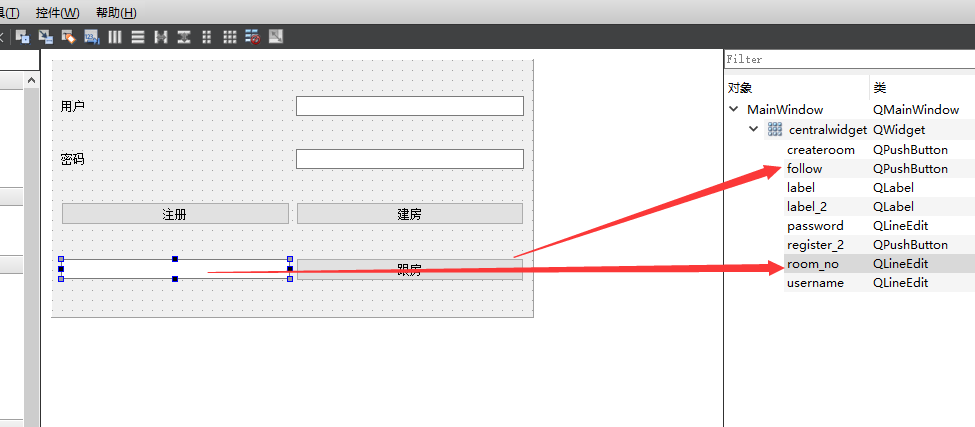
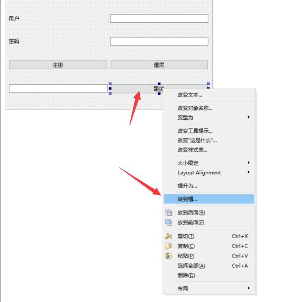

# 30 跟房功能

跟房按钮





点击事件为

```c++
void MainWindow::on_follow_clicked()
{
    m_cur_opt = follow_room;
    Req_login("follow_room", ui->room_no->text());
}
```

设置跟房的处理函数

和其他Req_login比

添加了 

```c++
 json["room_no"] = _room_no;
```

```c++

void MainWindow::Req_login(QString _opt, QString _room_no)
{
    //取出用户名密码
    QString username = ui ->username->text();
    QString password = ui ->password->text();

    //构造某个算法的签名生成器
    QCryptographicHash md5_hash(QCryptographicHash::Md5);

    //添加原始数据到生成器中
    md5_hash.addData(password.toUtf8());
    //调用生成函数得到数字签名
    QString md5_password(md5_hash.result().toHex());

    //拼登录请求(Json格式)
    //构建一个json对象 填入用户名和密码的加密值
    QJsonObject json;
    json["username"] = username;
    json["password"] = md5_password;

    // 将参数填入 opt 键
    json["opt"] = _opt;
    json["room_no"] = _room_no;
    //将json对象放到doc中
    QJsonDocument json_doc(json);

    QString output = json_doc.toJson();

    //发给登录服务器(发http -> qt网络访问库)
    QNetworkRequest req(QUrl("http://192.168.200.132/login/"));
    //QNetworkRequest req(QUrl("http://10.3.113.175:7777/login/"));
    req.setHeader(QNetworkRequest::ContentLengthHeader, output.size());
    req.setHeader(QNetworkRequest::ContentTypeHeader, "application/json");

    m_reply = m_access_mng.post(req, output.toUtf8());
    //异步处理服务器的回复(connect 服务器回复和回复的处理函数)
    connect(m_reply, SIGNAL(finished()), this, SLOT(proc_login_reply()));
}
```


客户端发送请求后  得到服务器回复的处理

```c++
void MainWindow::proc_login_reply()
```

```c++
else if(follow_room == m_cur_opt)
        {
            if("OK" == json["follow_result"].toString())
            {
                QProcess pro;
                QStringList argv;
                QString room_no = ui ->room_no->text();
                argv.push_back("192.168.200.132");
                argv.push_back(room_no);
                pro.startDetached("./client.exe", argv, ".");
                qApp->exit();
            }
            else{
                QMessageBox::information(this, "跟房失败", "房间不存在");
            }
        }
```

全部

```c++
void MainWindow::Req_login(QString _opt, QString _room_no)
{
    //取出用户名密码
    QString username = ui ->username->text();
    QString password = ui ->password->text();

    //构造某个算法的签名生成器
    QCryptographicHash md5_hash(QCryptographicHash::Md5);

    //添加原始数据到生成器中
    md5_hash.addData(password.toUtf8());
    //调用生成函数得到数字签名
    QString md5_password(md5_hash.result().toHex());

    //拼登录请求(Json格式)
    //构建一个json对象 填入用户名和密码的加密值
    QJsonObject json;
    json["username"] = username;
    json["password"] = md5_password;

    // 将参数填入 opt 键
    json["opt"] = _opt;
    json["room_no"] = _room_no;
    //将json对象放到doc中
    QJsonDocument json_doc(json);

    QString output = json_doc.toJson();

    //发给登录服务器(发http -> qt网络访问库)
    QNetworkRequest req(QUrl("http://192.168.200.132/login/"));
    //QNetworkRequest req(QUrl("http://10.3.113.175:7777/login/"));
    req.setHeader(QNetworkRequest::ContentLengthHeader, output.size());
    req.setHeader(QNetworkRequest::ContentTypeHeader, "application/json");

    m_reply = m_access_mng.post(req, output.toUtf8());
    //异步处理服务器的回复(connect 服务器回复和回复的处理函数)
    connect(m_reply, SIGNAL(finished()), this, SLOT(proc_login_reply()));
}
```

遇到了bug 但不是跟房功能的问题 我们用31来讲这个问题

测试后跟房功能成功