# 3 docker三大核心 及命令

## 2.2 docker详解


**程序架构**

docker是CS架构的软件，命令行敲的命令会发送到一个守护进程docker Daemon执行。一般地，命令行和守护进程在同一个计算机运行。容器，镜像的管理由docker Daemon执行，命令行无需关心。

**docker程序架构** 

cs架构

容器，镜像都是由守护进程管理

### 核心

docker有三个核心概念: 镜像 容器 和 仓库

### 2.2.1. 仓库

仓库（dockerhub）


类似github，docker官方设定了一个docker镜像的仓库：dockerhub（https://hub.docker.com/）

我们先注册仓库 

```c++
//去docket仓库里拉镜像
docker pull 作者/镜像名:标签名 拉去镜像

//运行镜像
docker run -ti 镜像名 命令
//比如
//docker run -ti ubuntu /bin/bash
//这样的化会进入镜像的ubuntu 中 你可以进行linux操作

//当想退出时 输出exit
exit 
    
//看现在docker里有几个镜像 
docker images

//登录自己的仓库
docker login
    
//进行上传前 要进行改名 改成 作者/镜像名:标签名 的格式  
//但这个改名 是会先复制一份出来进行改名 原来的不受影响
docker tag ubuntu:latest mgpdian/apple:V1.0
 
//上传
docker push mgpdian/apple:V1.0
```

现在看看每个操作的实际效果

#### 1 下载

```c++
//去docket仓库里拉镜像
docker pull 作者/镜像名:标签名 拉去镜像
```

```c++
docker pull ubuntu:latest
```

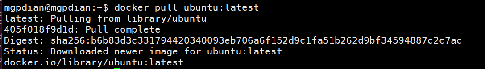

### 2 查看

```c++
docker images
```

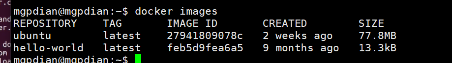

### 3 镜像运行

运行 和 退出

```c++
//运行镜像
docker run 镜像名 命令
//比如
docker run -ti ubuntu /bin/bash
//这样的化会进入镜像的ubuntu 中 你可以进行linux操作
//-ti 是会为容器运行一个终端 显示发生了什么
    
    
//当想退出时 输出exit
exit 
```

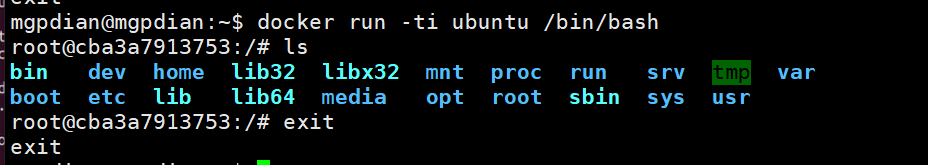

### 4 登录

```c++
//登录自己的仓库
docker login
```

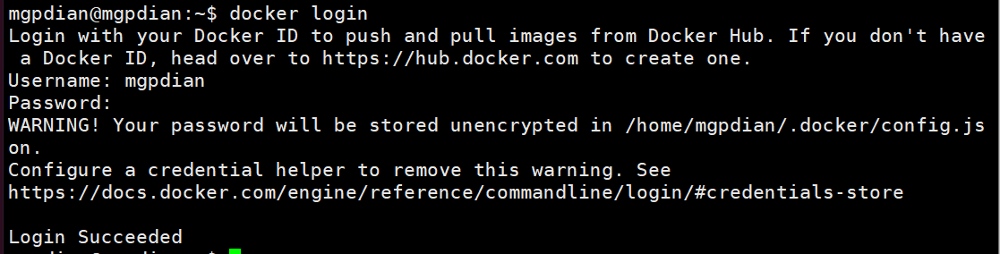


### 5 改名

```c++
//进行上传前 要进行改名 改成 作者/镜像名:标签名 的格式  
//但这个改名 是会先复制一份出来进行改名 原来的不受影响
docker tag ubuntu:latest mgpdian/apple:V1.0
```


改名 是会先复制一份出来进行改名 原来的不受影响

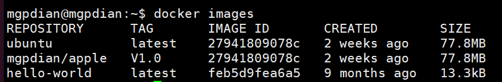


### 6 上传

```c++
//上传
docker push mgpdian/apple:V1.0
```

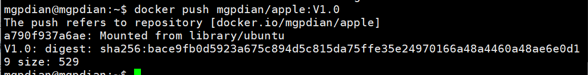

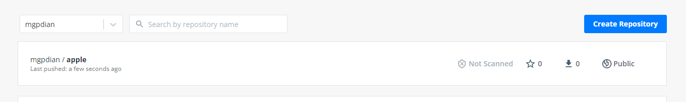

### 7 删除

```c++
docker rmi ubuntu:latest 
```

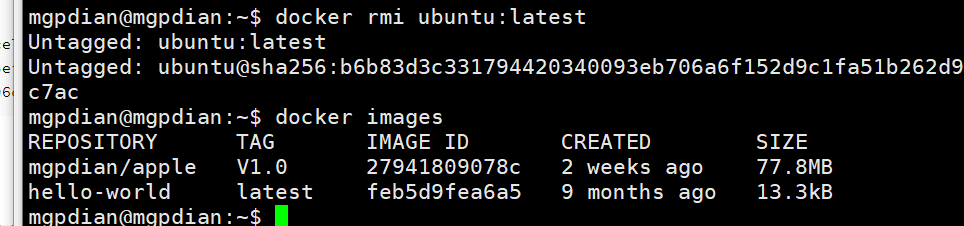

### 2.2.2. 镜像

- **概念：** 一组环境的静态集合，类似操作系统镜像。
- **特点：** docker镜像有分层依赖的关系。创建镜像的过程就好像写代码，从简单到复杂的过程。

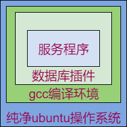

- **运行：** 镜像运行后会产生容器。基于一个镜像可以运行多个容器。

  我的理解是: 镜像是一个工厂类 容器是他生产的类  工厂类可以生成多个类  所以一个镜像可以生成多个容器

  也就是说 镜像是个模板 来生产相同的容器

```bash
# 查看当前所有的镜像
$ docker images
# 运行ubuntu镜像：在ubuntu容器中执行一条ls的命令，不写命令则运行bash
$ docker run --rm -ti ubuntu ls
# --rm -ti参数：运行结束后删除容器，提供虚拟终端和交互式界面
```

查看镜像生成的容器的

```bash
$ docker ps -a
```

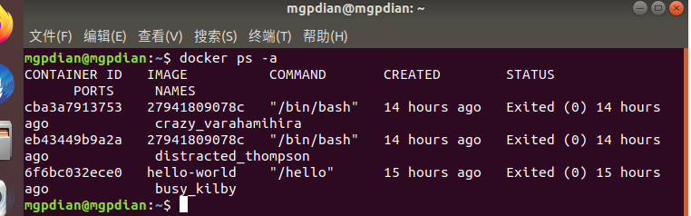

这是我们昨天删除镜像后 的 容器情况 我们会发现 删除镜像后 该镜像生产的容器不会被删除

所以我们要想删除容器该怎么办

注意这里的NAMES

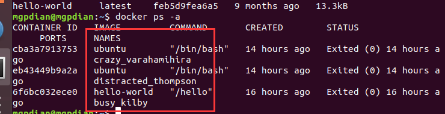

当我们要删除容器时 要记住容器对应的NAMES

> 首先要让容器停止
>
> 
>
> ```bash
> #使用docker stop命令停止要删除的容器
> sudo docker stop ck10_mariadb
> 
> #停用全部运行中的容器:
> docker stop $(docker ps -q)
> ```
>
> 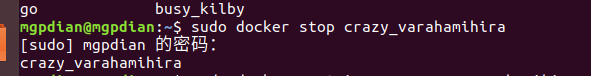
>
> 然后删除 这样可能比较安全
>
> ```bash
> sudo docker rm ck10_mariadb
> 
> #删除全部容器：
> docker rm $(docker ps -aq)
> ```
>
> 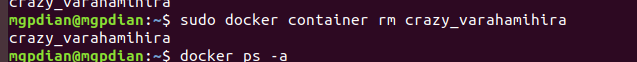
>
> 注：还可以使用以下命令一次删除所有停止的容器。
>
> ```bash
> sudo  docker rm $(docker ps -a -q)
> ```
>
> 删除成功
>
> 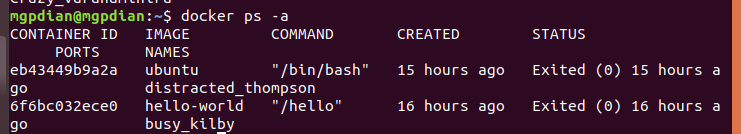
>
> 一条命令实现停用并删除容器：
>
> ```bash
> docker stop $(docker ps -q) & docker rm -f $(docker ps -aq)
> ```
>
> 


### 安装镜像环境

实际上 下载下来的镜像里面只有一个空的ubuntu 我们需要给这个镜像安装环境 

步骤: 镜像生成一个容器 我们给这个容器安装环境 然后提交这个容器(就想git一样)  让容器生成一个对应的镜像

**创建：** 类似基于原始系统搭环境

- 手动创建
  1. 下载并运行基础镜像
  2. 进入基础镜像的容器内安装所需环境
  3. 将容器提交为镜像

比如 这个的情况 就是说明了没有安装

```bash
# 直接执行ifconfig，报错，因为基础镜像没有安装ifconfig包
$ docker run --rm ubuntu ifconfig
docker: Error response from daemon: OCI runtime create failed: container_linux.go:344: starting container process caused "exec: \"ifconfig\": executable file not found in $PATH": unknown.
ERRO[0000] error waiting for container: context canceled 
```

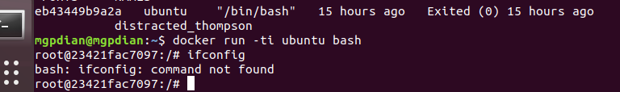

接下来 我们进行安装

```c++
# 进入基础镜像，安装工具包后退出
$ docker run -ti ubuntu
# apt-get update
# apt-get install -y net-tools
# exit
```

安装成功 后退出

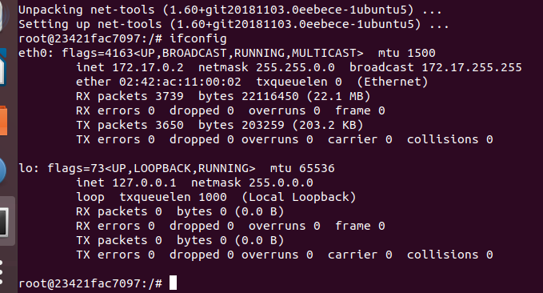

找到刚才的容器 提交他 生成一个新的镜像

```bash
# 找到刚才的容器，基于其创建镜像
$ docker ps -a
```

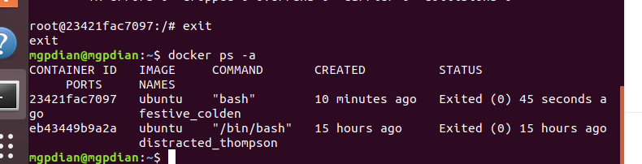

#### 上传

提交生成新镜像

```bash
# commit命令用于容器---》镜像
# 容器ID可以用简写
$ docker commit 034a my_unbuntu:add_net

```

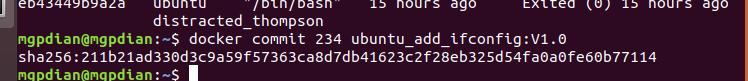

查看提交后生成的新镜像

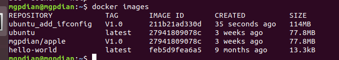


用新镜像运行ifconfig

```bash
# 用新镜像运行ifconfig
$ docker run --rm my_unbuntu:add_net ifconfig
# --rm 表示 容器运行后删除
```

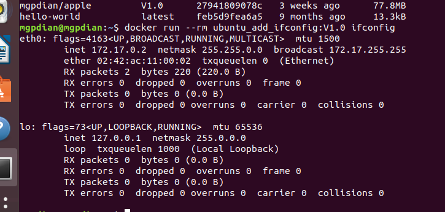


- 脚本创建

  1. 编写Dockerfile
  2. 运行docker编译命令

  ```bash
  # Dockerfile中定义基础镜像，和要运行的安装命令
  $ cat Dockerfile
  FROM ubuntu
  RUN apt-get update
  RUN apt-get install -y net-tools
  # 编译镜像，指定镜像名是df_unbutu:add_net，指定Dockerfile所在目录是当前目录
  $ docker build -t df_unbutu:add_net .
  ```

**小结：** 手动创建方便操作，脚本创建方便分享。

### 镜像

- 静态的一组环境的集合
- 运行：创建容器，在容器中运行XXXX
- 手动创建：
  - 下载原始镜像
  - 在基于该镜像运行bash，装所需软件
  - 将装好软件的容器提交为新的镜像
- 脚本创建：
  - 写Dockerfifile：规定镜像创建的过程
  - 构建镜像


### 2.2.3. 容器

- **概念：** 运行中的一组环境。基于某个镜像创建。

- **特点：** 容器中要运行程序，最好只运行一个程序。容器的运行不会影响镜像内容。

- **运行：**

  - 支持以后台模式运行进程

  ```bash
  docker run -d xxx:xxx
  ```

  - 支持将容器内的端口映射到宿主机
  - 支持以挂载的形式和宿主机共享文件系统 (就是利用linux内存扩展的机制 把自己挂载主机内存分支 那里)
  - 容器运行的程序退出后，容器随之退出；容器退出后可以再次打开

#### 端口映射

创建一个回声服务器 他在 `/home/mgpdian/projects/docker_try`那里

我们要把它放入容器中

先运行一个容器  然后再另一个窗口 操作

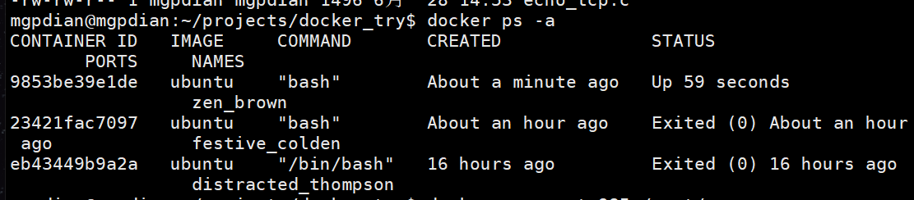

```bash
$ docker cp a.out 985:/root/
```


将a.out执行文件 放入 ID缩写为985的容器的 /root/中

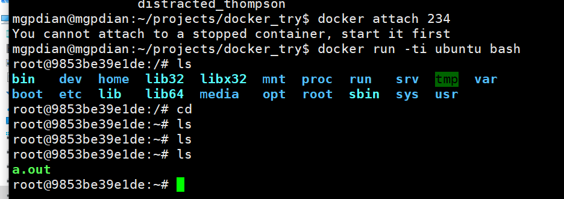


但还不能和外部通信 你需要把在容器创建时和系统的端口绑定

-p 为绑定端口  前面的是主机的端口 后面的是容器的端口

```bash
$ docker run -ti -p 44444:55555 ubuntu bash

```

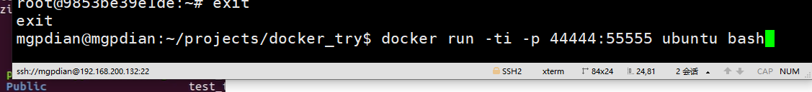

再次移入文件

```bash
$ docker cp a.out eba:/root/
```

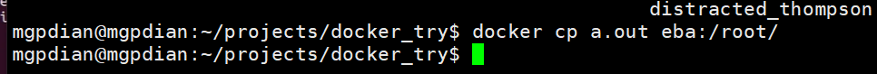


运行 连接成功

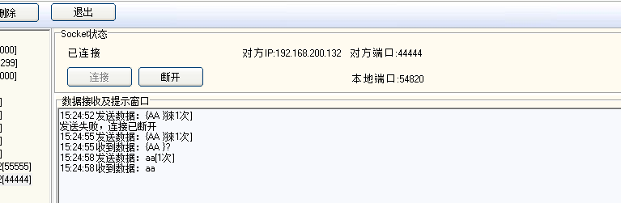


#### 挂载

将主机和容器的内存关联起来 共享

-v  主机的路径:容器的路径

```bash
$ docker run -ti -v /home/mgpdian:/root/client ubuntu bash
```

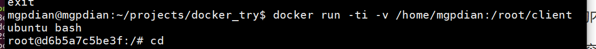

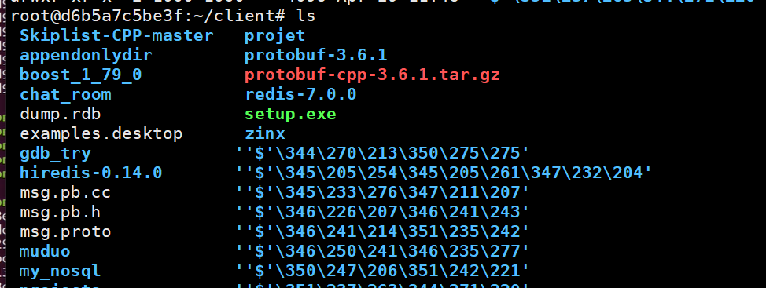


#### 再次进入同一个容器

```bash
$ docker start -ai 234
# -ai 等于创建时的ti 进入容器的命令端口

```

#### 删除容器


```bash
$ docker rm xx

$ docker ps -aq
# 查看所有容器

$ docker rm 'docker ps -aq'
# 双引号表示把返回值传入参数  
```

完整

使用ubuntu镜像运行该程序：

```bash
# 启动容器，
# -d 以守护进程启动容器
# -v /home/dev/:/root/host/ 将本机的/home/dev/目录挂载到容器内的/root/host目录下
# -p 22334:55555 将本机的22334端口映射到容器内的55555端口
# /root/host/tcp_echo，可执行程序的路径
$ docker run -d -v /home/dev/:/root/host/ -p 22334:55555 ubuntu /root/host/tcp_echo
```

### 容器总结

- 运行时的一组环境，基于某个镜像创建

- 容器的修改不会影响镜像

- 运行容器：

  - 守护运行 -d
  - 端口映射: -p 外端口号:内端口号
  - 共享文件系统： -v 外绝对路径:内绝对路径
  - 容器开始于要运行的进程，结束于进程退出

- 删掉所有容器：

  - ` docker rm 'docker ps -aq'`

    


### 2.2.4. 使用约束

- docker只能安装在64位linux系统上（或专业版win10）
- docker官方推荐，在一个容器中最好只运行一个进程
- 镜像和容器会占用磁盘空间。好习惯：删除不用的容器和镜像

## 2.3 docker和虚拟机的对比

相似处：

- 都通过镜像包装
- 都可以起到隔离进程运行环境的作用

**区别：**

|        | docker                                 | 虚拟机                                         |
| ------ | -------------------------------------- | ---------------------------------------------- |
| 速度   | 快（基于当前系统创建不同的运行上下文） | 慢（启动操作系统）                             |
| 体量   | 小（镜像文件可以自由定制裁剪）         | 大（依赖厂商决定）                             |
| 分发   | 容易（dockerhub，Dockerfile）          | 困难（一般由厂商分发）                         |
| 复杂度 | 简单（对于操作系统而言只是一个程序）   | 复杂（需要考虑资源分配，与宿主机的通信等问题） |
| 独立性 | 较好（容器只能基于端口独立）           | 非常好（跟真实主机几乎没有区别）               |

## 2.4 常用docker命令

| 类型     | 命令                                                    | 描述                                     |
| -------- | ------------------------------------------------------- | ---------------------------------------- |
| 镜像操作 | docker images                                           | 显示存在的当前镜像                       |
|          | docker image prune                                      | 删除无用的镜像（被更新的旧镜像）         |
|          | docker rmi *镜像ID*                                     | 删除指定的镜像                           |
|          | docker build -t *镜像名称：tag dockerfile所在路径*      | 编译镜像                                 |
|          | docker login                                            | 登陆dockerhub                            |
|          | docker pull *镜像作者/镜像名称：tag*                    | 从dockerhub拉取镜像                      |
|          | docker tag *镜像名称：tag* *镜像作者/新名称：tag*       | 规范重命名镜像                           |
|          | docker push *镜像作者/镜像名称：tag*                    | 推送镜像到dockerhub                      |
| 容器操作 | docker ps -a                                            | 显示当前所有容器                         |
|          | docker rm *容器ID*                                      | 删除指定容器，运行中容器不能删           |
|          | docker start -ai *容器ID*                               | 启动之前退出的容器                       |
|          | docker stop *容器ID*                                    | 停止指定容器                             |
|          | docker cp *宿主机文件绝对路径* *容器ID：容器内绝对路径* | 从宿主机拷贝文件到容器内                 |
|          | docker cp *容器ID：容器内绝对路径* *宿主机文件绝对路径* | 从容器内拷贝文件到宿主机                 |
| run命令  | docker run _参数_ *镜像名* *执行程序名*                 | 创建并运行容器                           |
|          | -d                                                      | 守护模式运行，适用服务，与ti参数互斥     |
|          | -ti                                                     | 打开终端交换模式，适用应用程序，与-d互斥 |
|          | -v *主机绝对路径*:*容器内绝对路径*                      | 将宿主机路径挂载到容器内                 |
|          | -p *主机端口*:*容器内端口*                              | 将容器内端口映射到宿主机端口             |
|          | -e *环境变量名=环境变量值*                              | 向容器内定义环境变量                     |
|          | --rm                                                    | 容器退出后自动删除，适用纯应用程序       |

更多：`man docker,man docker run .....`