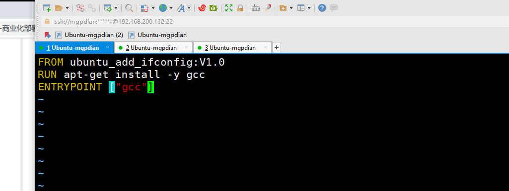
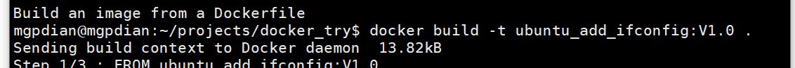
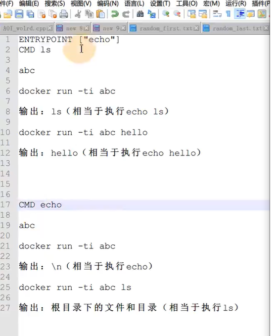

# 4 dockerfile编写

## 2.5 Dockerfile编写

**编写思路**

1. 确定基础镜像
2. 安装所需环境
3. 定义执行点

```
FROM ubuntu
RUN apt-get update
RUN apt-get install -y gcc
ENTRYPOINT ["gcc"]
```



编译镜像，执行gcc

```bash
$ docker build -t my_gcc .
# 由于dockerfile中定义了执行点是gcc，所以，镜像名后所有内容都是gcc的参数
$ docker run -v /home/dev/:/root/host/ my_gcc /root/host/tcp_echo.c -o /root/host/tcp_echo 
```



**常见指令**

| 指令                               | 描述                                                         |
| ---------------------------------- | ------------------------------------------------------------ |
| FROM *本地镜像名或dockerhub镜像名* | 指定基础镜像                                                 |
| WORKDIR *容器内绝对路径*           | 指定后续容器内命令的执行路径                                 |
| RUN *命令*                         | 构建镜像过程中执行的命令，多条可以顺序书写                   |
| COPY *主机文件路径* *容器内路径*   | 将主机文件拷贝到容器内，主机文件必须使用dockerfile所在路径的相对路径 |
| EXPOSE *端口号*                    | 定义要映射到主机的端口号，搭配run命令的-P参数可以随机映射    |
| ENTRYPOINT *["程序"]*或*脚本*      | 定义镜像执行点，定义后，run命令的最后字段会变成该命令的参数  |
| CMD *["命令或参数"]*               | 若没有定义执行点，则该命令定义的是镜像创建后缺省的指向程序。若定义了执行点，则该命令定义的是执行点的参数。run命令的最后字段会替换该命令的值 |

## 脚本创建docker镜像 

1. 指定基础镜像（FROM XXXX） 

2.  装环境（RUN ，WORKDIR，COPY） 

3. 指定执行点（ENTRYPOINT） 

  

  ENTRYPOINT ["XXX"]：

  -  XXX是且仅是镜像所运行的程序

  - CMD 命令指定你的内容会作为XXX的参数

  - run 镜像名 xxxx：xxxx会作为XXX的参数

    

    CMD ["XXX"]

  - 镜像缺省运行XXX程序

  - run 镜像名 xxxx：容器会执行xxxx程序



理解:

ENTRYPOINT ["xxx"] 用来定义执行点 有了这个 用它创建的镜像 都会在运行的时候 先加个xxx 你输入的命令会变成它的参数

CMD xxx  如果没有执行点 你也没有输入命令 那它就执行默认执行的程序xxx

如果有执行点 它就会作为参数 

如果没有执行点 但你输入了命令 那它就没用了