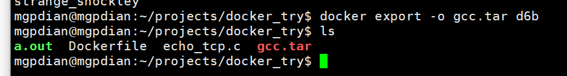
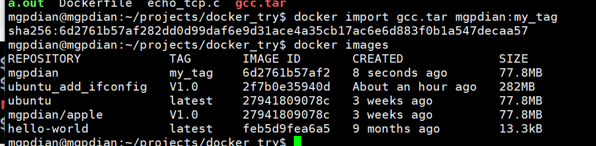

# 5 离线分发镜像

离线分发镜像

- 导出容器：`docker export -o XXX.tar af85`: 将容器中固化的内容导出

- 导入镜像：`docker import XXX.tar my_image:my_tag`：导入的镜像只包含原容器内的文件系统，缺失了镜像执行点，暴露端口，原镜像的构建历史


```bash
#导出
docker export -o xxx.tar ID

```



```bash
#导入
docker import xxx.tar mgpdian:my_tag 
```

