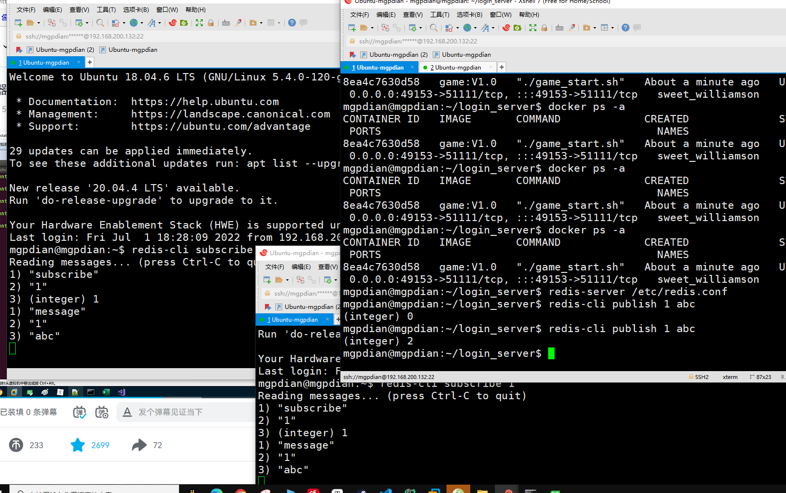
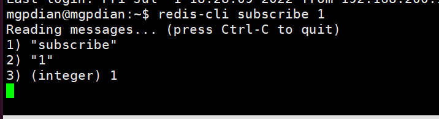
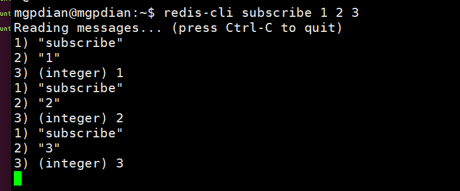

# 33 redis发布订阅机制

复习一下redis

启动redis服务器

```c++
redis-server /etc/redis.conf
```

publish 为发布

subscribe 为订阅


publish 发布

```c++
redis-cli publish 1 abc
```

这个表示为 在通道1上 发布abc 内容  会返回接收到该通道的订阅人数


发布后 会返回 接收到该发布消息的订阅人数




subscribe 订阅

订阅通道1的内容

```c++
redis-cli subscribe 1
```

一开始订阅后 会马上返回 三行  第一行:表示订阅 第二行: 表示订阅通道号 第三行: 表示订阅是否有效

然后陷入阻塞  等待通道的数据到来 需要ctrl+c退出



可以订阅多个通道



#### redis发布发布订阅机制

- 发布（发消息）：publish 频度名 内容

- 订阅（收消息）：subscribe 频道名（命令会阻塞一直等待新消息）

- 发布消息时会同时发给所有订阅者

- 订阅消息时，可以同时订阅多个频度