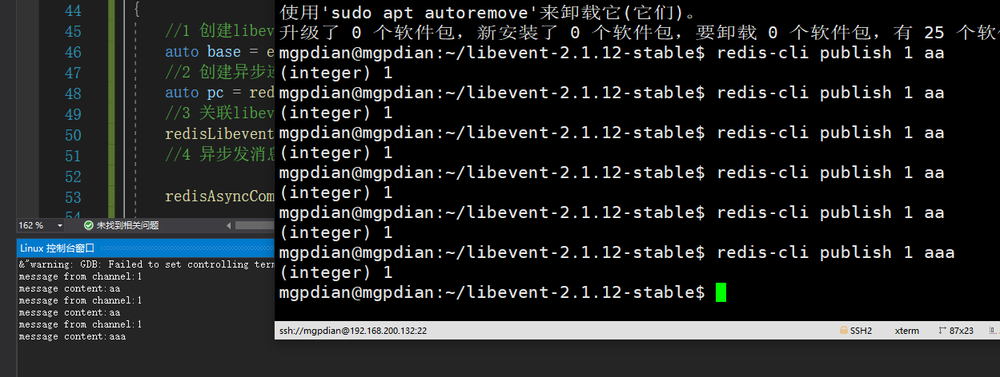

# 35 异步处理hiredis订阅

想要使用hiredis的异步功能 想要先下载libevent库

[看这里](G:\笔记\游戏服务器\笔记\软件安装\libevent安装.md)


```c++

//redisAsyncCommand 的第二参数 回调函数
void my_callback(redisAsyncContext* c, void* preply, void* privdata)
{
	redisReply* reply = (redisReply*)preply;
	if ("message" == std::string(reply->element[0]->str))
	{
		std::cout << "message from channel:" << std::string(reply->element[1]->str) << std::endl;
		std::cout << "message content:" << std::string(reply->element[2]->str) << std::endl;
	}
}
```

```c++

void redis_async()
{
	//1 创建libevent实例
	auto base = event_base_new();
	//2 创建异步连接
	auto pc = redisAsyncConnect("127.0.0.1", 6379);
	//3 关联libevent实例和异步连接
	redisLibeventAttach(pc, base);
	//4 异步发消息 (指定回复处理函数

	redisAsyncCommand(pc, my_callback,NULL, "subscribe 1");
	
	//5 开始事件循环
	event_base_dispatch(base);
}
```

理解: event_base_new应该是一个异步的期望?  异步连接先连接则

异步连接与期望先绑定  应该是 异步连接加 "subscribe 1" 实现阻塞 然后 当通道传输数据时 触发期望 从而触发回调函数

然后 event_base_dispatch 触发循环 跳回 event_base_new



### **异步订阅redis**

- 创建libevent实例

- 创建异步连接（redisAsyncConnect）
- 关联异步连接和libevent实例（redisLibeventAttach）
- 异步发消息们，指定处理函数们
- 开启事件循环