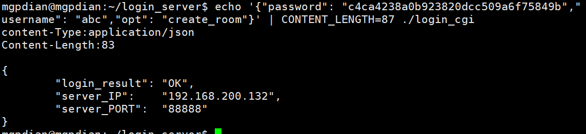
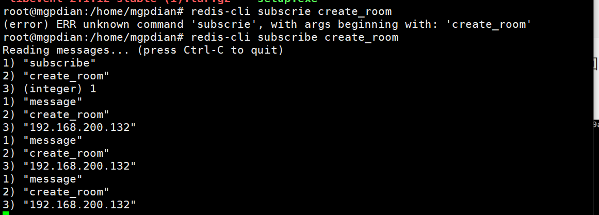
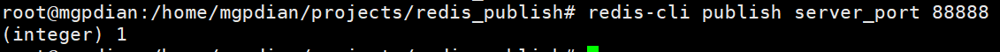

# 38 分布式部署的CGI实现

> 遇到bug redis无法启动
>
> 已解决
>
> 解决方法 修改/etc/redis.conf中的dir  把她修改为绝对路径 并且该路径必须是当前用户可以修改的  否则只有root用户可以来用  而且用户无法启动redis  


### fcgi程序

login_cgi.cpp

修改房间的函数  得到返回值 包括 IP + PORT 将他们分离 并放入reply中

```c++
if("create_room" == opt)
{
				std::string room_info = create_container();
				reply.Add("server_IP", room_info.substr(0, room_info.find(' ')));
				reply.Add("server_PORT", room_info.substr(room_info.find(' ') + 1));
}
```


user_opt.cpp

修改其中的创建房间的函数  让她具有遍历所有服务器的功能  

发送发布数据给 遍历到的一个服务器

并得到她返回 创建的游戏服务器的端口

返回 该服务器的IP和 其返回的端口

```c++

static int g_cur_select = 0;
std::string create_container()
{
	//return "x.x.x.x xxxxx"
	//1 确定调用在哪个服务器上创建
	std::string port;
	std::string server_array[2] = {"192.168.200.132", "192.168.200.133"};
	std::string cur_server = server_array[g_cur_select++];
	g_cur_select %= sizeof(server_array)/sizeof(server_array[0]);
	
	//2 向这个服务器发送创建容器的请求
	//向这个服务器的redis(这个redis订阅着主服务器的redis)  发布一个消息
	//通道名字为 create_room
	// redis-cli publish create_room 
	redisContext* pc = redisConnect("127.0.0.1", 6379);
	if(nullptr != pc)
	{
		freeReplyObject(redisCommand(pc, "publish create_room %s", cur_server.c_str()));
		//3 等待服务器返回创建容器的端口
		freeReplyObject(redisCommand(pc, "subscribe server_port"));

		redisReply *reply = NULL;
		if(REDIS_OK == redisGetReply(pc, (void**)&reply))
		{
			port.append(reply->element[2]->str);
			freeReplyObject(reply);
		}
		redisFree(pc);
	}

	//4 return IP + PORT
	
	//std::string ret;
	// //popen 可以运行脚本 并且获取他的输出
	// FILE* fd = popen("./create_room.sh", "r");
	// if(nullptr != fd)
	// {
	// 	char buff[1024];
	// 	fread(buff, 1, sizeof(buff), fd);
	// 	ret.append(buff);
	// 	//退出最后一个字符 --\n
	// 	ret.pop_back();
	// 	pclose(fd);
	// }
	//return ret;
	return cur_server + " " + port;
}
```

编译:

```c++
g++ -std=c++11 login_cgi.cpp user_opt.cpp cJSON.c CJsonObject.cpp -o login_cgi -lfcgi -lhiredis

```

测试:

```c++
echo '{"password": "c4ca4238a0b923820dcc509a6f75849b","username": "abc","opt": "create_room"}' | CONTENT_LENGTH=87 ./login_cgi 

```

因为还没有设计返回功能  所以 用另一个redis客户端来返回

主服务器



选择的服务器情况



当发布数据给选择的服务器后 主服务器会陷入阻塞 等待服务器发布数据(创建的端口)给她


发送端口




测试完成

### **分布式部署的FCGI程序修改**

- 回复给客户端的信息要包含IP+PORT 

- IP是轮流选取

- 向create_room频道发布消息（当前选择的IP作为消息）

- 等server_port频道的回复（端口）