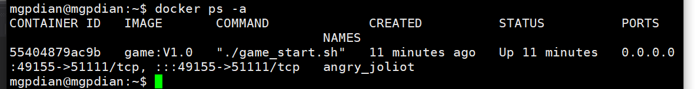
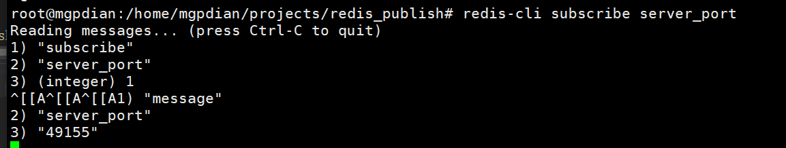

# 39 容器管理进程

38 是通知服务器要部署容器了

那39 就算 服务器怎么部署容器

先通过异步hiredis 等待主服务器发布通知

```c++
auto base = event_base_new();

    redisAsyncContext* pc =  redisAsyncConnect("192.168.200.132", 6379);
    redisLibeventAttach(pc, base);

    redisAsyncCommand(pc, my_callbask, NULL, "subscribe create_room");

    event_base_dispatch(base);
```


接收到通知后 触发异步通信  跳转到my_callbask函数中

my_callbask分为三步

第一步 判断 该发布数据是不是通知她创建容器

```c++
 std::string port;

    //若指定的服务器是自己才会创建房间
    redisReply* my_reply = (redisReply*)reply;
   
    if ("message" != std::string(my_reply->element[0]->str))
    {
        //刚连接
        
        return;
    }
    else {
        std::string IP(my_reply->element[2]->str);
        //判断IP是否是自己的IP
        //选择环境变量来获取IP  因为如果系统调用可能会获取到外网或者内网等各种各样的IP
        std::string my_ip(getenv("MY_IP"));
        if (IP != my_ip)
        {
            
            return;
        }
    }
```

第二步 调用popen 函数 来执行脚本 并将脚本的返回值 记录到字符串port中

```c++
 //执行脚本获取端口号
    FILE* pf = popen("./create_room.sh", "r");
    if (nullptr != pf)
    {
        char buff[1024];
        fread(buff, 1, sizeof(buff), pf);

        port.append(buff);
        port.pop_back();
        pclose(pf);
    }
```

第三步

使用同步的方法 向主服务器发布端口号

```c++
//发布端口号

    redisContext* spc = redisConnect("192.168.200.132", 6379);
    if (nullptr != spc)
    {
        freeReplyObject(redisCommand(spc, "publish server_port %s", port.c_str()));
        redisFree(spc);
    }
```


总 my_callbask

```c++
void my_callbask(struct redisAsyncContext* pc, void* reply, void* private_data)
{
    std::string port;

    //若指定的服务器是自己才会创建房间
    redisReply* my_reply = (redisReply*)reply;
    std::cout << 1;
    if ("message" != std::string(my_reply->element[0]->str))
    {
        //刚连接
        std::cout << 2;
        return;
    }
    else {
        std::string IP(my_reply->element[2]->str);
        //判断IP是否是自己的IP
        //选择环境变量来获取IP  因为如果系统调用可能会获取到外网或者内网等各种各样的IP
        std::string my_ip(getenv("MY_IP"));
        if (IP != my_ip)
        {
            std::cout << my_ip;
            return;
        }
    }
    std::cout << 3;
    //执行脚本获取端口号
    FILE* pf = popen("./create_room.sh", "r");
    if (nullptr != pf)
    {
        char buff[1024];
        fread(buff, 1, sizeof(buff), pf);

        port.append(buff);
        port.pop_back();
        pclose(pf);
    }

    //发布端口号

    redisContext* spc = redisConnect("192.168.200.132", 6379);
    if (nullptr != spc)
    {
        freeReplyObject(redisCommand(spc, "publish server_port %s", port.c_str()));
        redisFree(spc);
    }
    //redisAsyncCommand(pc, empty, NULL, "publish server_port %s", port.c_str());

}

```


编译

在vs上编译 然后将生成的执行文件放入login_server中

```c++
cp /home/mgpdian/projects/container_mnger/bin/x64/Debug/container_mnger.out .
```


测试 

要设置环境变量 MY_IP

```c++
MY_IP='192.168.200.132' ./container_mnger.out
```


效果

服务器执行后 会陷入阻塞 因为会循环等待 新的发布过来


主服务器发布数据

```c++
redis-cli publish create_room 192.168.200.132

```


从服务器会判断该数据的内容(即选中的服务器) 是不是自己设置的

如果不是 则进行循环

如果是就执行脚本 并返回创建容器关联的端口


效果





**容器管理进程**

异步redis订阅处理

回调函数中执行脚本创建容器

同步的方式发布新创建的容器端口


# 

