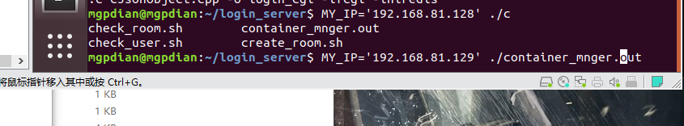
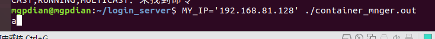
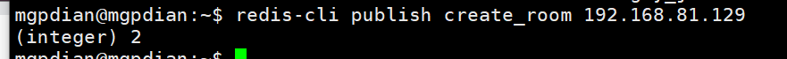
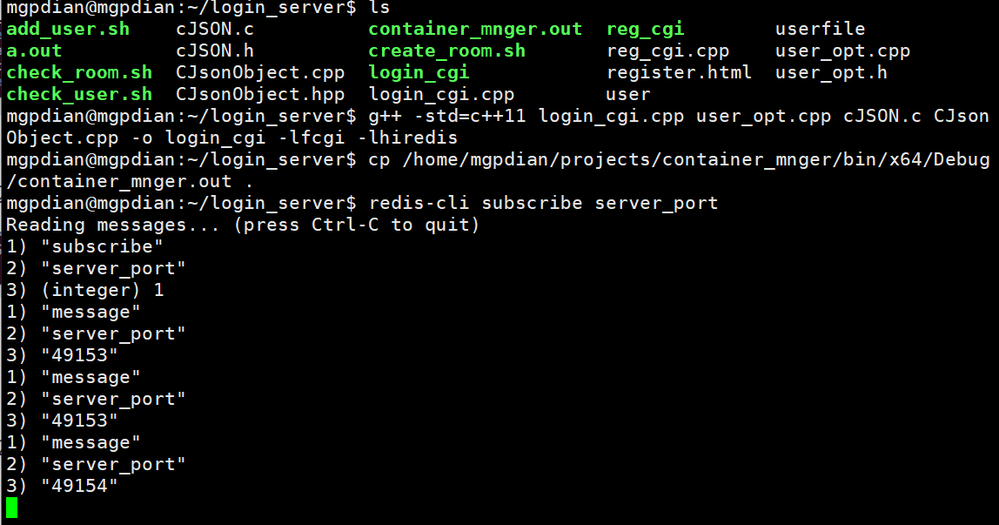
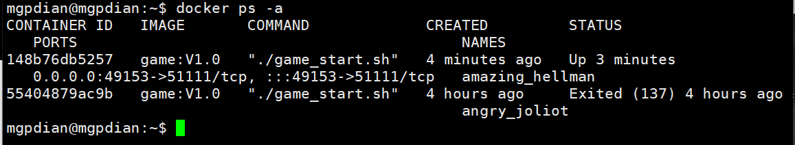
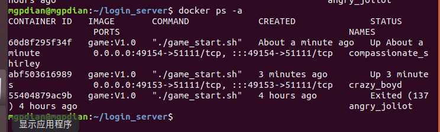
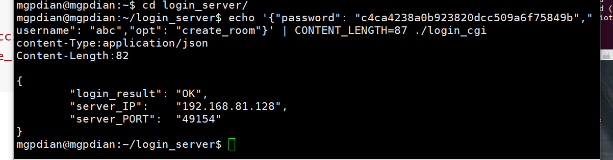
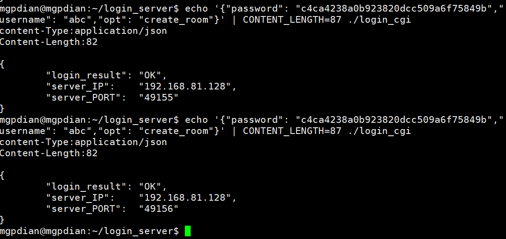

# 40 分布式测试

结合前面两个p 测试

克隆虚拟机  IP为 192.168.81.129



主服务器 IP为192.168.81.128



测试






主服务器的docker



从服务器的docker




模仿客户端发送过来的json数据

```c++
echo '{"password": "c4ca4238a0b923820dcc509a6f75849b","username": "abc","opt": "create_room"}' | CONTENT_LENGTH=87 ./login_cgi 
```





问题 永远是主服务器那里创建docker

原因: 因为我们现在是命令行处理 login_cgi中的循环函数(FCGI_Accept() >= 0) 这个命令是 当http链接>= 0 时 运行 现在没有http协议 所以每次只运行一次  每次调用都是从第一个那里创建