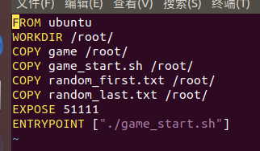
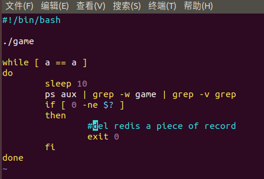
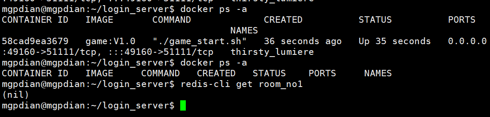

# 41 容器退出房间删除实现

# 容器退出思路 

  将从服务器返回的IP和端口的字符串 前面加上一个唯一的房间号 然后将他们绑定起来  房间号发送给客户端作为房间号  同时将房间号和该容器绑定  当容器退出时 删除房间号

我们会先准备好一个镜像  该镜像是由docker build 运行 一个Dockerfile脚本 创建的   该脚本中将 游戏服务器game 和 game_start.sh脚本 加载进去  并设置容器关联端口 及 容器创建后默认运行的东西`ENTRYPOINT ["./game_start.sh"]`



容器创建时 会运行`game_start.sh`脚本

该脚本会运行game这个游戏服务器  然后一直循环查询该游戏服务器

的状态 看他是否在运行  当没有运行时  向redis服务器发送删除房间号的请求 并且脚本退出




容器退出 就需要主服务器 即要接收登录服务器发来的请求 又要监控服务器在不在


我们先实现 容器退出时 game_start.sh脚本 调用redis的删除

## 删除redis上的房间号

game_start 脚本修改

$MY_ROOM为 docker 设置的环境变量, 该环境变量会在docker镜像产生时使用dockerfile来设置关联  然后等待镜像生成容器时 通过命令行的-e 来设置具体的值

game_start 脚本修改

```bash
#!/bin/bash
  
./game

MY_ROOM_NO="room_no"$MY_ROOM_NO

while [ a == a ]
do
        sleep 10
        ps aux | grep -w game | grep -v grep
        if [ 0 -ne $? ]
        then
                #del redis a piece of record
                redis-cli -h 192.169.81.128 del $MY_ROOM_NO
                exit 0
        fi
done

```

镜像生成容器的命令

create_room.sh脚本

```bash
#!/bin/bash
  
docker run -d -P -e MY_ROOM_NO=$1 game:V1.0 2>&1 >/dev/null

docker ps -n 1 -f ancestor=game:V1.0 | grep game_start | awk -F "->" '{print $1}' | awk -F : '{print $NF}'

```

回顾

```bash
docker run -d  为设置为守护线程
-P 为 随机端口
-e MY_ROOM_NO=$1 为将外部传入的参数设置为环境变量MY_ROOM_NO
```

调用create_room.sh脚本 是 程序 container_mnger.out  他是订阅redis频道 等待主服务器的发布数据传输过来

所以我们要让他来设置环境变量给 create_room.sh

## container_mnger修改

修改container_mnger的回调函数 

修改它获取订阅数据的方法  将数据分成两段 

第一段作为IP判断  第二段作为 房间号 来设置环境变量

```c++
void my_callbask(struct redisAsyncContext* pc, void* reply, void* private_data)
{
    std::string port;
    std::string room_no;
    ...
    
    else {
        //reply 中 包括 IP: 房间号
        std::string orig_content(my_reply->element[2]->str);
        int pos = orig_content.find(':');
        std::string IP = orig_content.substr(0, pos);
        //判断IP是否是自己的IP
        //选择环境变量来获取IP  因为如果系统调用可能会获取到外网或者内网等各种各样的IP
        std::string my_ip(getenv("MY_IP"));
        if (IP != my_ip)
        {
            
            return;
        }
        room_no = orig_content.substr(pos + 1);
    }
   
    //执行脚本获取端口号
    std::string cmd = "./create_room.sh " + room_no;
    ...
}
```

而该订阅数据中房间号 是由login_server设置的


## 主服务器的 login_server

创建房间时 传入房间号  发布给从服务器给它做环境变量 来让他在游戏服务器结束时能删除redis上的对应房间号

为从服务器返回的IP和端口 添加房间号

```c++
static int cur_room_no = 0; //作为房间号

//在创建房间判断中 添加房间号 
if("create_room" == opt)
			{
    			cur_room_no++;
				std::string room_info = create_container(cur_room_no);
				//add a 数据 : room_noX room_info
				
				redisContext* pc = redisConnect("127.0.0.1", 6379);
				if(nullptr != pc)
				{
					
					freeReplyObject(redisCommand(pc, "set room_no%d %s", cur_room_no, room_info.c_str()));

					redisFree(pc);
				}
				
				reply.Add("server_IP", room_info.substr(0, room_info.find(' ')));
				reply.Add("server_PORT", room_info.substr(room_info.find(' ') + 1));
				reply.Add("room_no", cur_room_no);
			}
```

修改创建房间的函数(redis发布) 

### create_container修改

让create_container 在发布数据时 添加一个房间号

```c++
std::string create_container(int _room_no)
{
    ...
    if(nullptr != pc)
	{
		freeReplyObject(redisCommand(pc, "publish create_room %s:%d", cur_server.c_str(), _room_no));
       ... 
        
    }
    ...
    
}
```


对于login_cgi测试

```c++
g++ -std=c++11 login_cgi.cpp user_opt.cpp cJSON.c CJsonObject.cpp -lfcgi -lhiredis -o login_cgi
```

设置FCGI

```c++
spawn-fcgi -a 127.0.0.1 -p 8888 -f ./login_cgi
```

复制container_mnger.out

```c++
 cp /home/mgpdian/projects/container_mnger/bin/x64/Debug/container_mnger.out .
```

删除旧容器和旧镜像

```c++
docker rm -f `docker ps -aq`
```

```c++
docker rmi game:V1.0
```

重新设置生成新镜像

```c++
docker build -t game:V1.0 .
```


开始测试

启动从服务器监听器

```c++
 MY_IP=192.168.81.128 ./container_mnger.out
```


### QT客户端修改

建房时 获取房间号作为房间号  同时 将得到的IP和端口作为客户端连接的IP和端口

```c++
if(create_room == m_cur_opt)
        {
            qDebug() << "login_result";
            QProcess pro;
            QStringList argv;
            int room_no = json["room_no"].toInt();

            QMessageBox::information(this, "房间号", "房间号" + QString::number(room_no));
            argv.push_back(json["server_IP"].toString());
            argv.push_back(json["server_PORT"].toString());
            pro.startDetached("client.exe", argv, ".");

            qApp ->exit();
        }
```


# 遇到的问题 redis无法删除

原因 镜像没有安装redis  删jb

game_start.sh 中 的 MY_ROOM_NO没有加room_no

## Dockerfile修改

```c++
FROM ubuntu
WORKDIR /root/
RUN apt-get update && apt-get install -y redis-tools
COPY game /root/
COPY game_start.sh /root/
COPY random_first.txt /root/
COPY random_last.txt /root/
EXPOSE 51111
ENTRYPOINT ["./game_start.sh"]
```


## game_start.sh修改

```c++
#!/bin/bash
  
./game

MY_ROOM_NO="room_no"$MY_ROOM_NO

while [ a == a ]
do
        sleep 10
        ps aux | grep -w game | grep -v grep
        if [ 0 -ne $? ]
        then
                #del redis a piece of record
                redis-cli -h 192.169.81.128 del $MY_ROOM_NO
                exit 0
        fi
done

```


解决容器结束退出问题

在create_room.sh 创建容器时 设置容器关闭时删除容器

```c++
#!/bin/bash

docker run --rm -d -P -e MY_ROOM_NO=$1 game:V1.0 2>&1 >/dev/null

docker ps -n 1 -f ancestor=game:V1.0 | grep game_start | awk -F "->" '{print $1}' | awk -F ":" '{print $NF}'

```



终于删除了  我哭了