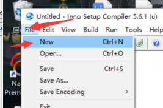

# 43 客户端打包

客户端打包成安装包 便于安装

先修改运行模式  修改为Release


点击锤子


它会生成一个新的QT运行文件  里面的release中生成了运行exe 但是确实运行环境,  我们需要手动添加

我们先将生成的launchar.exe 放入一个新的文件夹中 这样方便打包

然后在这个文件夹中 打开cmd


输入

找到qt安装位置 的bin

```c++
D:\QT\5.14.2\mingw73_64\bin
```

输入里面的windeployqt.exe 和 launcher.exe

```c++
D:\QT\5.14.2\mingw73_64\bin\windeployqt.exe launcher.exe
```


并将其中的 libgcc_s_seh-1.dll复制过来(因为上面的.exe不能把它复制过来) (已经不需要了  可以自动移动过来了)


接下来安装innosetup 打包软件

[innosetup 打包软件](G:\笔记\游戏服务器\笔记\软件安装\打包工具innosetup安装)


在这里直接搜索


点击第一个




直接next


修改下名字


选择Browse 选择运行程序launcher.exe

选择add folder 添加运行文件夹


创建打包后的位置


安装成功