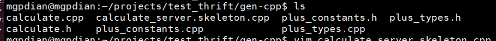
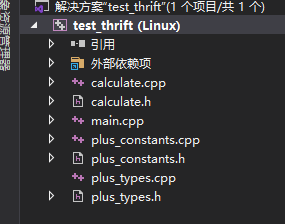
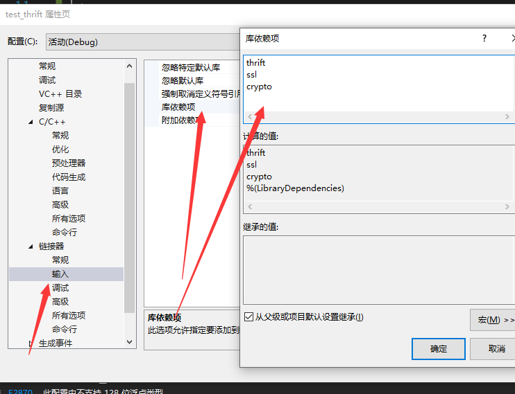
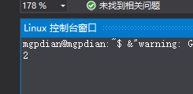

# 46 rpc编写

thrift
一、写xxxx.thrift文件(定义函数原型)
二、生成代码（服务器（B主机）代码---》预留函数的实现)

三、实现预留的函数，启动服务
四、在A主机包含生成的部分代码，编写调用的程序


test

### 第一步写xxxx.thrift文件(定义函数原型)

```thrift
service calculate{
        i32 plus(1:i32 a, 2:i32 b)
}
```

语法 : i32 等于c++ 的 int

不同点: 参数要写明位置 1: 2:

```c++
 service 命名空间? {
	i32 plus(1:i32 a, 2:i32 b)
}
```

### 二 生成代码（服务器（B主机）代码---》预留函数的实现)

```bash
$ thrift -r --gen cpp plus.thrift 
```

> -r 会生成编译目录
>
> --gen  生成  (但好像不能该名字?)
>
> cpp  以c++的方式编译
>
> plus.thrift 为编译目标

编译成功后 会生成一个gen.cpp文件夹

进入后查看 



其中calculate_server.skeleton.cpp 就算服务器(计算处理函数)的cpp

进入

里面有calculateHandler 和 一个main函数

> calculateHandler 为构造函数 你可以在这里初始化需要的东西
>
> plus 则是我们上面设置的处理函数  需要你自己来编写处理过程

```c++
class calculateHandler : virtual public calculateIf {
 public:
  calculateHandler() {
    // Your initialization goes here
  }

  int32_t plus(const int32_t a, const int32_t b) {
    // Your implementation goes here
    printf("plus\n");
  }

};
```

```c++
int main(int argc, char **argv) {
  int port = 9090;
  ::apache::thrift::stdcxx::shared_ptr<calculateHandler> handler(new calculateHandler());
  ::apache::thrift::stdcxx::shared_ptr<TProcessor> processor(new calculateProcessor(handler));
  ::apache::thrift::stdcxx::shared_ptr<TServerTransport> serverTransport(new TServerSocket(port));
  ::apache::thrift::stdcxx::shared_ptr<TTransportFactory> transportFactory(new TBufferedTransportFactory());
  ::apache::thrift::stdcxx::shared_ptr<TProtocolFactory> protocolFactory(new TBinaryProtocolFactory());

  TSimpleServer server(processor, serverTransport, transportFactory, protocolFactory);
  server.serve();
  return 0;
}
```

main 通过工厂类来接收数据


### 三 实现预留的函数，启动服务

实现

```c++
int32_t plus(const int32_t a, const int32_t b) {
    // Your implementation goes here
    return a + b;
  }
```


编译:

```c++
g++ -std=c++11 *.cpp -o server -lthrift -lssl -lcrypto
```

### 四、在A主机包含生成的部分代码，编写调用的程序

将其他生成的文件 拷贝到vs的项目文件夹中




编写mian

```c++
#include <cstdio>
#include "calculate.h"
#include <iostream>
#include <memory>
#include <thrift/protocol/TBinaryProtocol.h>
#include <thrift/transport/TSocket.h>
int main()
{
    //这是通信协议
    std::shared_ptr< apache::thrift::protocol::TTransport> socket(new apache::thrift::transport::TSocket("192.168.81.128", 9090));

    //这是二进制 它将通信协议写了进去
    std::shared_ptr<apache::thrift::protocol::TProtocol> protocol(new apache::thrift::protocol::TBinaryProtocol(socket));
    //连接服务器
    socket->open();
    //调用远程 需要传输给远程服务器 通信协议和 二进制化
    calculateClient client(protocol);

    std::cout << client.plus(1, 1) << std::endl;
    
    getchar();
    
    return 0;
}
```

库依赖项



```c++
thrift
ssl
crypto
```

测试 

在服务器启动 编译好的 `./server`文件

运行vs



获得答案 证明编写成功