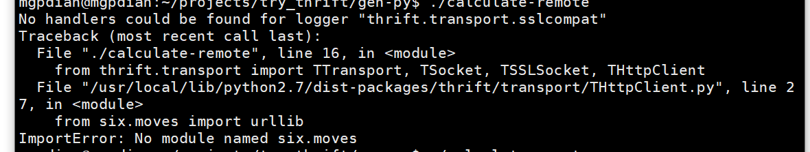
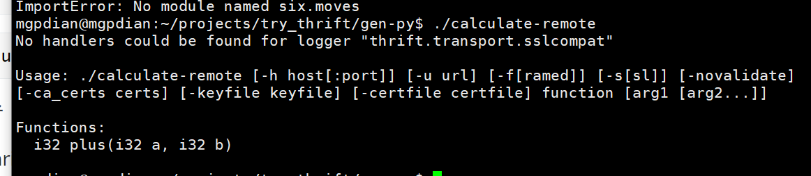
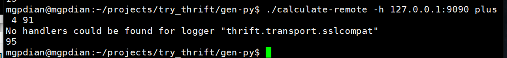

# 47 python调用rpc

这可能是要做脚本了

thrift编译

```bash
$ thrift -r --gen py plus.thrift
```

会生成一个gen.py文件夹

其中有一个 `__init__.py `   文件和   ` plus`文件夹

进入`plus`文件夹


其中的 `calculate-remote` 为可执行文件  类似之前客户端的调用函数 我们将它拷贝到前一个文件夹

```c++
cp calculate-remote ../
```


python问题



原因: 没有安装python环境

```c++
sudo apt-get install python-pip #python2
sudo apt-get install python3-pip #python3
sudo apt install python-all python-all-dev python-all-dbg

```

```c++
 sudo pip install thrift
```

或者

在thrift安装完成后需要手动把build目录的thrift模块（macos为例：./lib/py/build/lib.macosx-10.10-x86_64-2.7/thrift）copy到python对应的site-package目录

### 

之后就能正常提示了



### 回归正题

需要 输入 IP和端口  调用的函数 已经传入的参数

要保证服务器的函数启动


```c++
./calculate-remote -h 127.0.0.1:9090 plus 4 91

```

